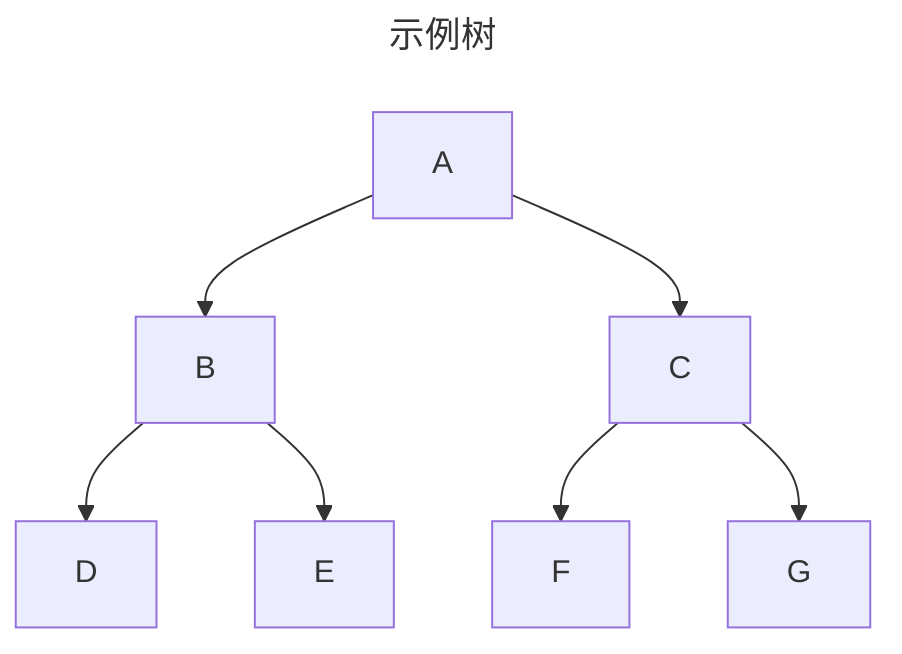

## 概述

\==二叉树（Binary Tree）== 是一种非线性数据结构，每个节点最多有两个子节点（左子节点和右子节点）。

## 核心特性

* **度**：节点拥有的子树数（二叉树节点度 ≤ 2）
* **层次**：根节点为第 1 层，逐级递增
* **深度**：从根到节点的路径长度
* **高度**：从节点到最深叶子的路径长度

## 二叉树基础节点实现

```ts
class TreeNode<T> {
  val: T
  left: TreeNode<T> | null
  right: TreeNode<T> | null

  constructor(
    val: T,
    left: TreeNode<T> | null = null,
    right: TreeNode<T> | null = null
  ) {
    this.val = val
    this.left = left
    this.right = right
  }
}
```

## 特殊二叉树

* **完全二叉树**：除最后一层外全满，最后一层左对齐
* **满二叉树**：所有非叶子节点都有两个子节点
* **二叉搜索树 (BST)**：左子树所有值 < 根 < 右子树所有值

## 二叉搜索树的实现

```ts
// 满二叉树：所有非叶子节点都有两个子节点
class FullBinaryTree<T> { /* 实现 */ }

// 完全二叉树：除最后一层外全满，最后一层左对齐
class CompleteBinaryTree<T> { /* 实现 */ }

// 二叉搜索树 (BST)：左子树所有值 < 根 < 右子树所有值
class BinarySearchTree<T> {
  root: TreeNode<T> | null = null

  insert(val: T): void {
    const newNode = new TreeNode(val)
    if (!this.root) {
      this.root = newNode
      return
    }

    let current = this.root
    while (true) {
      if (val < current.val) {
        if (!current.left) {
          current.left = newNode
          break
        }
        current = current.left
      }
      else {
        if (!current.right) {
          current.right = newNode
          break
        }
        current = current.right
      }
    }
  }
}
```

## 二叉树的遍历

访问树的所有节点有三种遍历方式：中序，先序和后序。

* **中序遍历**：以从最小到最大的顺序访问所有节点
* **先序遍历**：以优先于后代节点的顺序访问每个节点
* **后序遍历**：先访问节点的后代节点再访问节点本身

属于何种遍历方式，通常可以根据 根节点 所在的位置：

* **先序遍历**：**根** --> 左子树 --> 右子树
* **中序遍历**：左子树 --> **根** --> \*\*右子树
* **后序遍历**：左子树 --> 右子树 -- > **根**

### 先序遍历（Preorder Traversal）

**访问顺序**：根节点 → 左子树 → 右子树

**应用场景**：创建树副本、序列化树结构、前缀表达式生成

```ts
// 递归实现
function preorder<T>(root: TreeNode<T> | null): T[] {
  if (!root)
    return []
  return [
    root.val,
    ...preorder(root.left),
    ...preorder(root.right)
  ]
}

// 迭代实现（使用栈）
function preorderIterative<T>(root: TreeNode<T> | null): T[] {
  if (!root)
    return []
  const stack: TreeNode<T>[] = [root]
  const result: T[] = []

  while (stack.length) {
    const node = stack.pop()!
    result.push(node.val)
    if (node.right)
      stack.push(node.right) // 右子先入栈
    if (node.left)
      stack.push(node.left) // 左子后入栈（后进先出）
  }
  return result
}
```

### 中序遍历 (Inorder Traversal)

**访问顺序**：左子树 → 根节点 → 右子树

**应用场景**：二叉搜索树排序输出、表达式树中缀表示

```ts
// 递归实现
function inorder<T>(root: TreeNode<T> | null): T[] {
  if (!root)
    return []
  return [
    ...inorder(root.left),
    root.val,
    ...inorder(root.right)
  ]
}

// 迭代实现（使用指针+栈）
function inorderIterative<T>(root: TreeNode<T> | null): T[] {
  const stack: TreeNode<T>[] = []
  const result: T[] = []
  let curr = root

  while (curr || stack.length) {
    // 深入左子树
    while (curr) {
      stack.push(curr)
      curr = curr.left
    }
    // 回溯访问节点
    curr = stack.pop()!
    result.push(curr.val)
    // 转向右子树
    curr = curr.right
  }
  return result
}
```

### 后序遍历（Postorder Traversal）

**访问顺序**：左子树 → 右子树 → 根节点

**应用场景**：释放树内存、计算目录大小、后缀表达式求值

```ts
// 递归实现
function postorder<T>(root: TreeNode<T> | null): T[] {
  if (!root)
    return []
  return [
    ...postorder(root.left),
    ...postorder(root.right),
    root.val
  ]
}

// 迭代实现（反转法）
function postorderIterative<T>(root: TreeNode<T> | null): T[] {
  if (!root)
    return []
  const stack: TreeNode<T>[] = [root]
  const result: T[] = []

  while (stack.length) {
    const node = stack.pop()!
    result.push(node.val)
    if (node.left)
      stack.push(node.left)
    if (node.right)
      stack.push(node.right)
  }
  return result.reverse() // 反转先序变体结果
}

// 迭代实现（双栈法）
function postorderTwoStacks<T>(root: TreeNode<T> | null): T[] {
  if (!root)
    return []
  const stack1: TreeNode<T>[] = [root]
  const stack2: TreeNode<T>[] = []
  const result: T[] = []

  while (stack1.length) {
    const node = stack1.pop()!
    stack2.push(node)
    if (node.left)
      stack1.push(node.left)
    if (node.right)
      stack1.push(node.right)
  }

  while (stack2.length) {
    result.push(stack2.pop()!.val)
  }
  return result
}
```

### 遍历过程



| 遍历方式 | 访问顺序       | 输出结果        |
| -------- | -------------- | --------------- |
| 先序遍历 | A→B→D→E→C→F->G | `[A,B,D,E,C,F]` |
| 中序遍历 | D→B→E→A→C→F->G | `[D,B,E,A,C,F]` |
| 后序遍历 | D→E→B→F→G->C→A | `[D,E,B,F,C,A]` |

## 二叉树的搜索

在二叉树中搜索值是树操作中最基础和重要的操作之一。

### 普通二叉树搜索

::: code-tabs

@tab 递归实现

```ts
function searchBinaryTree<T>(
  root: TreeNode<T> | null,
  target: T
): TreeNode<T> | null {
  if (!root)
    return null

  // 检查当前节点
  if (root.val === target)
    return root

  // 递归搜索左子树
  const leftResult = searchBinaryTree(root.left, target)
  if (leftResult)
    return leftResult

  // 递归搜索右子树
  return searchBinaryTree(root.right, target)
}
```

@tab 迭代实现（使用栈）

```ts
function searchBinaryTreeIterative<T>(
  root: TreeNode<T> | null,
  target: T
): TreeNode<T> | null {
  if (!root)
    return null

  const stack: TreeNode<T>[] = [root]

  while (stack.length) {
    const node = stack.pop()!

    // 检查当前节点
    if (node.val === target)
      return node

    // 将子节点压入栈
    if (node.right)
      stack.push(node.right)
    if (node.left)
      stack.push(node.left)
  }

  return null
}
```

:::

### 二叉搜索树（BST）搜索

二叉搜索树具有有序特性，可以高效搜索：

::: code-tabs

@tab 递归实现

```ts
function searchBST<T>(
  root: TreeNode<T> | null,
  target: T,
  comparator: (a: T, b: T) => number = (a, b) => a === b ? 0 : a > b ? 1 : -1
): TreeNode<T> | null {
  if (!root)
    return null

  const comp = comparator(target, root.val)

  if (comp === 0)
    return root // 找到目标
  if (comp < 0)
    return searchBST(root.left, target, comparator) // 目标小于当前值，搜索左子树
  return searchBST(root.right, target, comparator) // 目标大于当前值，搜索右子树
}
```

@tab 迭代实现

```ts
function searchBSTIterative<T>(
  root: TreeNode<T> | null,
  target: T,
  comparator: (a: T, b: T) => number = (a, b) => a === b ? 0 : a > b ? 1 : -1
): TreeNode<T> | null {
  let current = root

  while (current) {
    const comp = comparator(target, current.val)

    if (comp === 0)
      return current // 找到目标
    if (comp < 0)
      current = current.left // 目标小于当前值，转向左子树
    else current = current.right // 目标大于当前值，转向右子树
  }

  return null // 未找到
}
```

:::

### 搜索路径记录

有时我们需要记录搜索路径而不仅仅是找到节点：

```ts
function searchWithPath<T>(
  root: TreeNode<T> | null,
  target: T
): TreeNode<T>[] | null {
  if (!root)
    return null

  const path: TreeNode<T>[] = []
  let found = false

  function dfs(node: TreeNode<T> | null): boolean {
    if (!node || found)
      return false

    path.push(node)

    if (node.val === target) {
      found = true
      return true
    }

    if (dfs(node.left))
      return true
    if (dfs(node.right))
      return true

    path.pop()
    return false
  }

  dfs(root)
  return found ? path : null
}
```

## 时间复杂度

| 操作      | 平均       | 最差   |
| --------- | ---------- | ------ |
| 访问/搜索 | $O(log n)$ | $O(n)$ |
| 插入/删除 | $O(log n)$ | $O(n)$ |
| 空间      | $O(n)$     | $O(n)$ |

## 适用场景

* **数据库索引**：B/B+ 树（二叉树变种）
* **文件系统**：目录树结构
* **编译器**：语法分析树
* **游戏 AI**：决策树
* **数据压缩**：哈夫曼编码树

## 相关问题

[**LeetCode** - 二叉树](https://leetcode.cn/problem-list/tree/){.read-more}

### 基础操作

* **101. 对称二叉树**（[LeetCode](https://leetcode.cn/problems/symmetric-tree/)）
* **104. 二叉树的最大深度**（[LeetCode](https://leetcode.cn/problems/maximum-depth-of-binary-tree/)）
* **226. 翻转二叉树**（[LeetCode](https://leetcode.cn/problems/invert-binary-tree/)）
* **102. 二叉树的层序遍历**（[LeetCode](https://leetcode.cn/problems/binary-tree-level-order-traversal/)）
* **199. 二叉树的右视图**（[LeetCode](https://leetcode.cn/problems/binary-tree-right-side-view/)）

### 路径、深度与综合应用

* **112. 路径总和**（[LeetCode](https://leetcode.cn/problems/path-sum/)）
* **543. 二叉树的直径**（[LeetCode](https://leetcode.cn/problems/diameter-of-binary-tree/)）
* **110. 平衡二叉树**（[LeetCode](https://leetcode.cn/problems/balanced-binary-tree/)）
* **114. 二叉树展开为链表**（[LeetCode](https://leetcode.cn/problems/flatten-binary-tree-to-linked-list/)）

### 二叉搜索树（BST）专项

* **98. 验证二叉搜索树**（[LeetCode](https://leetcode.cn/problems/validate-binary-search-tree/)）
* **230. 二叉搜索树中第K小的元素**（[LeetCode](https://leetcode.cn/problems/kth-smallest-element-in-a-bst/)）
* **538. 把二叉搜索树转换为累加树**（[LeetCode](https://leetcode.cn/problems/convert-bst-to-greater-tree/)）
* **701. 二叉搜索树中的插入操作**（[LeetCode](https://leetcode.cn/problems/insert-into-a-binary-search-tree/)）
