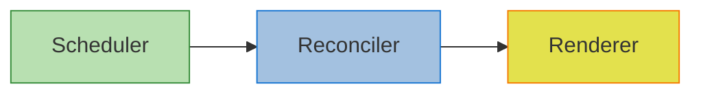
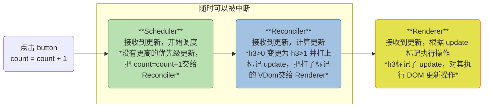
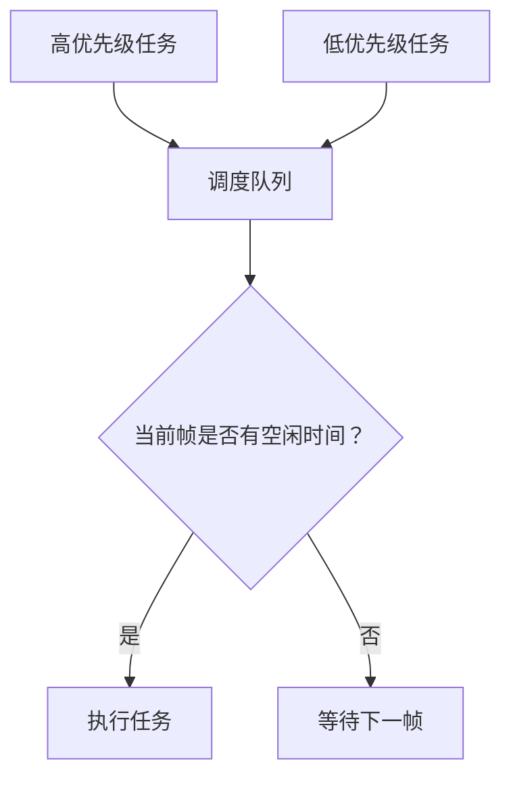
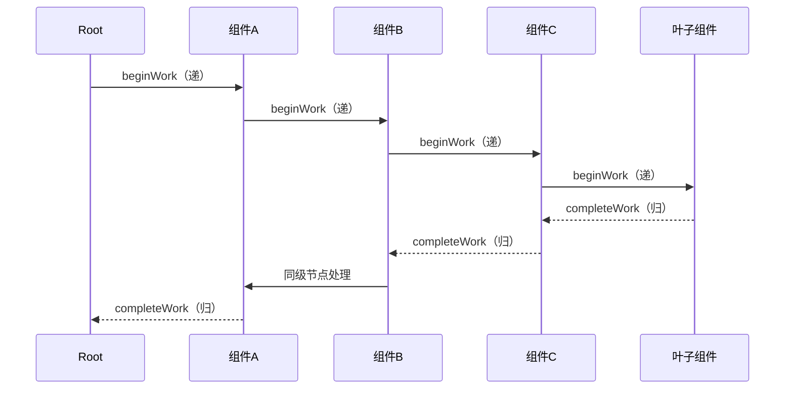
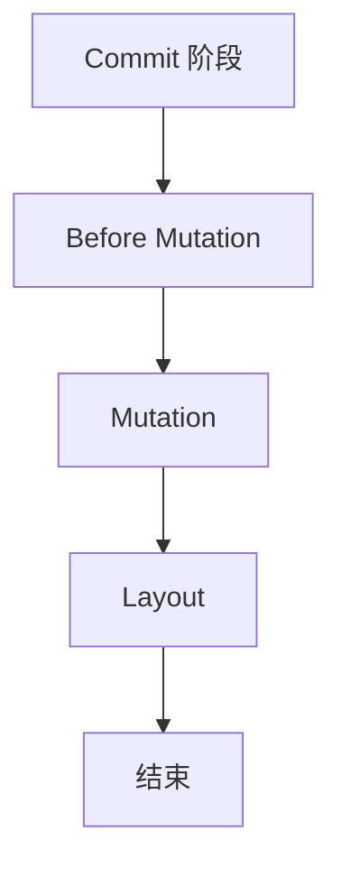
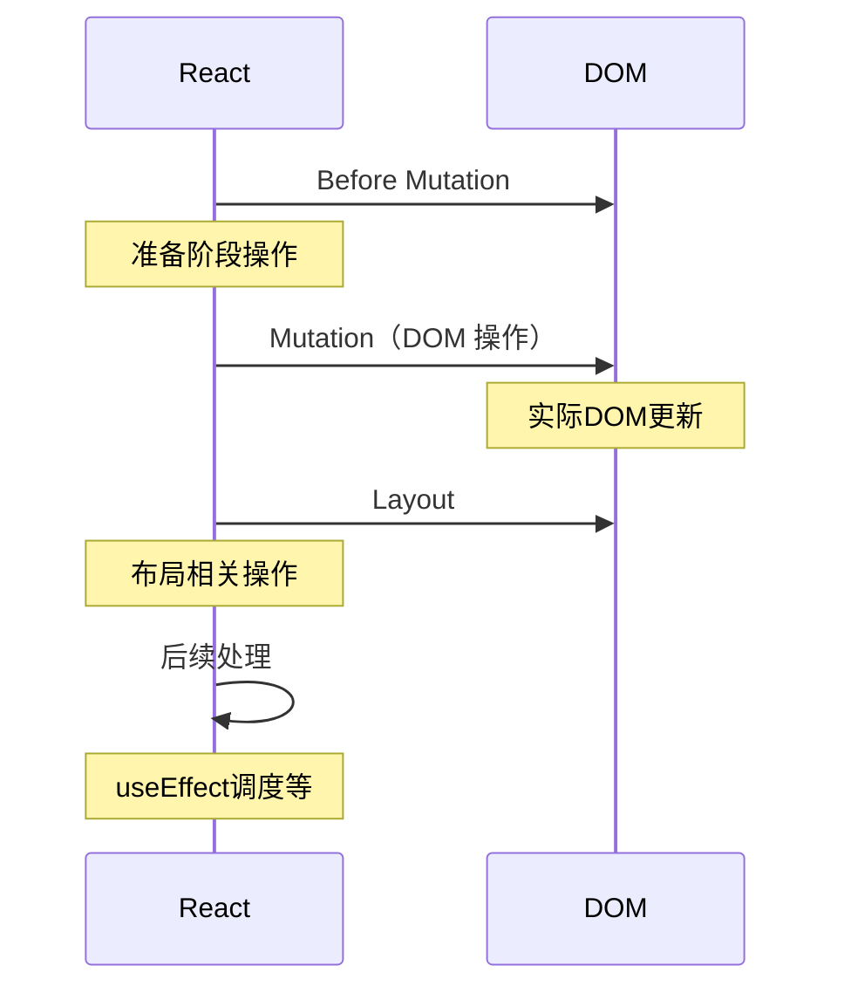
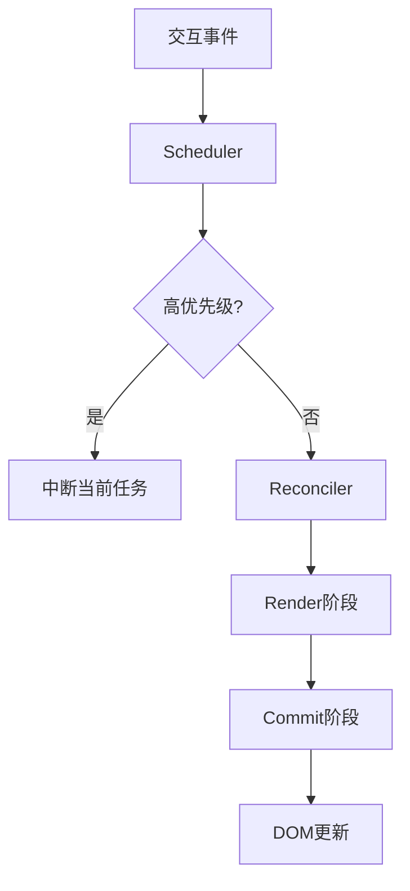

## 核心概念回顾

在深入渲染流程前，先回顾 Fiber 架构的三个核心模块：

* **Scheduler（调度器）**：基于任务优先级调度任务执行顺序
* **Reconciler（协调器）**：计算新旧虚拟 DOM 树的差异
* **Renderer（渲染器）**：将更新后的虚拟 DOM 转换为实际 UI

这三个模块共同构成了 React 高效灵活的渲染机制。下面通过完整渲染流程解析它们如何协同工作。

## 整体渲染流程概述

React 渲染流程分为两个关键阶段：



1. **Render 阶段（协调阶段）**：Reconciler 负责调用组件渲染方法，构建 Fiber 树
2. **Commit 阶段（渲染阶段）**：Renderer 将变更同步应用到真实 DOM

### 示例场景分析

```jsx
export default function CounterApp() {
  const [count, setCount] = useState(0)

  const increment = () => setCount(prev => prev + 1)

  return (
    <div className="counter">
      <h3>
        当前计数:
        {count}
      </h3>
      <button onClick={increment}>增加</button>
    </div>
  )
}
```

当用户点击按钮触发状态更新时：

1. Scheduler 接收更新任务并调度执行
2. Reconciler 计算变更并标记需要更新的部分
3. Renderer 将变更同步应用到真实 DOM



## 调度器（Scheduler）工作原理

Scheduler 是 React 16 引入的调度系统，核心作用是管理任务优先级和执行时机。虽然浏览器提供了 `requestIdleCallback` API，但 React 基于以下原因实现了自定义调度器：

1. **浏览器兼容性问题**：部分浏览器不支持 `requestIdleCallback`
2. **触发频率不稳定**：原生 API 受多种因素影响
3. **优先级控制需求**：需要更细粒度的任务优先级管理



Scheduler 采用 **时间切片（Time Slicing）** 技术，将任务分解为小块，在浏览器空闲时执行，避免阻塞主线程。

## 协调器（Reconciler）与 Render 阶段

### 可中断的协调过程

React 16 将协调过程从递归改为可中断的循环：

```js
// 同步模式工作循环
function workLoopSync() {
  while (workInProgress !== null) {
    performUnitOfWork(workInProgress)
  }
}

// 并发模式工作循环
function workLoopConcurrent() {
  while (workInProgress !== null && !shouldYield()) {
    performUnitOfWork(workInProgress)
  }
}
```

* `workInProgress`：当前正在处理的 Fiber 节点
* `shouldYield()`：检查当前帧是否有剩余时间
* `performUnitOfWork()`：处理当前 Fiber 节点并连接后续节点

### Fiber 节点处理流程

`performUnitOfWork` 采用深度优先遍历（DFS）策略，分为两个阶段：



1. **递阶段（beginWork）**：

   * 从根节点开始深度优先遍历
   * 为每个 Fiber 节点调用 `beginWork`
   * 创建子节点并建立连接
   * 到达叶子节点后进入归阶段

2. **归阶段（completeWork）**：

   * 收集副作用（如 DOM 更新需求）
   * 存在兄弟节点则进入兄弟节点的递阶段
   * 不存在兄弟节点则返回父节点继续归阶段
   * 最终回到根节点完成协调

::: info **设计细节**
Fiber 节点指向父节点的字段名为 `return` 而非 `parent`，因为从子节点角度看，完成工作后是"返回"到父节点继续工作。
:::

## 渲染器（Renderer）与 Commit 阶段

当协调阶段完成，进入不可中断的 Commit 阶段。此阶段将协调结果提交到真实 DOM，分为三个子阶段：



### 1. Before Mutation 阶段（DOM 操作前）

* 处理 DOM 渲染/删除后的自动聚焦逻辑
* 调用 `getSnapshotBeforeUpdate` 生命周期
* 调度 `useEffect`

### 2. Mutation 阶段（执行 DOM 操作）

* 根据协调结果执行 DOM 增删改操作
* 解绑旧节点的 ref 引用
* 执行函数组件的销毁清理函数

### 3. Layout 阶段（DOM 操作后）

* 绑定新节点的 ref 引用
* 调用 `componentDidMount`/`componentDidUpdate`
* 执行 `useLayoutEffect` 回调

### 完整 Commit 流程



## 关键设计优势

1. **可中断渲染**：
   * Scheduler 和 Reconciler 工作可被高优先级任务中断
   * 所有计算在内存中进行，不会显示中间状态

2. **双缓存机制**：
   * 内存中同时存在两棵 Fiber 树（current 和 workInProgress）
   * 减少界面闪烁，提升用户体验

3. **副作用隔离**：
   * 协调阶段收集副作用（effect）
   * 提交阶段统一执行副作用

## 总结

React 的渲染流程通过精密的模块化设计实现高效渲染：

1. **Scheduler** 智能调度任务，优先处理用户交互
2. **Reconciler** 使用可中断的 DFS 遍历计算变更
3. **Renderer** 通过三阶段提交保证 DOM 更新一致性



这种架构使 React 能够平衡响应性和性能，在复杂应用场景下仍能保持流畅的用户体验。理解这些底层机制对于优化 React 应用性能和解决渲染相关问题至关重要。
