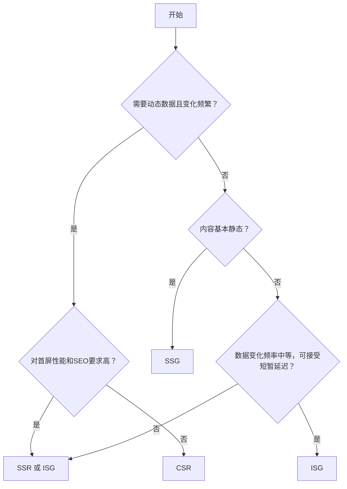

想象一下建设一座城市（你的Web应用）。

你是选择在工厂（服务器）里预先建造好整栋房子运过去（SSG）？

还是派个施工队（浏览器）到现场根据图纸（JS）慢慢盖（CSR）？

或者是让工厂按订单要求快速生产好毛坯房再运过去让施工队装修（SSR）？

甚至是在预制好的房子里预留模块，按需更新（ISG）？

🤔 今天，我们就来拆解这四种主流渲染策略：**客户端渲染 (CSR)**、**服务器端渲染 (SSR)**、**静态站点生成 (SSG)** 和 **增量静态再生 (ISG)**，帮你找到最适合项目的“城市建设方案”。

## 客户端渲染 (CSR - Client-Side Rendering)

### 工作原理

* 用户请求一个URL。
* 服务器返回一个**近乎空白的HTML文件**（通常只有一个根元素`

`和指向大量JavaScript文件的链接）。
* 浏览器下载HTML、CSS和**所有必需的JavaScript**（包括框架如React/Vue/Angular，以及应用代码）。
* JavaScript **在用户的浏览器中执行**，负责：
  * 获取数据（通常通过API调用）。
  * 构建DOM（页面结构）。
  * 将构建好的DOM插入到根元素中。
  * 处理后续的交互和路由切换（所有后续页面跳转也由JS处理，无需整页刷新）。

### 典型代表

传统的单页应用 (SPA) 框架如 **Create React App, Vue CLI 默认输出**。

### 优点

* **交互体验流畅：** 首次加载后，后续导航和交互感觉极其快速，接近原生应用，因为只更新变化的部分。
* **服务器压力小：** 服务器主要提供静态文件和API，计算负担转移到客户端。
* **开发体验好：** 前后端分离清晰，前端开发者拥有完全控制权，利用现代框架开发高效。
* **丰富的交互能力：** 非常适合构建高度交互式、类应用（Application-like）的体验。

### 缺点

* **首屏加载慢 (FCP/TTI 差)：** 用户需要等待所有JS下载、解析、执行、数据获取、渲染完成才能看到有意义的内容。尤其对低端设备和慢网络用户不友好。
* **SEO 不友好：** 搜索引擎爬虫早期（现在部分高级爬虫如Googlebot能执行JS，但仍有延迟和不确定性）可能只能看到空HTML或加载状态，难以正确索引内容。
* **内容可见性延迟：** 用户盯着空白屏或加载动画的时间较长。

### 适用场景

* 后台管理系统、Dashboards（对SEO无要求）。
* 高度交互的Web应用（如在线编辑器、复杂表单、实时协作工具）。
* 登录后才能访问的内容（此时SEO不重要）。
* 网络条件较好（或对首屏性能要求不高）的场景。

## 服务器端渲染 (SSR - Server-Side Rendering)

### 工作原理

* 用户请求一个URL。
* 服务器**实时**接收到请求。
* 服务器运行JavaScript应用（如Node.js + React/Vue）。
* 服务器根据请求的URL，**获取所需数据**（查询数据库、调用API等）。
* 服务器执行应用代码，**将组件渲染成完整的HTML字符串**（包含实际内容）。
* 服务器将这个**完整的、包含数据的HTML文档**发送给浏览器。
* 浏览器接收到HTML后能**立即显示有意义的内容**（FCP快）。
* 同时，浏览器会下载JS包（hydration）。JS下载执行后，会“接管”页面，附加事件监听器，使页面变得可交互（TTI可能稍晚于FCP）。后续交互和导航通常又转为CSR模式。

### 典型代表

* **Next.js** (`getServerSideProps`),
* **Nuxt.js** (`server-side rendering mode`)
* **SvelteKit** (适配器如`@sveltejs/adapter-node`)

### 优点

* **优秀的首屏性能 (FCP)：** 用户能快速看到完整内容，提升感知速度。
* **卓越的SEO：** 搜索引擎爬虫直接获取到包含完整内容的HTML，索引无忧。
* **更好的社交分享：** 分享链接时，社交媒体的爬虫也能获取到包含完整元信息（如Open Graph tags）和内容的HTML，生成正确的预览卡片。
* **对低端设备/慢网络更友好：** 用户能尽早看到内容。

### 缺点

* **服务器压力大：** 每个请求都需要服务器实时渲染，消耗CPU资源。高并发时可能成为瓶颈，需要良好的服务器架构和缓存策略（如CDN缓存、反向代理缓存）。
* **TTI可能延迟：** 虽然内容显示快，但页面可交互（TTI）需要等待JS下载和执行完成（hydration）。如果JS包很大，用户看到内容但无法立即点击，体验会打折扣（需优化hydration性能）。
* **开发复杂度稍高：** 需要考虑服务器环境、数据获取方式（`getServerSideProps`等）、hydration过程，调试可能更复杂。

### 适用场景

* 内容密集型且对SEO要求极高的网站（新闻、博客、电商列表/详情页）。
* 需要良好社交分享预览的页面。
* 用户网络条件差异较大的公共网站。
* 需要用户立即看到核心内容的页面。

## 静态站点生成 (SSG - Static Site Generation)

### 工作原理

* **在构建时（Build Time）**，而不是在用户请求时。
* 应用代码运行在**构建服务器**上。
* 为网站中的**每一个可能的页面路径**（基于文件路由或配置），执行以下操作：
  * **获取该页面所需的所有数据**（从CMS、API、数据库、本地文件等）。
  * **将React/Vue/Svelte组件渲染成纯HTML字符串**。
* 将生成的每个HTML文件，连同其CSS、JS、图片等资源，**输出为静态文件**。
* 将这些静态文件部署到CDN或静态文件托管服务。
* 用户请求一个URL时，CDN直接返回**预先渲染好的、包含完整内容的静态HTML文件**，浏览器快速展示（FCP极快）。JS随后下载执行进行hydration，添加交互性（TTI通常也很快，因为资源在CDN边缘）。

### 典型代表

* **Next.js** (`getStaticProps`/`getStaticPaths`)
* **Gatsby**
* **Nuxt.js** (`target: static`)
* **VitePress**
* **Hugo**
* **Jekyll**
* **Eleventy (11ty)**

### 优点

* **极致性能：** 页面直接从全球CDN边缘节点提供，加载速度极快（FCP, TTI, LCP 都优秀）。
* **超强安全性：** 没有实时服务器或数据库暴露给公共网络，攻击面极小。
* **成本低廉：** 静态文件托管（如Vercel, Netlify, GitHub Pages, AWS S3 + CloudFront）通常非常便宜甚至免费，且能轻松应对高流量。
* **优秀的SEO：** 和SSR一样，爬虫直接获取完整HTML内容。
* **简单可靠：** 部署就是上传文件，没有服务器运行时的复杂性和潜在故障点。

### 缺点

* **构建时数据：** 页面内容在构建时就固定了。如果数据源更新，必须**重新构建并部署整个站点（或受影响页面）** 才能更新页面内容。不适合**数据频繁变化**的页面（如实时股票行情、高频更新的评论区）。
* **大规模站点构建时间长：** 如果页面数量成千上万，每次构建可能需要几分钟甚至几十分钟。

### 适用场景

* 博客、文档网站、营销/宣传页（内容相对稳定）。
* 产品展示页、公司官网。
* 基于CMS但内容发布不频繁的网站（可以在CMS更新后触发构建）。
* 任何内容变化频率低于构建/部署频率的场景。追求极致性能、安全和成本效益的场景。

## 增量静态再生 (ISG - Incremental Static Regeneration)

### 工作原理

::: tip Next.js 提出的概念，核心思想
:::

* 在SSG的基础上，增加了**按需或在后台更新静态内容的能力**，**无需重新部署整个应用**。
* 在构建时 (`getStaticProps`) 可以指定一个 `revalidate` 时间（单位：秒）。
* 用户请求一个页面：
  1. **首先**，CDN/服务器会立即返回**上次构建或再生的静态HTML**（极快）。
  2. **同时**，在后台检查该页面自上次生成后是否已超过 `revalidate` 时间。
  3. **如果超过**，则在后台触发一次该页面的“再生”：
     * 重新运行 `getStaticProps` 获取**最新数据**。
     * 用新数据**重新生成该页面的HTML**。
     * 将新HTML**保存/缓存**起来，替换旧版本。
  4. **下次请求**该页面时，用户将直接获得新生成的HTML。
* 第一个触发再生的用户可能看到的还是旧页面，但他“默默”帮助后续用户更新了缓存。
* 也可以使用 `On-Demand Revalidation` (按需再生)：通过API路由手动触发特定页面（或带标签的一组页面）的立即再生（如CMS更新后调用Webhook）。

### 典型代表

**Next.js** (`getStaticProps` with `revalidate` 或 `unstable_revalidate` API / On-Demand ISR)。

### 优点

* **保留SSG的所有优点：** 极致的性能、安全性、成本效益、SEO。
* **解决SSG的最大痛点：** 内容可以**在部署后更新**！数据不再是完全静态的。可以设置一个合理的更新频率（如每10秒、1分钟、1小时）。
* **增量更新：** 只更新过期的页面，而不是全站重建，大大减少构建压力。
* **优雅降级：** 即使后台再生失败或超时，用户看到的仍是有效的（可能稍旧的）缓存内容。

### 缺点

* **内容更新非即时：** 用户可能在 `revalidate` 时间窗口内看到稍旧的数据（但通常可接受）。需要按需再生API才能实现接近实时（但仍有CDN传播延迟）。
* **概念稍复杂：** 需要理解缓存、再生、过期时间等机制。
* **平台依赖：** 主要深度集成在Vercel平台，其他平台实现可能不同或有局限（如Netlify也支持类似功能）。

### 适用场景

**SSG的理想场景，但数据更新频率高于全站部署频率时**：

* 电商网站（商品列表/详情页 - 价格/库存可设置短时刷新，商品增删触发按需再生）。
* 新闻/博客网站（新文章发布触发按需再生，热门文章设置短刷新）。
* 社交媒体Feed（用户主页Feed设置分钟级刷新）。
* 任何需要良好性能+SEO+动态内容组合的页面。

## 对比

| 特性                   | CSR (Client-Side)     | SSR (Server-Side)        | SSG (Static Site Gen)       | ISG (Incremental Static Regen)     |
| :--------------------- | :-------------------- | :----------------------- | :-------------------------- | :--------------------------------- |
| **渲染发生地**         | 浏览器                | 服务器 (每次请求)        | 构建服务器 (一次)           | 构建服务器 + 运行服务器 (按需)     |
| **首次内容加载 (FCP)** | 慢 (需下载执行JS)     | **快** (收到完整HTML)    | **极快** (CDN静态文件)      | **极快** (CDN静态文件)             |
| **可交互时间 (TTI)**   | 慢 (依赖JS下载执行完) | 中 (需Hydration)         | **快** (Hydration快)        | **快** (Hydration快)               |
| **SEO**                | 差/需额外处理         | **优**                   | **优**                      | **优**                             |
| **服务器压力**         | 低 (主要API)          | **高** (每次渲染)        | **极低** (仅静态文件)       | **低** (按需再生)                  |
| **数据实时性**         | 实时 (API调用)        | 实时 (请求时获取)        | 构建时 (固定)               | **可配置** (`revalidate`时间/按需) |
| **内容更新方式**       | JS动态更新            | 重新请求                 | **重新构建部署**            | **后台再生/按需触发**              |
| **成本**               | 中 (需要API服务器)    | 高 (需要计算型服务器)    | **极低** (静态托管)         | **低** (静态托管+少量计算)         |
| **安全性**             | 中 (暴露API)          | 中 (暴露服务器)          | **高** (纯静态)             | **高** (主要静态)                  |
| **开发复杂度**         | 低                    | 中高                     | 低                          | 中                                 |
| **典型用例**           | 后台SPA, 复杂交互应用 | 电商详情, 新闻, 高SEO页  | 博客, 文档, 营销页          | 电商, 新闻Feed, 需更新的SSG页      |
| **代表框架**           | CRA, Vite, Vue CLI    | Next.js, Nuxt, SvelteKit | Next.js, Gatsby, Nuxt, 11ty | **Next.js (最佳支持)**             |

## 如何选择？决策流程图

**决策要点：**

1. **数据变化频率：** 数据多久变一次？秒级？分钟级？小时级？天级？这是选择SSG vs SSR/ISG的关键。
2. **SEO需求：** 页面是否需要被搜索引擎良好索引？是则优先考虑SSR、SSG、ISG。
3. **性能要求：** 首屏速度 (FCP) 和可交互速度 (TTI) 有多重要？追求极致选SSG/ISG。
4. **用户交互复杂度：** 页面是否高度交互？是则CSR或SSR/SSG/ISG + 强大的客户端JS。
5. **基础设施与成本：** 是否有预算/能力维护服务器（SSR）？还是倾向于零服务器管理/低成本（SSG/ISG）？
6. **内容规模：** 页面数量巨大？SSG全量构建可能慢，ISR或SSR（配合缓存）可能是更好的选择。

## 结论：没有银弹，只有权衡

CSR、SSR、SSG、ISG 代表了Web渲染策略的演进，每一种都有其独特的优势和适用场景。现代框架（尤其是Next.js）的强大之处在于它们**支持混合渲染模式**：你可以为一个应用中的不同页面选择最合适的策略！

* 将营销首页、博客文章页用 **SSG/ISG** 实现极致性能和SEO。
* 将用户个人中心、设置页用 **CSR** 实现流畅交互（SEO不重要）。
* 将需要实时数据的特定页面（如最新交易）用 **SSR** 或 **ISR (短`revalidate`)**。

**理解这些模式的核心原理、优缺点和适用场景，是作为前端工程师做出明智架构决策的基础。** 选择哪种方案，最终取决于你的具体项目需求在性能、SEO、开发体验、成本和数据实时性之间的优先级排序。
