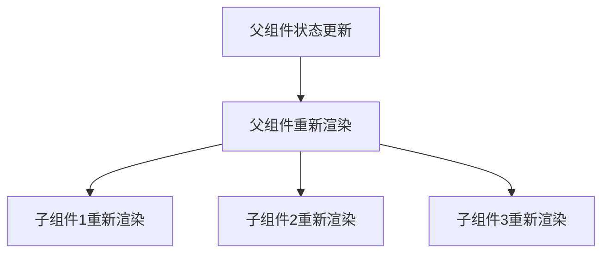
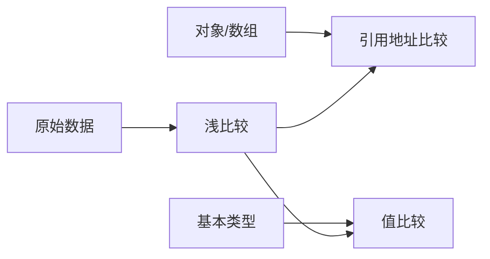

在大型 React 应用中，组件渲染性能直接影响用户体验。

## 渲染机制与优化

当父组件状态变化时，React 默认会重新渲染该组件及其所有子组件，即使子组件的 props 未改变。

这种机制可能导致不必要的渲染开销：



因此，优化核心策略是 阻断不必要的渲染链，我们可以通过 **浅比较(shallow comparison)** 来实现这一目标。

## 类组件渲染性能优化

::: warning
`shouldComponentUpdate` 和 `PureComponent` 主要用于 类组件，虽然 ==React 更推荐使用函数式组件=={.warning}，
但了解其渲染优化策略是有必要的。
不仅仅是因为对于维护旧的类组件代码有帮助，而且在优化策略上是相通的。
:::

我们先来看一个简单的 类组件 例子：

```tsx
class Child extends React.Component {
  render() {
    console.log('Child rendered')
    return (
      <div>
        <h1>
          Child Count:
          {this.props.count}
        </h1>
      </div>
    )
  }
}

class App extends React.Component {
  state = {
    count: 0,
    otherValue: 'Hello',
  }

  increment = () => {
    this.setState(prevState => ({ count: prevState.count + 1 }))
  }

  changeOtherValue = () => {
    this.setState(prevState => ({ otherValue: prevState.otherValue === 'Hello' ? 'World' : 'Hello' }))
  }

  render() {
    console.log('Parent rendered')
    return (
      <div>
        <h1>
          otherValue:
          {this.state.otherValue}
        </h1>
        <Child count={this.state.count} />
        <button onClick={this.increment}>Increment Count</button>
        <button onClick={this.changeOtherValue}>Change Other Value</button>
      </div>
    )
  }
}

export default App
```

在这个应用中，`Child` 组件的 Props `count` 是 `App` 的 `State` 的一部分。

当我们点击 `Increment Count` 按钮时，`App` 的 `count` 会增加，
此时，`App` 会重新渲染，`Child` 也会重新渲染。

::: center
{style="max-width:640px"}
:::

当我们点击 `Change Other Value` 按钮时，`otherValue` 发生了改变，`App` 会重新渲染。
虽然 `Child` 组件没有用到 `otherValue`, 但 `Child` 依然重新渲染了。

::: center
{style="max-width:640px"}
:::

这是因为当 Parent 组件的 `state` 或 `props` 发生变化时，React 会默认重新渲染该组件及其所有 Child 组件。

在这种情况下，我们可以通过 `shouldComponentUpdate` 来进行优化，来阻断不必要的渲染。

### shouldComponentUpdate

[**React** -> Component -> shouldComponentUpdate](https://zh-hans.react.dev/reference/react/Component#shouldcomponentupdate){.read-more}

`shouldComponentUpdate` 是 类组件 的生命周期。它用于决定组件是否需要更新。当返回 `true` 时，表示组件可以更新，
返回 `false` 时，表示组件不需要更新。

我们对 `Child` 组件进行优化：

```tsx
class Child extends React.Component {
  shouldComponentUpdate(nextProps) { // [!code ++:4]
    // 仅当count变化时更新
    return this.props.count !== nextProps.count
  }

  render() {
    console.log('Child rendered')
    // ...
  }
}
```

我们重新分别点击 `Increment Count` 和 `Change Other Value` 按钮，可以看到:

::: center
{style="max-width:640px"}
:::

### PureComponent

[**React** -> PureComponent](https://zh-hans.react.dev/reference/react/PureComponent){.read-more}

除了使用 `shouldComponentUpdate` 进行优化外，React 还提供了一个更加简便的方法：使用 `PureComponent`。

`PureComponent` 类似于 `Component`，但是当 `props` 和 `state` 与之前保持一致时会跳过重新渲染。

我们使用 `PureComponent` 重写 `Child` 组件:

```tsx
class Child extends React.PureComponent {
  render() {
    console.log('Child rendered')
    return (
      <div>
        <h1>
          Child Count:
          {this.props.count}
        </h1>
      </div>
    )
  }
}
```

当 `count` 一致时，`Child` 会跳过重新渲染。

需要注意的是，`PureComponent` 只对 `Props` 和 `State` 进行浅比较，
如果 props 或 state 中包含复杂的数据结构（如对象或数组），浅比较可能无法正确判断数据是否发生变化。
在这种情况下，可以使用深比较或手动实现 `shouldComponentUpdate` 来确保组件正确地更新。

**浅比较的注意事项**：



:::important 重要提示
当 props 包含嵌套对象时，需返回新引用（如 `[...list]` 或 `{...obj}`）才能触发更新。
:::

## 函数组件渲染性能优化

我们来看下面的 函数组件 例子：

::: tip 这是 React 推荐的函数组件写法
它实现了与上面的 类组件实现的 应用完全相同的功能。
:::

```tsx
import { useState } from 'react'

function Child({ count }) {
  console.log('Child rendered')
  return (
    <div>
      <h1>
        Child Count:
        {count}
      </h1>
    </div>
  )
}

function App() {
  const [count, setCount] = useState(0)
  const [otherValue, setOtherValue] = useState('Hello')

  const increment = () => {
    setCount(prevCount => prevCount + 1)
  }

  const changeOtherValue = () => {
    setOtherValue(prevValue => prevValue === 'Hello' ? 'World' : 'Hello')
  }

  console.log('Parent rendered')
  return (
    <div>
      <h1>
        otherValue:
        {otherValue}
      </h1>
      <Child count={count} />
      <button onClick={increment}>Increment Count</button>
      <button onClick={changeOtherValue}>Change Other Value</button>
    </div>
  )
}

export default App
```

当我们点击 `Increment Count` 按钮时，`App` 的 `count` 会增加，
此时，`App` 会重新渲染，`Child` 也会重新渲染。

::: center
{style="max-width:640px"}
:::

当我们点击 `Change Other Value` 按钮时，`otherValue` 发生了改变，`App` 会重新渲染。
虽然 `Child` 组件没有用到 `otherValue`, 但 `Child` 依然重新渲染了。

::: center
{style="max-width:640px"}
:::

### React.memo

[**React** -> memo](https://zh-hans.react.dev/reference/react/memo){.read-more}

`React.memo` 是一个高阶组件，使用 `memo` 将组件包装起来，以获得该组件的一个 记忆化 版本。
通常情况下，只要该组件的 props 没有改变，这个记忆化版本就不会在其父组件重新渲染时重新渲染。

我们使用 `React.memo` 重写 `Child` 组件:

```tsx
const Child = React.memo(({ count }) => { // [!code ++]
  console.log('Child rendered')
  return (
    <div>
      <h1>
        Child Count:
        {count}
      </h1>
    </div>
  )
})
```

我们重新分别点击 `Increment Count` 和 `Change Other Value` 按钮，可以看到:

::: center
{style="max-width:640px"}
:::

::: tip 可以把 `React.memo` 看做是 `PureComponent` 的等价实现
`Rect.memo` 只对 `props` 进行浅比较
:::

对于 `props` 为比较复杂的数据结构时，我们可以在需要更新时返回一个新的对象或数组，以避免浅比较的问题。

还可以使用 `React.memo` 的第二个参数，自定义 `props` 的比较逻辑。

**React.memo 语法**：

```tsx
const Child = React.memo(
  props => <div>{/* ... */}</div>,
  (prevProps, nextProps) => {
    // 自定义比较逻辑
    // 如果返回true，表示新旧props相等，不渲染 与shouldComponentUpdate相反
    // 如果返回false，表示新旧props不等，重新渲染
  }
)
```

### useCallback

[**React** -> useCallback](https://zh-hans.react.dev/reference/react/useCallback){.read-more}

`useCallback` 是 React 提供的 `hook`，它用于在多次渲染中 ==缓存函数==。

我们重新调整下 `App` 的代码，将 `increment` 作为 `Child` 的 `props`，将按钮置于 `Child` 中：

```tsx
import React, { useState } from 'react'

const Child = React.memo(({ count, increment }: { count: number, increment: () => void }) => {
  console.log('Child rendered')
  return (
    <div>
      <h1>
        Child Count:
        {count}
      </h1>
      <button onClick={increment}>Increment Count</button>
    </div>
  )
})

function App() {
  const [count, setCount] = useState(0)
  const [otherValue, setOtherValue] = useState('Hello')

  const increment = () => {
    setCount(prevCount => prevCount + 1)
  }

  const changeOtherValue = () => {
    setOtherValue(prevValue => prevValue === 'Hello' ? 'World' : 'Hello')
  }

  console.log('Parent rendered')
  return (
    <div>
      <h1>
        otherValue:
        {otherValue}
      </h1>
      <button onClick={changeOtherValue}>Change Other Value</button>
      <Child count={count} increment={increment} />
    </div>
  )
}

export default App
```

分别点击 `Increment Count` 和 `Change Other Value` 按钮，可以看到:

::: center
{style="max-width:640px"}
:::

当 `otherValue` 变化时，`App` 和 `Child` 都重新渲染了， `Child` 组件并没有使用 `otherValue` 。

实际问题是由于 `App` **每次重新渲染时，都创建了新的 `increment` 函数**，这对于 `Child` 来说，
`props` 发生了变化，所以重新渲染。

这显然是不必要的，可以使用 `useCallback` 来缓存 `increment` 函数:

```tsx
function App() {
  // ...
  const increment = useCallback(() => {
    setCount(prevCount => prevCount + 1)
  }, [])
  // ...
}
```

`useCallback` 接收两个参数，第一个参数是要缓存的函数，第二个参数是一个依赖项数组，如果依赖项发生变化，缓存的函数会重新创建。

在本示例中，由于 `increment` 比较简单，它不需要依赖项，所以只需要传入一个空数组即可。

分别点击 `Increment Count` 和 `Change Other Value` 按钮，可以看到:

::: center
{style="max-width:640px"}
:::

可以看到，当 `otherValue` 变化时，`Child` 没有重新渲染了，这符合我们的预期。

::: important 实际开发中， `React.memo` 和 `useCallback` 通常会一起使用，以减少不必要的组件渲染，从而提高性能。
:::

::: warning 注意
在某些文章中会提到 `useCallback` 可以避免不必要的 **函数创建** 。这种说法是 ==错误的=={.danger} ！！！

函数组件在每次执行时，都会创建新的执行上下文，在函数作用域内，传入 `useCallback` 的函数，每次都是一个新的函数。

`useCallback` 的核心并不是在阻止函数的创建，而是 ==控制函数引用的更新时机=={.important} 。从而避免与其相关的组件
由于引用发生变化，导致不必要的重新渲染，从而提高性能。
:::

### useMemo

[**React** -> useMemo](https://zh-hans.react.dev/reference/react/useMemo){.read-more}

`useMemo` 用于缓存计算结果，避免在每次渲染时重新计算。

它适合在一些计算代价比较大的操作中使用。

::: info 说明
`useMemo` 有些类似于 `Vue` 的 `computed` 计算属性。

它缓存了当前计算结果，在下次渲染时，只要依赖项没有发生变化，则跳过计算，直接返回缓存的结果。
:::

举个例子，当我们在实现一个购物车功能时，总价需要根据当前购物车中的商品进行计算，
如果每次重新渲染时都需要重新计算总价，可能产生的代价是高昂的，浪费了性能。

我们可以使用 `useMemo` 来缓存计算结果，避免在每次渲染时重新计算:

```tsx
function ShoppingCart({ items }) {
  const total = useMemo(() => {
    console.log('计算总价...')
    return items.reduce((sum, item) =>
      sum + item.price * item.quantity, 0)
  }, [items]) // 仅当items变化时重新计算

  return (
    <div>
      总价:
      {total}
    </div>
  )
}
```

我们回到最开始的 `App` 应用，增加一个 `doubleCount` ，它需要根据 `count` 进行计算:

```tsx
function App() {
  // ...
  // 处于演示目的，使用一个简单的函数，实际可以直接写为 doubleCount = count * 2
  const doubleCount = () => { // [!code ++:4]
    console.log('doubleCount called')
    return count * 2
  }
  // ...
  console.log('App rendered')
  return (
    <div>
      {/* ... */}
      <p>
        Double Count:
        {doubleCount()}
      </p>
    </div>
  )
}
```

::: center
{style="max-width:640px"}
:::

可以看到，不管是更新 `count` 还是更新 `otherValue` ， `doubleCount` 都会重新计算。
但 `doubleCount` 仅需要在 `count` 发生变化时才会重新计算，而 `otherValue` 变化时没必要重新计算。

此时我们可以使用 `useMemo` 来缓存计算结果，避免在每次渲染时重新计算:

```tsx
function App() {
  // ...
  const doubleCount = useMemo(() => { // [!code ++:4]
    console.log('doubleCount called')
    return count * 2
  }, [count])
  // ...
  console.log('App rendered')
  return (
    <div>
      {/* ... */}
      <p>
        Double Count:
        {doubleCount}
      </p>
    </div>
  )
}
```

::: center
{style="max-width:640px"}
:::

可以看到， 当 `count` 变化时，`doubleCount` 重新计算，但 `otherValue` 变化时，`doubleCount` 没有重新计算，这符合我们的预期。

### 对比

| 特性       | React.memo                                  | useCallback                        | useMemo                            |
| :--------: | ------------------------------------------- | ---------------------------------- | ---------------------------------- |
| 主要功能   | 缓存组件                                    | 缓存函数                           | 缓存计算结果                       |
| 使用场景   | 当传入的 props 没有变化时，避免组件重新渲染 | 当函数没有变化时，避免函数重新执行 | 当计算结果没有变化时，避免重新计算 |
| 依赖项     | props                                       | 依赖数组                           | 依赖数组                           |
| 缓存目标   | 组件实例                                    | 函数引用                           | 计算结果                           |
| 返回值类型 | 组件                                        | 函数                               | 任意值                             |

## 总结

React 渲染优化核心在于 **精确控制组件更新时机** 。

特别需要注意的是：

* 所有优化都基于浅比较原理
* 函数组件优化需要 hooks 的配合使用
* 复杂数据结构需保证引用更新可预测性

::: important 性能优化第一原则
只有在性能监测工具（如 React DevTools Profiler）确认存在性能问题后才进行优化，避免过早优化带来的代码复杂度。
:::
