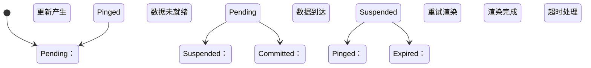
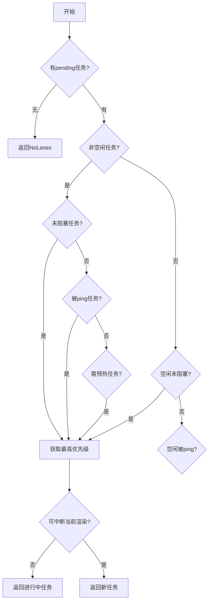
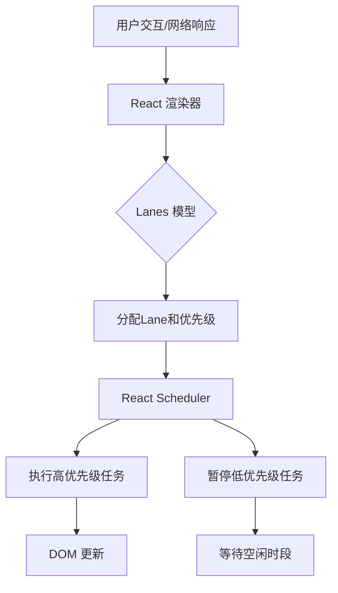

::: warning 🚧 施工中...
:::

React 的并发渲染能力依赖于其精细的优先级调度系统，==Lanes 模型== 是这一系统的基石。

## Lanes 模型

它使用 ==31 位二进制掩码== 表示不同优先级的更新任务，每个位称为一个 "Lane"（优先级通道）。

```txt
> 0b 0 0 0 0 0 0 0 0 0 0 0 0 0 0 0 0 0 0 0 0 0 0 0 0 0 0 0 0 0 0 1
                                                                 ^
                                                                最高优先级
> 0b 0 0 0 0 0 0 0 0 0 0 0 0 0 0 0 0 0 0 0 0 0 0 0 0 0 0 0 0 0 1 0
                                                               ^
                                                               第二优先级
> 0b 0 0 0 0 0 0 0 0 0 0 0 0 0 0 0 0 0 0 0 0 0 0 0 0 0 0 1 0 0 1 1
                                                         ^     ^ ^
                                                         优先级组合
```

* 每个 Lane 对应一个二进制位，共 31 个
* 优先级从右向左递减（SyncLane 在 bit 2）
* 相同类型任务复用 lane 组（如 TransitionLanes 含 14 个 lane）

## Lanes 类型

1. **同步优先级**
   * `SyncHydrationLane`
   * `SyncLane`
2. **连续输入优先级**
   * `InputContinuousHydrationLane`
   * `InputContinuousLane`
3. **默认优先级**
   * `DefaultHydrationLane`
   * `DefaultLane`
4. **过渡优先级**
   * `TransitionHydrationLane`
   * `TransitionLane`, `TransitionLane1` ~ `TransitionLane14`
5. **重试优先级**
   * `RetryLanes`
   * `RetryLane1` ~ `RetryLane4`
6. **空闲优先级**
   * `IdleHydrationLane`
   * `IdleLane`
   * `OffscreenLane`
   * `DeferredLane`

[源码位置：**facebook/react** / **react-reconciler/src/ReactFiberLane.js#L39**](https://github.com/facebook/react/blob/main/packages/react-reconciler/src/ReactFiberLane.js#L36-L105){.read-more}

```ts :collapsed-lines
export const TotalLanes = 31

export const NoLanes: Lanes = /*                        */ 0b0000000000000000000000000000000
export const NoLane: Lane = /*                          */ 0b0000000000000000000000000000000

export const SyncHydrationLane: Lane = /*               */ 0b0000000000000000000000000000001
export const SyncLane: Lane = /*                        */ 0b0000000000000000000000000000010
export const SyncLaneIndex: number = 1

export const InputContinuousHydrationLane: Lane = /*    */ 0b0000000000000000000000000000100
export const InputContinuousLane: Lane = /*             */ 0b0000000000000000000000000001000

export const DefaultHydrationLane: Lane = /*            */ 0b0000000000000000000000000010000
export const DefaultLane: Lane = /*                     */ 0b0000000000000000000000000100000

export const SyncUpdateLanes: Lane
  = SyncLane | InputContinuousLane | DefaultLane

export const GestureLane: Lane = /*                     */ 0b0000000000000000000000001000000

const TransitionHydrationLane: Lane = /*                */ 0b0000000000000000000000010000000
const TransitionLanes: Lanes = /*                       */ 0b0000000001111111111111100000000
const TransitionLane1: Lane = /*                        */ 0b0000000000000000000000100000000
const TransitionLane2: Lane = /*                        */ 0b0000000000000000000001000000000
const TransitionLane3: Lane = /*                        */ 0b0000000000000000000010000000000
const TransitionLane4: Lane = /*                        */ 0b0000000000000000000100000000000
const TransitionLane5: Lane = /*                        */ 0b0000000000000000001000000000000
const TransitionLane6: Lane = /*                        */ 0b0000000000000000010000000000000
const TransitionLane7: Lane = /*                        */ 0b0000000000000000100000000000000
const TransitionLane8: Lane = /*                        */ 0b0000000000000001000000000000000
const TransitionLane9: Lane = /*                        */ 0b0000000000000010000000000000000
const TransitionLane10: Lane = /*                       */ 0b0000000000000100000000000000000
const TransitionLane11: Lane = /*                       */ 0b0000000000001000000000000000000
const TransitionLane12: Lane = /*                       */ 0b0000000000010000000000000000000
const TransitionLane13: Lane = /*                       */ 0b0000000000100000000000000000000
const TransitionLane14: Lane = /*                       */ 0b0000000001000000000000000000000

const RetryLanes: Lanes = /*                            */ 0b0000011110000000000000000000000
const RetryLane1: Lane = /*                             */ 0b0000000010000000000000000000000
const RetryLane2: Lane = /*                             */ 0b0000000100000000000000000000000
const RetryLane3: Lane = /*                             */ 0b0000001000000000000000000000000
const RetryLane4: Lane = /*                             */ 0b0000010000000000000000000000000

export const SomeRetryLane: Lane = RetryLane1

export const SelectiveHydrationLane: Lane = /*          */ 0b0000100000000000000000000000000

const NonIdleLanes: Lanes = /*                          */ 0b0000111111111111111111111111111

export const IdleHydrationLane: Lane = /*               */ 0b0001000000000000000000000000000
export const IdleLane: Lane = /*                        */ 0b0010000000000000000000000000000

export const OffscreenLane: Lane = /*                   */ 0b0100000000000000000000000000000
export const DeferredLane: Lane = /*                    */ 0b1000000000000000000000000000000

// Any lane that might schedule an update. This is used to detect infinite
// update loops, so it doesn't include hydration lanes or retries.
export const UpdateLanes: Lanes
  = SyncLane | InputContinuousLane | DefaultLane | TransitionLanes

export const HydrationLanes
  = SyncHydrationLane
    | InputContinuousHydrationLane
    | DefaultHydrationLane
    | TransitionHydrationLane
    | SelectiveHydrationLane
    | IdleHydrationLane
```

## Lanes 操作机制

### 优先级计算

React 使用位运算实现高效优先级管理：

```ts
// 获取最高优先级Lane（最右侧的1）
export function getHighestPriorityLane(lanes: Lanes): Lane {
  return lanes & -lanes // 补码技巧：-lanes = ~lanes + 1
}

// 获取等或更高优先级的Lanes集合
function getLanesOfEqualOrHigherPriority(lanes: Lanes): Lanes {
  const lowestIndex = 31 - clz32(lanes) // 计算前导零
  return (1 << (lowestIndex + 1)) - 1 // 生成掩码
}
```

**位运算优势：**

* $O(1)$ 时间复杂度完成优先级查询
* 单次操作处理多个Lane（批量更新）
* 内存紧凑（单数字存储完整状态）

### 调度状态机

React 使用三状态模型管理任务生命周期：



对应代码实现：

```ts
// 标记挂起任务
export function markRootSuspended(root: FiberRoot, suspendedLanes: Lanes) {
  root.suspendedLanes |= suspendedLanes
  root.pingedLanes &= ~suspendedLanes
}

// 标记数据到达
export function markRootPinged(root: FiberRoot, pingedLanes: Lanes) {
  root.pingedLanes |= root.suspendedLanes & pingedLanes
}

// 检测过期任务
export function markStarvedLanesAsExpired(root, currentTime) {
  let lanes = root.pendingLanes
  while (lanes) {
    const index = 31 - clz32(lanes)
    const lane = 1 << index
    if (root.expirationTimes[index] <= currentTime) {
      root.expiredLanes |= lane // 标记过期
    }
    lanes &= ~lane
  }
}
```

## 任务调度算法

### 调度决策流程



### 关键调度逻辑

```ts
export function getNextLanes(root, wipLanes, rootHasPendingCommit) {
  const pendingLanes = root.pendingLanes

  // 分层处理策略
  const nonIdlePendingLanes = pendingLanes & NonIdleLanes
  if (nonIdlePendingLanes !== NoLanes) {
    // 优先级1：未阻塞任务
    const unblocked = nonIdlePendingLanes & ~root.suspendedLanes
    if (unblocked !== NoLanes)
      return getHighestPriorityLanes(unblocked)

    // 优先级2：被ping任务
    const pinged = nonIdlePendingLanes & root.pingedLanes
    if (pinged !== NoLanes)
      return getHighestPriorityLanes(pinged)

    // 优先级3：需预热任务
    if (!rootHasPendingCommit) {
      const toPrewarm = nonIdlePendingLanes & ~root.warmLanes
      if (toPrewarm !== NoLanes)
        return getHighestPriorityLanes(toPrewarm)
    }
  }

  // 中断保护机制
  if (wipLanes !== NoLanes && wipLanes !== nextLanes) {
    const nextLane = getHighestPriorityLane(nextLanes)
    const wipLane = getHighestPriorityLane(wipLanes)
    if (nextLane >= wipLane)
      return wipLanes // 不中断当前渲染
  }
}
```

**调度策略**：

* **非空闲任务优先**：确保用户交互及时响应
* **状态分层处理**：未阻塞任务 > 被ping任务 > 需预热任务
* **渲染连续性保护**：避免高优先级任务中断进行中的低优先级渲染

### 嵌套更新处理

React 通过纠缠（Entanglement）机制处理关联更新：

```ts
export function markRootEntangled(root, entangledLanes) {
  root.entangledLanes |= entangledLanes
  const entanglements = root.entanglements

  let lanes = root.entangledLanes
  while (lanes) {
    const index = 31 - clz32(lanes)
    const lane = 1 << index
    // 传播纠缠关系
    entanglements[index] |= entangledLanes
    lanes &= ~lane
  }
}
```

**纠缠场景**：

* 同一事件触发的多个更新
* 父组件更新触发的子组件更新
* `useDeferredValue` 关联更新

### 过期时间计算

```ts
function computeExpirationTime(lane, currentTime) {
  switch (lane) {
    case SyncLane: return currentTime + 250 // 250ms超时
    case DefaultLane: return currentTime + 5000 // 5s超时
    case TransitionLane1: return currentTime + 5000 // 5s超时
    case IdleLane: return NoTimestamp // 永不过期
  }
}
```

### 批量更新处理

```ts
export function upgradePendingLanesToSync(root, lanesToUpgrade) {
  root.pendingLanes |= SyncLane
  root.entangledLanes |= SyncLane

  let lanes = lanesToUpgrade
  while (lanes) {
    const index = 31 - clz32(lanes)
    const lane = 1 << index
    // 将多个Lane关联到SyncLane
    root.entanglements[SyncLaneIndex] |= lane
    lanes &= ~lane
  }
}
```

## 与Scheduler的协同


