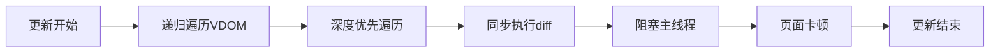
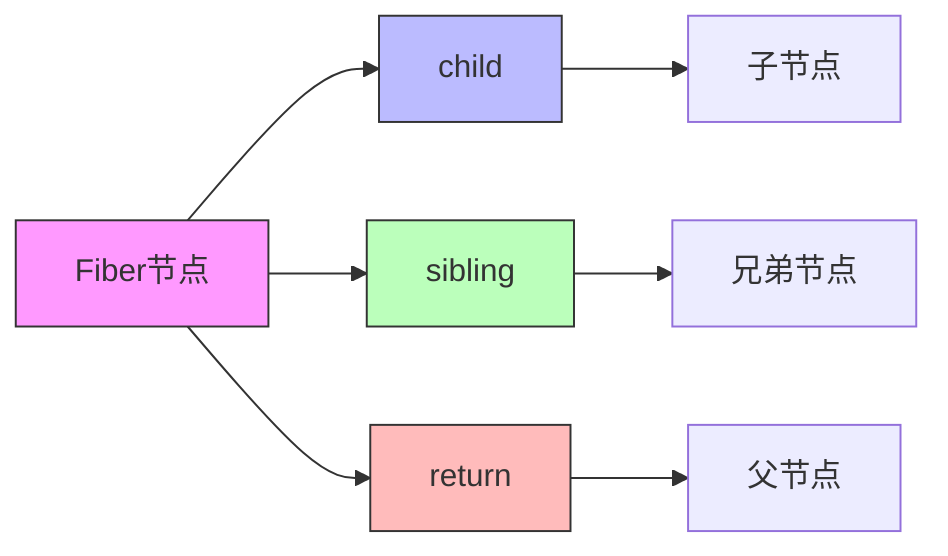
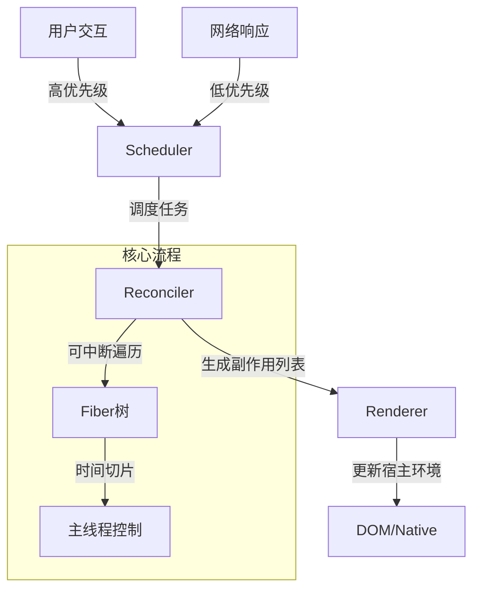
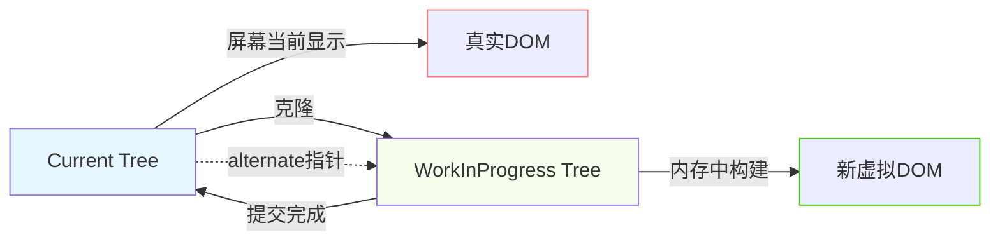

## 前言

在探讨 React 内部机制时，经常提及一个关键转折点：**React 16 引入了Fiber架构**。这引发了一系列核心问题：何为 Fiber 架构？它所取代的原有架构是什么？React 团队引入 Fiber 架构的根本动因何在？

本文旨在系统解析Fiber架构的核心概念与设计思想，揭示其如何解决历史架构的瓶颈。深入的技术细节（如具体调度算法、优先级机制）将在后续专题文章中探讨。

**前置知识：** 深入理解 **Virtual DOM (虚拟DOM)** 是掌握React协调（Reconciliation）机制的基础。

## 栈式协调器（Stack Reconciler）

在Fiber架构诞生前，React的核心更新机制依赖于 **栈式协调器（Stack Reconciler）** 。

其核心在于通过 **递归深度优先遍历** 的方式对比新旧虚拟DOM树（Virtual DOM Tree），并计算最小更新操作（diff算法）。



以下是一个简化的虚拟DOM树结构示例，栈式协调器正是递归遍历此类结构：

```js
const tree = {
  type: 'div',
  props: {
    id: 'list',
    children: [
      {
        type: 'ul',
        props: {
          children: [
            {
              type: 'li',
              props: {
                children: 'apple'
              }
            },
            // ... 其他子节点
          ]
        }
      }
    ]
  }
}
```

### 主要特性与局限性

1. **同步不可中断（Synchronous & Uninterruptible）**：
   * 更新流程一旦启动（即开始递归遍历与 diff 计算），必须 **连续执行直至完成** 。
   * 无法将庞大的更新任务拆分为小单元，也无法在执行过程中响应更高优先级的任务。

2. **性能瓶颈（Performance Bottlenecks）**：
   * 虽然 Virtual DOM 操作在 JavaScript 层面执行，相比直接操作真实 DOM 已是显著优化，但在处理**大型应用、深层嵌套组件树或复杂数据结构**时，递归遍历和 diff 计算仍可能消耗大量主线程（Main Thread）时间。
   * 长时间占用主线程会导致 **页面渲染卡顿（Jank）**、**交互响应延迟（Input Lag）**，严重损害用户体验（User Experience, UX）。

3. **缺乏任务优先级（Absence of Task Prioritization）**：
   * 所有更新任务均按生成顺序 **同步、无差别执行** 。
   * 当低优先级任务（如后台数据拉取后的UI更新）正在进行时，高优先级任务（如用户输入、动画）必须等待，导致 **高优先级交互无法得到即时响应** （例如，用户输入框输入时，毫秒级的延迟即可被感知为卡顿，而数据加载指示器更新延迟几秒可能尚可接受）。

### 核心瓶颈

栈式协调器主要面临两类影响UX的核心瓶颈：

1. **CPU瓶颈**：
   * **本质**：应用的计算复杂度（Virtual DOM diff、组件渲染逻辑）超出了单次事件循环（Event Loop）中主线程的处理能力上限。
   * **表现**：长时间、同步的JavaScript执行阻塞主线程，导致UI渲染与用户交互停滞。这是栈式架构最直接的性能痛点。

2. **I/O瓶颈**：
   * **本质**：网络请求延迟等I/O操作耗时是客观存在的物理限制。
   * **前端优化目标**：在I/O等待期间，主线程应保持响应能力，优先处理用户可感知的交互；同时，需根据任务来源（用户交互 vs. 后台数据）**区分更新优先级**，确保高优先级任务不被低优先级任务阻塞。栈式架构对此无能为力。

## Fiber架构

Fiber 架构是 React 为解决栈式协调器瓶颈而设计的全新协调引擎。

其核心思想是将 **同步不可中断的更新过程** 重构为 **异步可中断、可恢复且具备优先级调度能力** 的机制。

以下阐述其关键概念：

### Fiber节点（Fiber Node）



* **本质**：Fiber节点是Fiber架构下 **工作单元（Work Unit）** 的抽象，也是虚拟DOM节点在Fiber架构中的具体实现形式。

* **核心创新：链表数据结构**：与栈式协调器基于递归树不同，Fiber 节点通过 **显式链表指针** （`child`, `sibling`, `return`）组织成一颗**Fiber树**。这种结构赋予了遍历过程 **可暂停、可恢复、可回溯** 的能力。

* **结构示意**：

  * `child`: 指向当前节点的 **第一个子Fiber节点**。
  * `sibling`: 指向当前节点的 **下一个兄弟Fiber节点**。
  * `return`: 指向当前节点的 **父Fiber节点** （完成当前节点工作后需返回的节点）。

* **Fiber节点对象（源码简化版，附关键注释）**：

  ```ts
  function FiberNode(
    tag: WorkTag, // 节点类型标识：FunctionComponent, ClassComponent, HostRoot(根), HostComponent(DOM元素)等
    pendingProps: mixed, // 从新更新中接收到的、待处理的props
    key: null | string, // React元素的key，用于列表diff优化
    mode: TypeOfMode, // 渲染模式标志位（如ConcurrentMode, StrictMode）
  ) {
    // 实例标识与关联
    this.tag = tag
    this.key = key
    this.elementType = null // 创建该元素的函数/类或DOM标签名 (e.g., 'div', MyComponent)
    this.type = null // 与elementType类似，但对于懒加载组件可能不同
    this.stateNode = null // 关联的类组件实例、Host组件(DOM节点) 或 FiberRoot

    // Fiber树链表指针 (核心数据结构)
    this.return = null // 指向父Fiber节点
    this.child = null // 指向第一个子Fiber节点
    this.sibling = null // 指向下一个兄弟Fiber节点
    this.index = 0 // 在父节点children中的索引

    this.ref = null // ref引用

    // Props 与 State 管理
    this.pendingProps = pendingProps // 新传入的props
    this.memoizedProps = null // 上次渲染使用的props
    this.updateQueue = null // 状态更新、回调函数的队列
    this.memoizedState = null // 上次渲染产生的state (hooks链表等)
    this.dependencies = null // contexts, events订阅等依赖

    this.mode = mode // 渲染模式

    // 副作用 (Effects) 标记
    this.flags = NoFlags // 标记该Fiber节点需要进行的操作(Placement, Update, Deletion等)
    this.subtreeFlags = NoFlags // 子树中存在的副作用标记 (优化遍历)
    this.deletions = null // 记录待删除的子节点 (用于安全卸载)

    // 优先级与调度相关 (Lane 模型)
    this.lanes = NoLanes // 该Fiber上待处理的更新优先级 (lanes)
    this.childLanes = NoLanes // 子树中存在的最高优先级 (优化子树的跳过)

    // 双缓冲技术关键指针
    this.alternate = null // 指向current树或workInProgress树中的对应节点

    // 性能分析(Profiler)相关属性 (开发/分析构建下启用)
    if (enableProfilerTimer) { /* ... */ }
    // 开发模式调试属性
    if (__DEV__) { /* ... */ }
  }
  ```

### 调度器（Scheduler）、协调器（Reconciler）、渲染器（Renderer）



React Fiber 架构将渲染流程清晰地划分为三个协同工作的层级：

* **调度器（Scheduler）**：

  * **职责**：作为 React 16+ 新增的核心模块，负责 **任务调度**。
    它管理一个任务队列，根据任务的 **优先级**
    （如：`Immediate` - 用户输入、`UserBlocking` - 交互反馈、`Normal` - UI更新、`Low` - 数据分析、`Idle` - 非必要任务）决定任务的执行顺序。
  * **解决关键问题**：直接应对 **I/O瓶颈优化需求** 和 **高优先级任务抢占需求** 。确保用户交互（高优先级）能及时打断并插队正在进行的低优先级渲染任务（如大数据列表更新），极大提升应用响应度（Responsiveness）。
  * **机制**：通常利用浏览器的`requestIdleCallback`(或polyfill/shim)在浏览器空闲期执行低优先级任务，并实现任务的中断与恢复。

* **协调器（Reconciler） - 运行于Fiber架构之上**：

  * **职责**：执行核心的 **diff算法** 。它接收更新请求，在内存中操作 **工作树（workInProgress tree）** ，对比新旧Fiber树（或根据状态变化生成新树），计算出 **副作用列表（Effect List）** - 即描述哪些节点需要被插入、更新或删除。
  * **关键特性**：得益于Fiber节点的链表结构，协调过程是 **可中断的异步过程** 。协调器与调度器紧密配合，根据调度器分配的优先级和时间片进行工作。

* **渲染器（Renderer）** (如 ReactDOM, React Native)：

  * **职责**：**平台特异性渲染**。接收协调器产生的副作用列表，将其 **安全、高效地应用到真实的宿主环境（如浏览器DOM或原生移动视图）** 上，完成最终的UI更新。
  * **关注点分离**：Renderer不关心如何计算更新，只负责执行更新命令。这使得React核心协调逻辑可以跨平台复用。

### 时间切片（Time Slicing）

```mermaid
gantt
    title React时间切片机制执行流程（单位：毫秒）
    dateFormat  X
    axisFormat %L
    section 帧1 (16.6ms)
    JS任务单元A : crit, a1, 0, 4
    JS任务单元B : a2, after a1, 4
    浏览器渲染阶段 : active, b1, after a2, 5
    空闲时段 : done, b2, after b1, 3.6

    section 帧2 (16.6ms)
    JS任务单元C : crit, c1, after b2, 5
    用户输入处理 : active, c2, after c1, 3
    JS任务单元D : c3, after c2, 4
    浏览器渲染阶段 : active, c4, after c3, 4.6
```



* **核心思想**：将原本可能长时间阻塞主线程的大型更新任务，**分解成多个小的、有限时的工作单元**。
* **实现方式**：调度器与协调器协同工作。协调器在遍历处理Fiber节点时，会检查当前帧剩余时间（通过调度器提供的能力）。如果一个工作单元执行时间过长或超过了分配的帧时间（如5ms），协调器会暂停当前工作，将控制权交还给浏览器，让其处理更紧急的任务（如绘制、用户输入）。
* **价值**：有效避免JavaScript长时间独占主线程，保证浏览器有 **足够的时间进行渲染（Rendering）和响应用户输入（Input Handling）**，从而维持界面的 **流畅性（Fluency）** 和 **响应性（Responsiveness）**。这是解决**CPU瓶颈**的核心手段之一。

### 双重缓冲（Double Buffering）



* **技术类比**：借鉴图形学中的双重缓冲技术，避免画面撕裂。

* **在Fiber中的实现**：React在内存中同时维护两棵Fiber树：

  * **当前树（Current Tree）**：对应屏幕上当前显示的UI状态。Fiber节点的`stateNode`指向真实的DOM节点。
  * **工作树（Work-In-Progress Tree, WIP Tree）**：正在后台构建的、反映下一次更新后UI状态的树。构建过程不会直接影响当前显示的UI。

* **工作流程**：

  1. 更新开始时，协调器基于当前树克隆（或创建）出工作树。
  2. 所有diff计算和状态更新都在工作树上进行。
  3. 当工作树完整构建完成（或达到可提交状态），且当前无更高优先级任务时，Renderer将 **原子性地（Atomically）** 将工作树的更新应用到真实DOM上。此过程称为 **提交（Commit）**。
  4. 提交完成后，工作树即成为新的当前树。旧的当前树节点可能被回收或作为下次更新的备用（Alternate）。

* **优势**：

  * **非破坏性更新**：更新计算过程不影响当前显示，确保UI稳定性。
  * **快速回滚**：若更新过程中有更高优先级任务介入，可直接丢弃未完成的工作树，避免显示中间的不一致状态。
  * **并发模式基础**：是实现异步渲染（Concurrent Rendering）的关键机制。

## 结语

Fiber架构通过引入 **Fiber节点（链表结构）**、**任务调度器（Scheduler）**、**时间切片（Time Slicing）** 和 **双重缓冲（Double Buffering）** 等核心机制，成功将React的协调过程从 **同步不可中断** 转变为 **异步可中断且具备优先级调度能力**。

这一变革从根本上解决了栈式协调器面临的 **CPU瓶颈**（长时间任务阻塞主线程）与 **I/O瓶颈优化需求**（优先级调度），为React应用的 **流畅性、响应性** 奠定了坚实基础。理解这些基础概念是深入探索React Concurrent Features（并发特性）如`useTransition`、`useDeferredValue`以及Suspense流式渲染等高级能力的前提。
