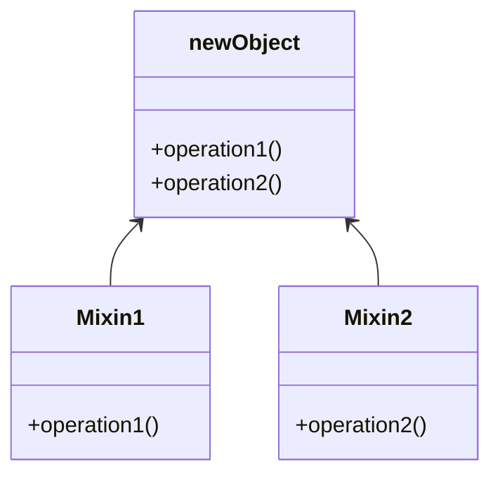

::: tip
Mixin 模式在 JavaScript 中提供了一种强大的代码复用机制，尤其适合需要横向扩展功能的场景。
然而，需谨慎处理命名冲突和代码组织问题。随着 ES6 Class 和组合式 API（如 Vue 3 Composables、React Hooks）的普及，Mixin 的使用有所减少，但其核心思想（组合优于继承）仍是现代开发的重要原则。
:::

## 什么是混入模式？

\==Mixin(混入)模式== 是一种行为型设计模式，它允许在不使用传统继承的情况下向类或对象添加功能。
它通过组合而非继承实现代码复用，支持将多个功能模块（Mixin）动态“混合”到目标对象中，避免了单继承的局限性。



## 实现混入模式

### 对象合并

将 Mixin 对象的方法复制到目标类的原型中（使用 `Object.assign`）：

```js
const loggerMixin = {
  log(message) {
    console.log(`Log: ${message}`)
  }
}

class User {}
Object.assign(User.prototype, loggerMixin)

const user = new User()
user.log('Hello') // Log: Hello
```

### 函数式混入

通过函数返回扩展后的类，支持链式组合多个 Mixin：

```js
function Serializable(Base) {
  return class extends Base {
    serialize() {
      return JSON.stringify(this)
    }
  }
}

function Loggable(Base) {
  return class extends Base {
    log() { console.log('Logged') }
  }
}

class User {}
const EnhancedUser = Serializable(Loggable(User))
const user = new EnhancedUser()
user.serialize() // 调用 Serializable 方法
```

## 优点

* **灵活复用代码**

  跨不同类共享功能，无需建立复杂的继承链。

* **避免继承陷阱**

  解决单继承限制，支持多 Mixin 组合。

* **模块化清晰**

  功能拆分为独立模块，便于维护和扩展。

* **动态组合**

  运行时按需添加或移除功能。

## 缺点

* **命名冲突**

  多个 Mixin 的同名方法/属性可能被覆盖（如 serialize 方法重复）。

* **隐式依赖**

  代码逻辑分散，难以追踪方法来源。

* **原型污染**

  直接修改原型可能导致副作用（如影响其他实例）。

* **类型检查失效**

  instanceof 无法检测 Mixin 的存在。

## 适用场景

* **跨层级共享功能**

  例如日志、事件管理、序列化等通用功能。

* **替代多继承**

  需要组合多个独立功能的场景（如游戏角色的技能系统）。

* **动态扩展对象**

  运行时按需增强对象能力（如插件系统）。
