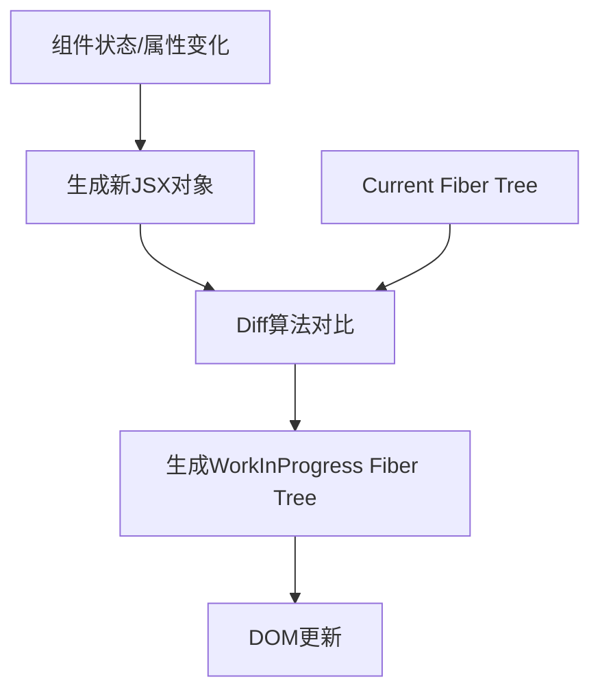
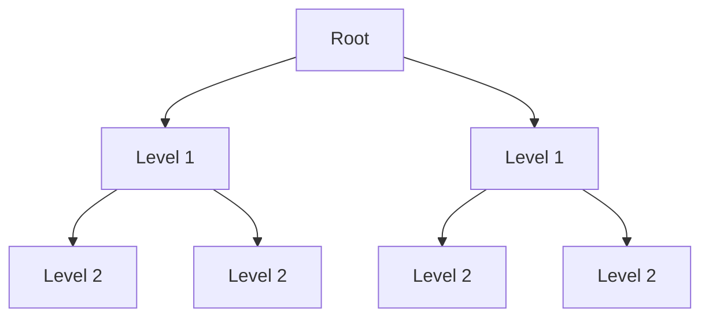
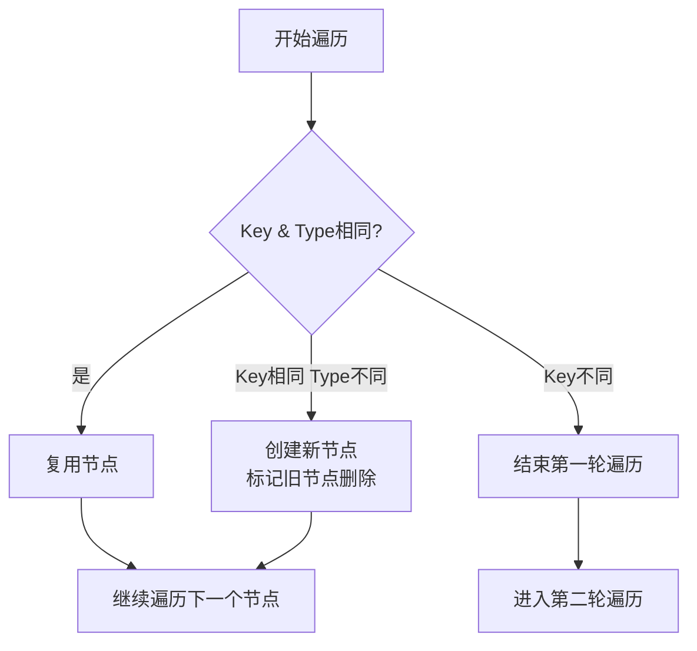
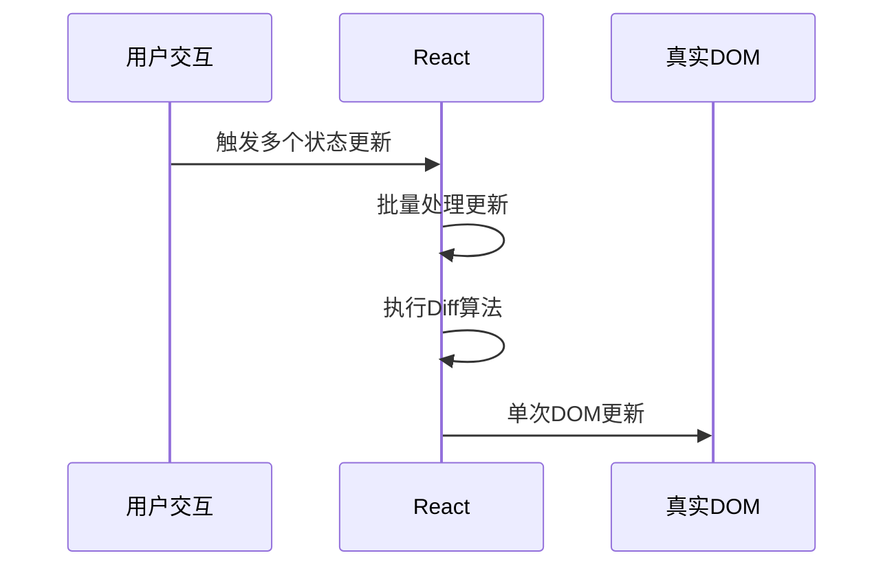

::: info React 的 Diff 算法是其高性能渲染的核心保障，本文将从原理到实现剖析这一关键机制。
:::

## Diff 算法：React 高效渲染的基石

在 React 框架中，**Diff 算法**扮演着至关重要的角色，它决定了在组件状态或属性变更时，React 如何高效地更新 DOM 结构。

其核心功能是在构建 **workInProgress Fiber Tree** 时，智能复用 **current Fiber Tree** 中对应的 FiberNode。

### 核心定位

当组件状态或属性发生变化时，React 需要精确识别需要更新的 DOM 部分。Diff 算法通过以下方式实现这一目标：



**JSX对象**（类组件 render 方法的返回值或函数组件的执行结果）包含描述 DOM 节点的关键信息。
Diff 算法的本质就是对比 **current Fiber Tree** 和 **JSX 对象**，生成 **workInProgress Fiber Tree**。

## 核心策略

### 1. 分层同级比较

React 将 DOM 树分解为多个层级，**只比较同一层级的节点**，避免跨层级比较带来的复杂度爆炸。
同级节点按照**从左到右的顺序**进行对比。



### 2. 元素类型对比

当节点类型发生变化时，React 会销毁旧树并创建新树：

```jsx
// 更新前
<div>
  <Button />
</div>
```

```jsx
// 更新后 - 元素类型改变
<div>
  <Input />
</div>
```

### 3. Key 属性的关键作用

Key 是 React 中标识节点唯一性的核心机制，帮助 React 在 Diff 过程中**精准识别节点**：

```jsx
// 更新前
<div>
  <p key="a">a</p>
  <span key="b">b</span>
</div>
```

```jsx
// 更新后
<div>
  <span key="b">b</span>
  <p key="a">a</p>
</div>
```

**关键机制**：当使用 key 时，React 能识别节点只是位置变化而非元素类型改变，从而**复用现有节点**而非重建整个子树。

## 实现机制

### 核心函数：reconcileChildFibers

Diff 算法在 React 源码中通过 `reconcileChildFibers` 函数实现，其核心逻辑如下：

```ts
function reconcileChildFibers(
  returnFiber: Fiber,
  currentFirstChild: Fiber | null,
  newChild: any
): Fiber | null {
  // 处理对象类型的新子元素
  if (typeof newChild === 'object' && newChild !== null) {
    switch (newChild.$$typeof) {
      case REACT_ELEMENT_TYPE:
        return placeSingleChild(
          reconcileSingleElement(returnFiber, currentFirstChild, newChild)
        )
      // 处理其他类型...
    }

    // 处理数组类型
    if (isArray(newChild)) {
      return reconcileChildrenArray(returnFiber, currentFirstChild, newChild)
    }

    // 处理迭代器类型
    if (getIteratorFn(newChild)) {
      return reconcileChildrenIterator(returnFiber, currentFirstChild, newChild)
    }
  }

  // 处理文本节点
  if ((typeof newChild === 'string' && newChild !== '') || typeof newChild === 'number') {
    return placeSingleChild(
      reconcileSingleTextNode(returnFiber, currentFirstChild, `${newChild}`)
    )
  }

  // 处理删除操作
  return deleteRemainingChildren(returnFiber, currentFirstChild)
}
```

## 两轮遍历流程

### 第一轮遍历：可复用节点处理



**示例场景**：

```html
<!-- 更新前 -->
<ul>
  <li key="a">a</li>
  <li key="b">b</li>
  <li key="c">c</li>
  <li key="d">d</li>
</ul>

<!-- 更新后 -->
<ul>
  <li key="a">a</li>
  <li key="b">b</li>
  <li key="c2">c2</li> <!-- key改变 -->
  <li key="d">d</li>
</ul>
```

**处理流程**：

1. 处理 key="a"：key 和 type 相同 → **复用**
2. 处理 key="b"：key 和 type 相同 → **复用**
3. 处理 key="c" vs key="c2"：key 不同 → **结束第一轮遍历**

### 第二轮遍历：处理剩余节点

将剩余旧 FiberNode 存入 Map：

```javascript
const existingChildren = mapRemainingChildren(returnFiber, oldFiber)
```

遍历剩余 JSX 元素：

- 从 Map 中查找可复用节点
- 找到则移动复用
- 未找到则创建新节点
- 遍历结束后 Map 中剩余节点标记删除

**复杂场景示例**：

```html
<!-- 更新前 -->
<ul>
  <li key="a">a</li>
  <li key="b">b</li>
  <li key="c">c</li>
  <li key="d">d</li>
  <li key="e">e</li>
</ul>

<!-- 更新后 -->
<ul>
  <li key="a">a</li>
  <li key="b">b</li>
  <li key="e">e</li> <!-- 位置移动 -->
  <li key="f">f</li> <!-- 新增 -->
  <li key="c">c</li> <!-- 位置移动 -->
</ul>
```

**处理流程**：

1. 第一轮遍历处理前两个节点后中断
2. 剩余旧节点存入 Map：`{c, d, e}`
3. 遍历新节点：
   - key="e"：在 Map 中找到 → **移动复用**
   - key="f"：未找到 → **新建**
   - key="c"：在 Map 中找到 → **移动复用**
4. Map 中剩余 key="d" → **标记删除**

## 优化策略

### 1. 时间复杂度优化

React 的 Diff 算法时间复杂度为 $O(n)$，远优于传统树比较算法的 $O(n³)$，这得益于：

- 分层同级比较策略
- Key 机制快速定位节点

### 2. Key 的最佳实践

```jsx
// 推荐：稳定唯一标识
{ items.map(item => (
  <Item key={item.id} data={item} />
)) }

// 避免：数组索引作为key
{ items.map((item, index) => (
  <Item key={index} data={item} /> // 可能导致渲染问题
)) }
```

### 3. 批量更新机制

React 将多个状态变更合并为单次渲染，减少 DOM 操作次数：



### 4. 节点类型优化

对于相同类型的组件，React 会递归比较子节点；对于不同类型的组件，则直接替换整棵子树。

## 总结与最佳实践

React 的 Diff 算法通过以下机制保证高性能：

1. **分层比较策略**：避免跨层级比较
2. **Key 机制**：精确识别节点变化
3. **两轮遍历**：平衡效率与准确性
4. **批量更新**：减少 DOM 操作次数

**开发建议**：

- 为列表项提供稳定唯一的 key
- 避免在渲染过程中改变组件类型
- 保持组件树结构稳定
- 使用 React.memo/PureComponent 减少不必要渲染

理解 Diff 算法的工作原理，有助于开发者编写高性能 React 应用，避免常见的性能陷阱，充分发挥 React 的渲染效能优势。
