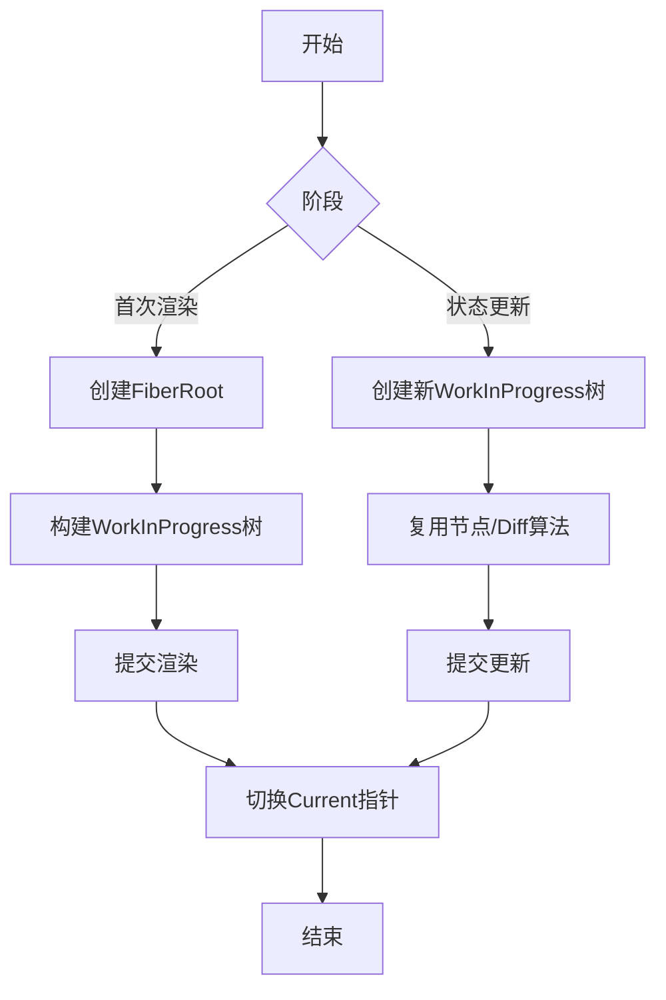
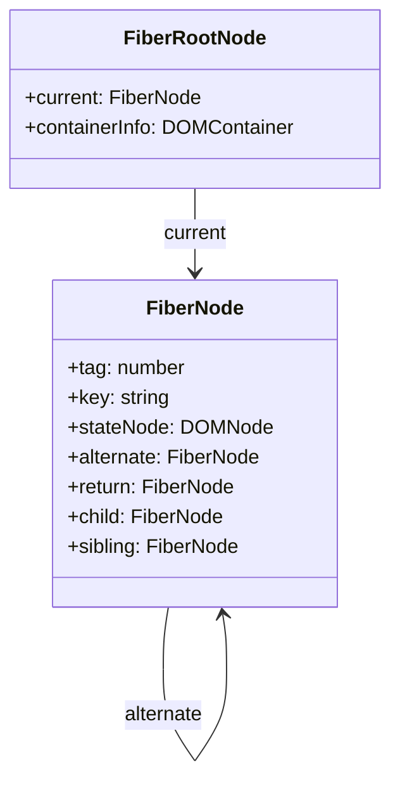
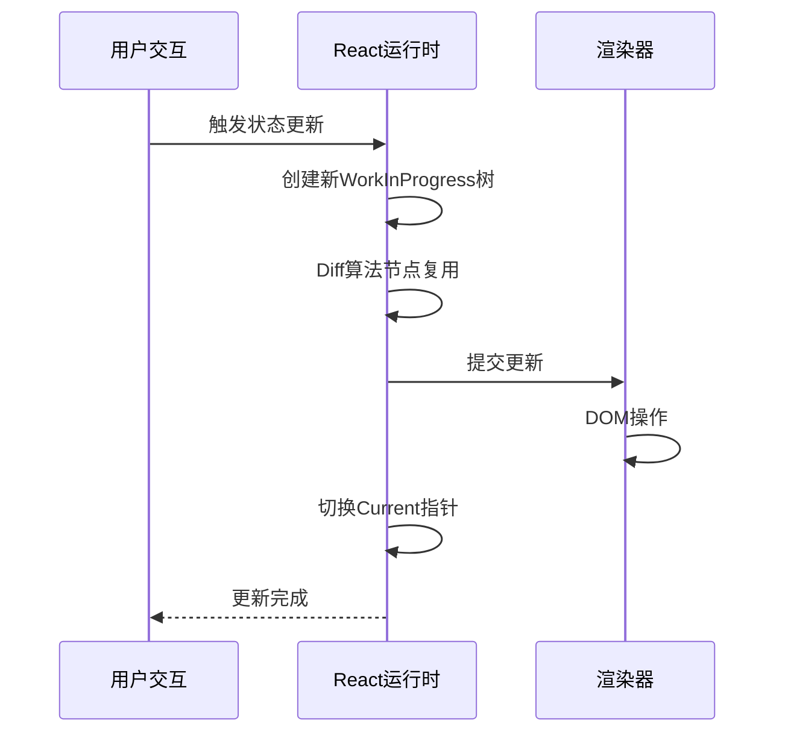
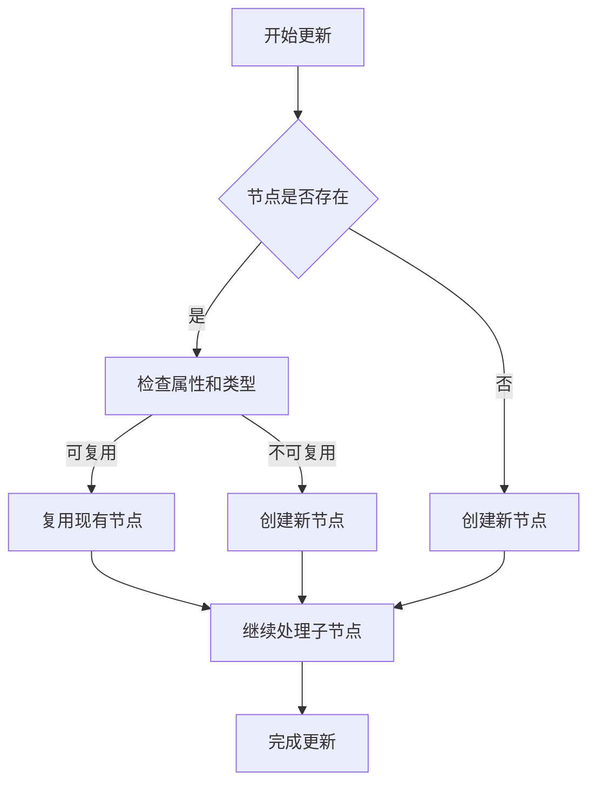

## Fiber 架构的核心概念

### Fiber 节点的本质

Fiber 节点是 React 16 引入的核心架构元素，它代表了 **组件树中的工作单元** 。
每个 Fiber 节点对应一个 React 元素，构成了一种 **基于链表的虚拟 DOM 实现**。

```javascript
function FiberNode(tag, pendingProps, key, mode) {
  // 树形结构指针
  this.return = null // 指向父节点
  this.child = null // 指向第一个子节点
  this.sibling = null // 指向下一个兄弟节点
  this.index = 0 // 在父节点中的索引位置

  // 静态数据结构
  this.tag = tag // 组件类型标记
  this.key = key // 唯一标识
  this.elementType = null // 元素类型
  this.type = null // 实际类型（函数/类/DOM标签）
  this.stateNode = null // 关联的DOM节点

  // 动态工作单元
  this.pendingProps = pendingProps // 待处理props
  this.memoizedProps = null // 已应用的props
  this.memoizedState = null // 当前状态
  this.updateQueue = null // 状态更新队列
  this.flags = NoFlags // 生命周期标记
  this.subtreeFlags = NoFlags // 子树标记
  this.lanes = NoLanes // 优先级标记
}
```

### Fiber 的三重含义

Fiber 架构包含三个维度的设计理念：

1. **架构层面**：取代传统递归更新（Stack Reconciler）的 **可中断异步架构**
2. **静态数据结构**：表示组件树结构的 **链表节点**
3. **动态工作单元**：封装组件状态、副作用和更新操作的 **执行单元**

这种设计使 React 能够将渲染工作拆分为可增量执行的小任务单元，实现时间切片和优先级调度。

## 双缓冲技术解析

### 双缓冲核心概念

双缓冲（Double Buffering）是一种图形渲染优化技术，在 React 中应用为：

- **当前树（Current Tree）**：代表屏幕上实际渲染的内容
- **工作树（WorkInProgress Tree）**：内存中构建的新树，用于准备下一次更新

两棵树通过 `alternate` 属性相互引用：

```javascript
current.alternate = workInProgress
workInProgress.alternate = current
```

### 双缓冲工作流程



## 首次渲染（Mount）流程

### 关键数据结构



### 挂载过程

```javascript
// 创建应用根节点
const root = ReactDOM.createRoot(document.getElementById('root'))

// 内部执行流程
function createFiberRoot() {
  const root = new FiberRootNode()
  const hostRootFiber = createHostRootFiber()

  // 建立关联
  root.current = hostRootFiber
  hostRootFiber.stateNode = root

  return root
}
```

1. **初始化阶段**：

   - 创建 `fiberRootNode`（应用根节点）
   - 创建 `hostRootFiber`（组件树根节点）
   - 建立相互引用关系

2. **渲染阶段**：

   - 基于组件 JSX 深度优先构建 WorkInProgress 树
   - 新节点与 current 树节点建立 `alternate` 关联

3. **提交阶段**：

   - 将 WorkInProgress 树渲染到 DOM
   - 切换 `fiberRootNode.current` 指向新树
   - WorkInProgress 树变为 Current 树

## 更新（Update）流程

### 更新触发机制

当组件状态变更触发更新：

```jsx
function Counter() {
  const [count, setCount] = useState(0)

  return (
    <button onClick={() => setCount(c => c + 1)}>
      Count:
      {' '}
      {count}
    </button>
  )
}
```

### 更新处理流程



1. **构建新树**：

   - 基于 current 树创建新 WorkInProgress 树
   - 通过 `alternate` 属性复用现有节点

2. **Diff 算法**：

   - 对比新旧树确定最小变更集
   - 标记需要更新的节点（`flags`）

3. **提交阶段**：

   - 应用 DOM 更新
   - 切换 `fiberRootNode.current` 指针
   - 新树成为 current 树

### 节点复用机制

在更新过程中，React 通过 Diff 算法决定节点复用策略：



## 双缓冲机制的优势

1. **无闪烁更新**：在内存中完成整棵树构建后一次性提交
2. **状态一致性**：确保渲染过程中状态不会部分更新
3. **异步可中断**：允许高优先级任务中断当前渲染
4. **高效回退**：更新失败可回退到完整旧树
5. **资源复用**：节点复用减少内存分配开销

## 总结

React Fiber 架构通过双缓冲机制实现了：

- **增量渲染**：将大型更新拆分为可中断的小任务
- **优先级调度**：确保高优先级交互（如动画）即时响应
- **高效更新**：通过节点复用和精确 DOM 操作优化性能
- **错误隔离**：组件树错误不影响整个应用

双缓冲机制作为核心优化策略，使 React 能够平衡渲染性能与用户体验，为复杂应用提供流畅的交互体验。理解这一机制有助于开发者编写更高效的 React 组件，并深入掌握框架底层原理。
