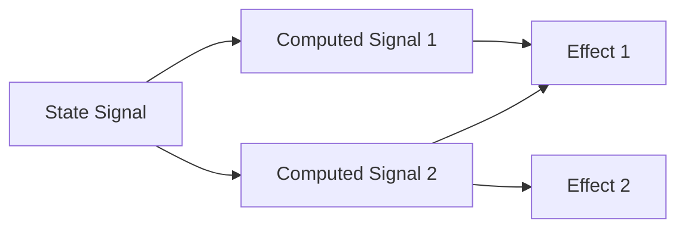
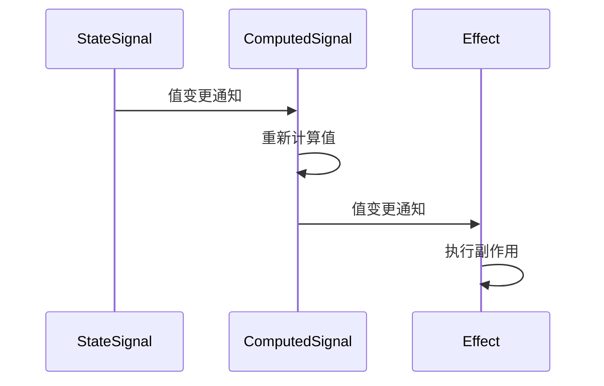

2024年了，Signals 在前端框架中越来越成为主流的底层技术依赖。
大概是从哪个框架开始兴起的，我有些忘记了，我映像中最早推动并流行的是 `SolidJS`，
后来在 `Vue3` 中也引入了该技术，随后，如 `MobX`，`Preact`，`Qwik`，`Svelte`，`Angular` 等
也纷纷引入了该技术。

<!-- more -->

事实上，`Signals` 的提出比 `SolidJS` 还要早的多，早在 [2010年](https://blog.stevensanderson.com/2010/07/05/introducing-knockout-a-ui-library-for-javascript/)，
[Knockout](https://knockoutjs.com/) 便有了类似的实现。

因此，`Signals` 并不是 “新兴的、前沿的” 前端技术方案。相反，关于它的论证、实践和应用，都已经相当的成熟，
这也是 `Signals` 如今越来越受各种框架青睐的原因。

::: tip 说明
[TC39](https://tc39.es/) 新增了一个 Stage-0 的 [提案](https://github.com/proposal-signals/proposal-signals)，
计划将 `Signals` 整合到 JavaScript 标准中。
并邀请了 [Angular](https://angular.io/), [Bubble](https://bubble.io/), [Ember](https://emberjs.com/),
[FAST](https://www.fast.design/), [MobX](https://mobx.js.org/), [Preact](https://preactjs.com/),
[Qwik](https://qwik.dev/), [RxJS](https://rxjs.dev/), [Solid](https://www.solidjs.com/),
[Starbeam](https://www.starbeamjs.com/), [Svelte](https://svelte.dev/),
[Vue](https://vuejs.org/), [Wiz](https://blog.angular.io/angular-and-wiz-are-better-together-91e633d8cd5a)
等多个框架的作者或贡献者 参与讨论，共同推动该提案的实现。

听到这个消息我是挺兴奋的，这意味着当 `Signals` 正式成为 `ECMA` 的标准时，将会给我们的前端开发带来很大的便利。
特别是对于各大框架而言，使用 原生 `Signals` 可能会带来更大的性能提升，甚至有机会在不同的框架之间共享同一个 `Signals`，
带来更多的可能性。
:::

## 为什么是 Signals ?

在一个常见的场景中，我们需要实现一个计数器，并希望将当前计数器的值是奇数还是偶数 渲染到 页面上，
每当 计数器的值 发生改变，我们就会重新渲染页面。

当我们使用 原生 JavaScript 实现时：

```js
let counter = 0

const isEven = () => (counter & 1) === 0
const parity = () => (isEven() ? 'even' : 'odd')
const render = () => (element.textContent = parity())

function setCounter(value) {
  counter = value
  render()
}
// 模拟对计数器的外部更新...
setInterval(() => setCounter(counter + 1), 1000)
```

这看起来实现了需求，然而，这里面有存在很多问题：

- `counter` 状态与 渲染系统 紧密耦合；
- 如果 `counter` 发生了变化，但是 `parity` 没有变化（比如 `counter` 从 2 变化为 4），
  那么就会对 奇偶校验进行不必要的计算和不必要的渲染；
- 如果 UI 的另一个部分只想在 `counter` 变化时重新渲染该如何处理？
- 如果 UI 的另一个部分只依赖 `isEven` 或 `parity`，那么该如何处理？

即使在这种相对简单的情况下，很快就会出现许多问题。
我们可以尝试通过引入 **发布/订阅** 来解决这些问题。
这将允许 `counter` 的其他使用者可以订阅添加他们自己对状态更改的反应。

但是，我们仍然可能遇到更多的问题：

- 渲染函数 `render` 只依赖于 `parity`，然而实际上它需要订阅 `counter`。
- 如果不直接与 `counter` 交互，则无法仅基于 `isEven` 和 `parity` 更新 UI。
- 引入了 **发布/订阅** ，问题不再仅仅是调用函数和读取变量，而是 订阅 和在哪里进行更新，
  如何管理退订的问题也变得复杂。

我们通过添加 `发布/订阅` 来解决包括 `counter`、`isEven` 和 `parity` 在内的几个问题。
我们必须将 `isEven` 订阅到 `counter`, 将 `parity` 订阅到 `isEven`，将 `render` 订阅到 `parity`。
然后，这个示例代码的体积越来越大，我们深陷在大量的 订阅 中，如果我们没有正确的方式清理内容，这
可能将导致发生内存灾难。我们虽然解决了一些问题，却编写了大量的代码，引入了更多的问题。

### 引入 Signals

::: info
为便于理解，以下示例 使用 [solid-js](https://www.solidjs.com/docs/latest/api) API，其中：

- `[getter, setter] = createSignal(initial)`: 创建信号，返回一个包含 getter 和 setter 的数组。
- `createMemo(getter)`: 创建一个与给定函数的返回值相等的只读响应值。
- `createEffect(effect)`: 创建一个在其依赖关系发生变化时执行的副作用。

:::

为了理解 `Signals` ，让我们首先对上面的例子进行一些改造：

```ts
const [counter, setCounter] = createSignal(0)
const isEven = createMemo(() => counter() & (1 == 0))
const parity = createMemo(() => (isEven() ? 'even' : 'odd'))

createEffect(() => (element.textContent = parity()))

setInterval(() => setCounter(counter() + 1), 1000)
```

我们可以立即看到：

- 我们消除了 `counter` 不必要的耦合
- 使用统一的 API 来 处理值，计算 和 副作用
- `counter` 和 `render` 之间没有循环引用的问题
- 没有手动订阅，不需要记录依赖关系
- 可以控制副作用的调用时机

同时，Signals 带给我们的，不仅仅是表面看到的：

- **自动依赖跟踪**：计算出来的 Signal 会自动发现它所依赖的其它任何 Signal ，无论这些 Signal 是 简单值 还是其他 计算值。
- **延迟评估**：计算在声明时不会立即评估，也不会在依赖更新时立即重新评估。仅当显式请求该值时，才会评估他们。
- **记忆**：计算信号缓存其最后一个值，以便无论访问多少次，都不需要重新评估其依赖项中没有更改的计算。

## 什么是 Signals ?

`Signals`，即 信号，信号表示可能随时间变化的数据单元。
信号可以是“State”（只是一个手动设置的值）或“Computed”（基于其他信号的公式）。
它 通常被称为 `Signals`，也可以被称为 Observables，Atoms，Subjects 和 Refs 。

`Signals` 通常由 `getter`，`setter`，`value` 组成：

::: code-tabs
@tab solid-js

```ts
const [count, setCount] = createSignal(0)

// 读取 value
console.log(count()) // 0

// 设置 value
setCount(5)
console.log(count()) // 5
```

:::

这看起来好像没有什么特别的地方，只是一个可以存储任意类型值的包装器。
但它的重点在于 `getter` 和 `setter` 可以运行在任意代码中，这对于更新的发布与订阅有很大的帮助。

也许你已经知道，在 Vue 中，它是使用 Object getter 或 Proxies 来实现：

::: code-tabs
@tab vue

```ts
const count = ref(0)

// 读取 value
console.log(count.value) // 0

// 设置 value
count.value = 5
console.log(count.value) // 5
```

:::

或者，像 Svelte 那样，隐藏在编译器后面：

::: code-tabs
@tab svelte

```ts
let count = 0
// 读取 value
console.log(count) // 0

// 设置 value
count = 5
```

:::

**从本质上讲，信号是事件发射器。但主要区别在于订阅的管理方式。**

### Reactive

如果缺少其它与之相关的 Reactive, 单看 `Signals` 好像并没有什么特别。
`Reactive`，也可以被称为 `Effects` 、`Autoruns`、 `Watches` 或 `Computed` 。
`Reactive` 通过观察 `Signals`，在其发生更新时重新运行。

```ts
console.log('1. Create Signal')
const [count, setCount] = createSignal(0)

console.log('2. Create Reaction')
createEffect(() => console.log('The count is', count()))

console.log('3. Set count to 5')
setCount(5)

console.log('4. Set count to 10')
setCount(10)
```

**输出：**

```txt
1. Create Signal

2. Create Reaction
The count is 0

3. Set count to 5
The count is 5

4. Set count to 10
The count is 10
```

这看起来有点神奇，在 `setCount()` 后 立即执行了 `createEffect` 的回调函数。
这看起来并没有直接关联的地方，实际上，在 `createEffect` 回调函数中， 执行 `count()` 时自动
订阅了 `createEffect` 回调函数，每当 `count` 发生变化时，都会重新运行 `createEffect` 回调函数。

## 如何实现 Signals ?

理解了 Signals 的核心概念后，让我们深入探讨其实现机制。Signals 的核心在于**依赖跟踪**和**更新传播**系统，这通过两个关键组件实现：**订阅机制**和**全局执行上下文**。

### 核心实现原理

1. **依赖跟踪**：当计算或副作用访问信号值时，系统自动记录当前上下文对该信号的依赖
2. **更新传播**：当信号值改变时，系统自动通知所有依赖项进行更新
3. **惰性求值**：计算值仅在需要时重新计算，避免不必要的计算
4. **变更批处理**：将多个更新合并为单一批处理，减少重复计算

以下是 Signals 核心机制的简化实现：

```typescript
// 当前正在执行的 effect 上下文
let currentEffect: (() => void) | null = null

// 信号类实现
class Signal<T> {
  private value: T
  private subscribers: Set<() => void> = new Set()

  constructor(initialValue: T) {
    this.value = initialValue
  }

  // 获取信号值并跟踪依赖
  get(): T {
    if (currentEffect) {
      this.subscribers.add(currentEffect)
    }
    return this.value
  }

  // 设置新值并触发更新
  set(newValue: T) {
    if (Object.is(this.value, newValue))
      return
    this.value = newValue
    this.notify()
  }

  // 通知所有订阅者
  private notify() {
    for (const sub of [...this.subscribers]) {
      sub()
    }
  }
}

// 创建副作用
function createEffect(effect: () => void) {
  const execute = () => {
    currentEffect = execute
    try {
      effect()
    }
    finally {
      currentEffect = null
    }
  }
  execute()
}

// 创建计算值
function createMemo<T>(fn: () => T): () => T {
  const [get, set] = createSignal(fn())
  createEffect(() => set(fn()))
  return get
}
```

### 依赖关系可视化

信号与计算值/副作用之间的依赖关系可以表示为有向图：



当状态信号更新时，更新会沿着依赖链传播：



### 关键优化技术

#### 1. 惰性求值 (Lazy Evaluation)

计算值不会立即重新计算，而是在被访问时才计算：

```typescript
class Computed<T> {
  private value!: T
  private dirty = true
  private computeFn: () => T
  private dependencies = new Set<Signal<any>>()

  constructor(fn: () => T) {
    this.computeFn = fn
    this.update()
  }

  get(): T {
    if (this.dirty) {
      this.update()
    }
    return this.value
  }

  private update() {
    // 清除旧依赖
    for (const dep of this.dependencies) {
      dep.unsubscribe(this.markDirty)
    }
    this.dependencies.clear()

    // 设置当前计算上下文
    const prevEffect = currentEffect
    currentEffect = this.markDirty.bind(this)

    // 计算新值并收集依赖
    this.value = this.computeFn()
    this.dirty = false

    // 恢复上下文
    currentEffect = prevEffect
  }

  private markDirty = () => {
    if (!this.dirty) {
      this.dirty = true
      // 通知自己的订阅者
    }
  }
}
```

#### 2. 变更批处理 (Batching Updates)

将多个连续更新合并为单一批处理：

```typescript
let batchedUpdates: (() => void)[] = []
let isBatching = false

function batch(callback: () => void) {
  if (isBatching) {
    callback()
    return
  }

  isBatching = true
  try {
    callback()
    flushUpdates()
  }
  finally {
    isBatching = false
  }
}

function scheduleUpdate(updateFn: () => void) {
  if (isBatching) {
    batchedUpdates.push(updateFn)
  }
  else {
    updateFn()
  }
}

function flushUpdates() {
  while (batchedUpdates.length) {
    const updates = batchedUpdates
    batchedUpdates = []
    updates.forEach(fn => fn())
  }
}
```

### 内存管理优化

为防止内存泄漏，Signal 实现需要包含自动清理机制：

```typescript
class EffectCleanup {
  private cleanupFns: (() => void)[] = []

  add(fn: () => void) {
    this.cleanupFns.push(fn)
  }

  run() {
    for (const fn of this.cleanupFns) {
      fn()
    }
    this.cleanupFns = []
  }
}

function createEffect(effectFn: (cleanup: EffectCleanup) => void) {
  const cleanup = new EffectCleanup()

  const effect = () => {
    cleanup.run()
    currentEffect = effect
    try {
      effectFn(cleanup)
    }
    finally {
      currentEffect = null
    }
  }

  effect()
}
```

### 框架集成策略

不同框架集成 Signals 的方式各有不同：

1. **编译时集成**（如 Svelte）：

   ```mermaid
   graph LR
     A[Svelte Component] --> B[Compiler]
     B --> C[Optimized JS with Signals]
     C --> D[Runtime]
   ```

2. **运行时集成**（如 SolidJS）：

   ```mermaid
   graph LR
     A[Component Render] --> B[Create Signals]
     B --> C[Create Effects]
     C --> D[DOM Updates]
   ```

3. **混合策略**（如 Vue）：

   ```mermaid
   graph LR
     A[Template] --> B[Compiler]
     B --> C[Render Function]
     C --> D[Reactivity System]
     D --> E[Signals]
   ```

### 性能优化对比

下表展示了不同更新策略的性能影响：

| 更新策略       | 计算次数 | DOM 操作次数 | 内存使用 |
|----------------|----------|--------------|----------|
| 传统方式       | O(N)     | O(N)         | 低       |
| 手动优化       | O(logN)  | O(logN)      | 中       |
| Signals 系统   | O(1)     | O(1)         | 中高     |
| 编译时优化     | O(1)     | O(1)         | 低       |

> 注：N 表示依赖项数量

## 未来展望：原生 Signals 支持

TC39 的 Signals 提案目前处于 Stage 0，其核心目标是提供：

1. **标准化 API**：

   ```js
   const count = new Signal.State(0)
   const isEven = new Signal.Computed(() => count.get() % 2 === 0)

   Signal.subtle.watch(() => {
     console.log(`Count is ${count.get()} (${isEven.get() ? 'even' : 'odd'})`)
   })
   ```

2. **跨框架互操作性**：

   ```mermaid
   graph LR
     A[Framework A] --> C[Shared Signals]
     B[Framework B] --> C
     C --> D[DOM Updates]
   ```

3. **底层优化能力**：
   - 直接内存访问
   - 硬件级优化
   - 跨线程同步

### 潜在优势

1. **性能提升**：浏览器可直接优化信号更新路径
2. **内存优化**：共享信号减少框架开销
3. **框架互操作**：不同框架组件可共享状态
4. **开发者体验**：统一响应式编程模型

## 结论

Signals 作为前端响应式编程的核心抽象，经历了十余年的发展和验证，已成为现代前端框架不可或缺的基础设施。其核心价值在于：

1. **精确更新**：最小化计算和渲染范围
2. **自动依赖跟踪**：解放开发者手动管理依赖
3. **声明式编程**：提升代码可维护性和可读性
4. **性能优化**：通过惰性求值和变更批处理减少开销

随着 TC39 标准化进程的推进，我们有望看到：

- 浏览器原生支持的 Signals API
- 跨框架共享的状态管理方案
- 更高效的响应式系统实现
- 更简洁的前端状态管理范式

对于前端开发者而言，深入理解 Signals 不仅有助于更好地使用现代框架，更能把握前端架构的未来发展方向。Signals 代表的细粒度响应式编程范式，正在重塑我们构建复杂用户界面的方式，为下一代 Web 应用奠定坚实基础。
