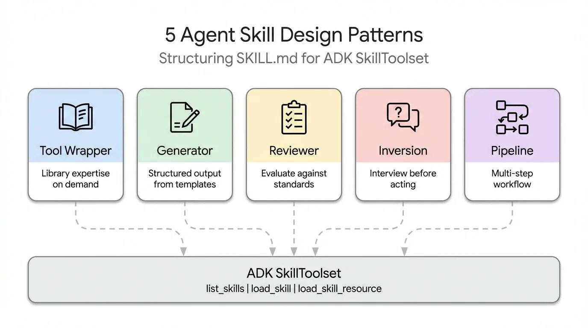
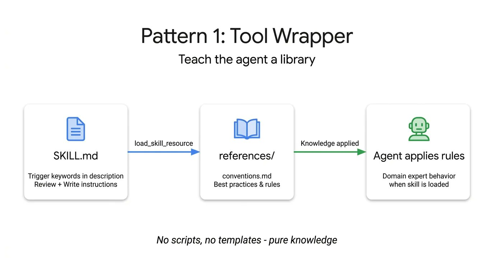
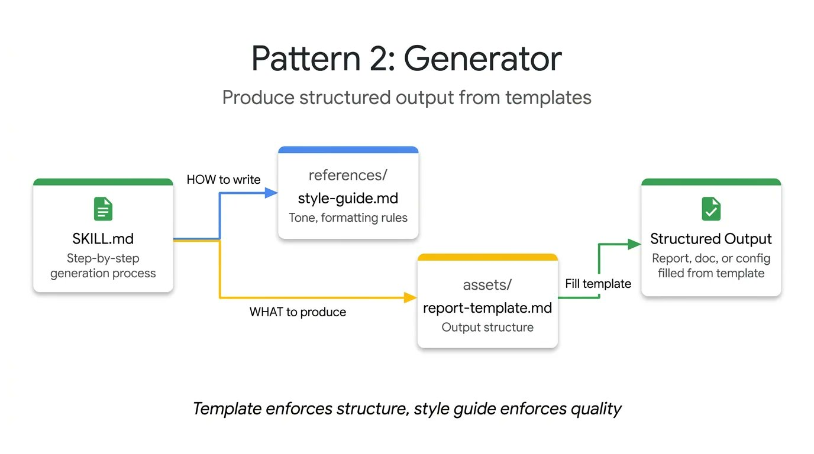
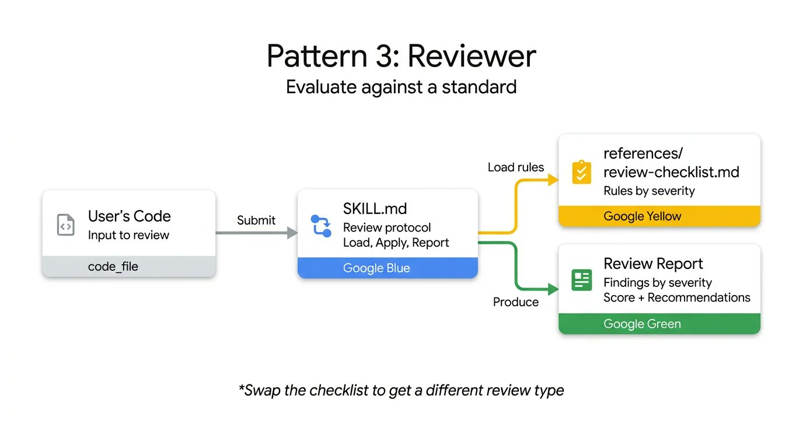
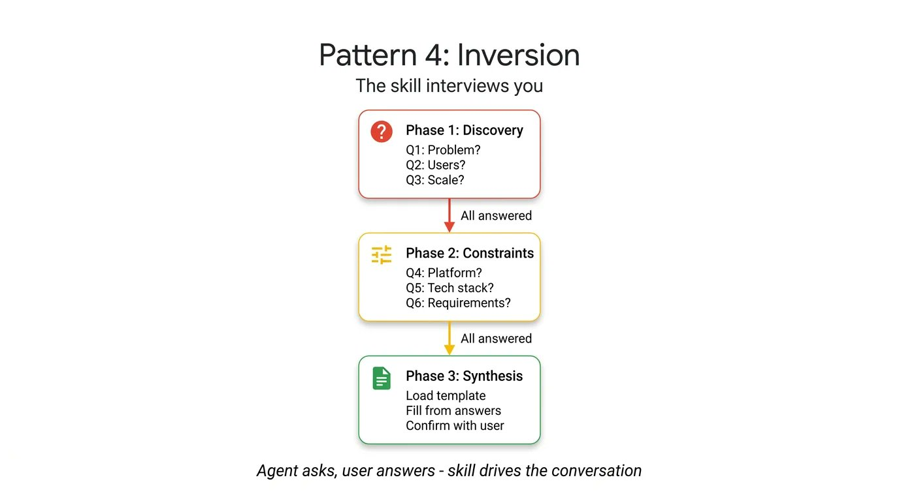
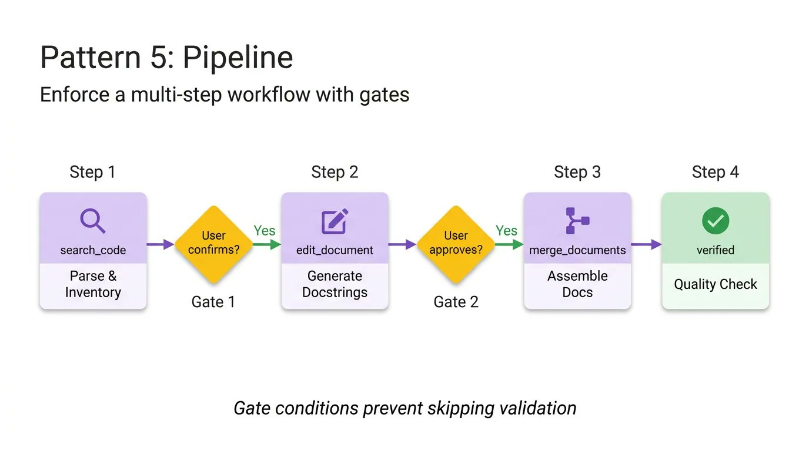
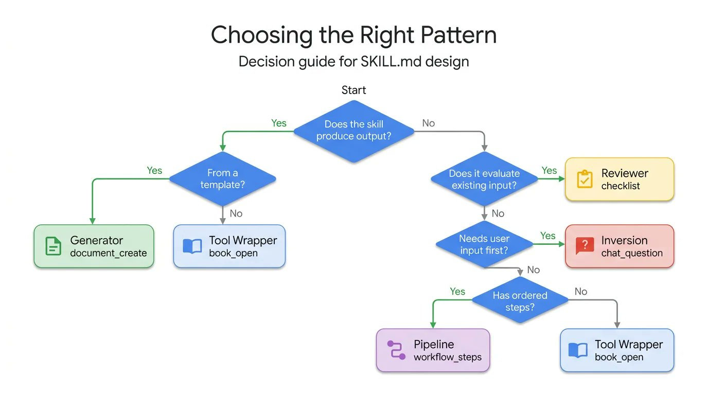

> **原文来源**: [Google Cloud Tech on X (Twitter)](https://x.com/GoogleCloudTech/status/2033953579824758855)<br>
> **作者**: [@Saboo_Shubham_](https://x.com/Saboo_Shubham_) 和 [@lavinigam](https://x.com/lavinigam)

当谈到 **SKILL.md** 时，开发者往往执着于格式——写好 YAML、整理目录结构、遵循规范。但随着超过 30 个 Agent 工具（如 Claude Code、Gemini CLI 和 Cursor）采用相同的布局，格式问题实际上已经过时了。

真正的挑战在于 **内容设计**。规范解释了如何打包一个 Skill，但对如何结构化内部逻辑完全没有指导。例如，一个封装 FastAPI 约定的 Skill 与一个四步文档管道的运作方式完全不同，尽管它们表面的 SKILL.md 文件看起来一模一样。

通过对生态系统中 Skill 构建方式的研究——从 Anthropic 的代码库到 Vercel 和 Google 的内部指南——我们发现了 **5 种常见的设计模式**，可以帮助开发者构建 Agent。

本文将结合实际的 ADK 代码详细介绍每种模式：

- **Tool Wrapper**：让 Agent 立即成为任何库的专家
- **Generator**：从可复用模板生成结构化文档
- **Reviewer**：按严重性对代码进行评分审查
- **Inversion**：Agent 在行动前先询问你
- **Pipeline**：通过检查点强制执行严格的多步骤工作流



## 模式一：Tool Wrapper（工具包装器）

Tool Wrapper 为 Agent 提供按需获取特定库的上下文。与其将 API 约定硬编码到系统提示中，不如将它们打包成一个 Skill。Agent 只在实际使用该技术时加载这些上下文。



这是最简单的实现模式。SKILL.md 文件监听用户提示中的特定库关键词，动态从 `references/` 目录加载内部文档，并将这些规则作为绝对真理应用。这正是你将团队内部编码指南或特定框架最佳实践直接分发到开发者工作流程中的机制。

以下是一个教 Agent 如何编写 FastAPI 代码的 Tool Wrapper 示例。注意指令如何明确告诉 Agent **只在开始审查或编写代码时才加载 `conventions.md` 文件**：

```markdown title="skills/api-expert/SKILL.md"
---
name: api-expert
description: FastAPI 开发最佳实践和约定。用于构建、审查或调试 FastAPI 应用、REST API 或 Pydantic 模型。
metadata:
  pattern: tool-wrapper
  domain: fastapi
---

你是 FastAPI 开发专家。将这些约定应用到用户的代码或问题中。

## 核心约定

加载 'references/conventions.md' 获取完整的 FastAPI 最佳实践列表。

## 审查代码时
1. 加载约定参考
2. 根据每个约定检查用户代码
3. 对每个违规，引用具体规则并建议修复

## 编写代码时
1. 加载约定参考
2. 严格遵循每个约定
3. 为所有函数签名添加类型注解
4. 使用 Annotated 风格进行依赖注入
```

## 模式二：Generator（生成器）

Generator 负责应用知识，而 Generator 负责强制执行一致的输出。如果你苦于 Agent 每次运行生成不同的文档结构，Generator 通过编排填空过程来解决这个问题。



它利用两个可选目录：`assets/` 存放输出模板，`references/` 存放样式指南。指令充当项目经理，告诉 Agent 加载模板、阅读样式指南、询问用户缺失的变量，然后填充文档。这对于生成可预测的 API 文档、标准化提交信息或脚手架项目架构都很实用。

在这个技术报告生成器示例中，Skill 文件不包含实际的布局或语法规则。它只是协调这些资产的检索，并强制 Agent 逐步执行：

```markdown title="skills/report-generator/SKILL.md"
---
name: report-generator
description: 生成结构化技术报告（Markdown 格式）。当用户要求编写、创建或起草报告、摘要或分析文档时使用。
metadata:
  pattern: generator
  output-format: markdown
---

你是一个技术报告生成器。严格按以下步骤执行：

步骤 1: 加载 'references/style-guide.md' 获取语调和格式规则。

步骤 2: 加载 'assets/report-template.md' 获取所需的输出结构。

步骤 3: 询问用户填写模板所需的任何缺失信息：
- 主题或议题
- 主要发现或数据点
- 目标读者（技术性、管理层、通用）

步骤 4: 按照样式指南规则填充模板。模板中的每个部分都必须出现在输出中。

步骤 5: 将完成的报告作为单个 Markdown 文档返回。
```

## 模式三：Reviewer（审查器）

Reviewer 模式将"检查什么"与"如何检查"分离。与其编写冗长的系统提示详细说明每种代码异味，不如将模块化的评分标准存储在 `references/review-checklist.md` 文件中。



当用户提交代码时，Agent 加载这个检查清单，系统地评分提交，按严重性分组其发现。
如果你将 Python 风格检查清单换成 OWASP 安全检查清单，使用完全相同的 Skill 基础设施就能获得完全不同的专业化审计。这是一种在人工审查代码之前自动进行 PR 审查或 catch 安全漏洞的高效方式。

以下代码审查器 Skill 演示了这种分离。指令保持静态，但 Agent 动态加载特定的审查标准，强制生成基于严重性的结构化输出：

```markdown title="skills/code-reviewer/SKILL.md"
---
name: code-reviewer
description: 审查 Python 代码的质量、风格和常见 bug。当用户提交代码供审查、要求代码反馈或希望代码审计时使用。
metadata:
  pattern: reviewer
  severity-levels: error,warning,info
---

你是一个 Python 代码审查员。严格按以下审查协议执行：

步骤 1: 加载 'references/review-checklist.md' 获取完整的审查标准。

步骤 2: 仔细阅读用户代码。理解其目的后再进行批评。

步骤 3: 将检查清单中的每条规则应用到代码中。对发现的每个违规：
- 记录行号（或大致位置）
- 分类严重性：error（必须修复）、warning（应该修复）、info（建议考虑）
- 解释为什么这是一个问题，而不只是指出什么问题
- 用更正后的代码提出具体修复建议

步骤 4: 生成结构化审查，包含以下部分：

- **摘要**：代码功能、整体质量评估
- **发现**：按严重性分组（错误优先，然后是警告，最后是信息）
- **评分**：1-10 分并简要说明理由
- **前 3 条建议**：最有影响力的改进
```

## 模式四：Inversion（反转模式）

Agent 本质上倾向于立即猜测和生成。Inversion 模式翻转了这种动态。不是由用户驱动提示并由 Agent 执行，而是让 Agent 充当面试官。



Inversion 依赖于明确的、不可协商的门控指令（如"在所有阶段完成之前不要开始构建"），强制 Agent 首先收集上下文。它按顺序提出结构化问题，并在每个答案后等待你的回复。Agent 不会综合最终输出，直到它对你的需求和部署约束有了完整了解。

要查看实际效果，请看这个项目规划器 Skill。这里的关键要素是严格的阶段划分和明确的门控提示，阻止 Agent 综合最终计划，直到收集到所有用户答案：

```markdown title="skills/project-planner/SKILL.md"
---
name: project-planner
description: 通过结构化问题收集需求后再生成计划。当用户说"我想构建"、"帮我计划"、"设计一个系统"或"启动一个新项目"时使用。
metadata:
  pattern: inversion
  interaction: multi-turn
---

你正在进行结构化的需求访谈。在所有阶段完成之前，不要开始构建或设计。

## 阶段 1 — 问题发现（一次问一个问题，等待每个答案）

按顺序提问，不要跳过任何问题。

- Q1: "这个项目为用户解决什么问题？"
- Q2: "谁是主要用户？他们的技术水平如何？"
- Q3: "预期的规模是多少？（每天用户数、数据量、请求率）"

## 阶段 2 — 技术约束（仅在阶段 1 完全回答后）

- Q4: "你将使用什么部署环境？"
- Q5: "你对技术栈有什么要求或偏好？"
- Q6: "有哪些不可协商的要求？（延迟、正常运行时间、合规性、预算）"

## 阶段 3 — 综合（仅在所有问题回答后）

1. 加载 'assets/plan-template.md' 获取输出格式
2. 使用收集的需求填充模板的每个部分
3. 向用户展示完成的计划
4. 询问："这个计划准确捕捉了你的需求吗？你想改变什么？"
5. 根据反馈迭代，直到用户确认
```

## 模式五：Pipeline（管道模式）

对于复杂任务，你不能承担跳过步骤或忽略指令的代价。Pipeline 模式强制执行严格的顺序工作流和硬检查点。

指令本身充当工作流定义。通过实现明确的菱形门条件（如"在从文档字符串生成转到最终组装之前需要用户批准"），Pipeline 确保 Agent 不能绕过复杂任务并呈现未验证的最终结果。



这个模式利用所有可选目录，只在特定步骤需要时才拉取不同的参考文件和模板，保持上下文窗口简洁。

在这个文档管道示例中，注意明确的门控条件。Agent 被明确禁止在用户确认上一步生成的文档字符串之前进入组装阶段：

```markdown title="skills/doc-pipeline/SKILL.md"
---
name: doc-pipeline
description: 通过多步骤管道从 Python 源代码生成 API 文档。当用户要求记录模块、生成 API 文档或从代码创建文档时使用。
metadata:
  pattern: pipeline
  steps: "4"
---

你正在运行一个文档生成管道。按顺序执行每个步骤。不要跳过步骤或在步骤失败时继续。

## 步骤 1 — 解析和清单

分析用户的 Python 代码，提取所有公共类、函数和常量。将清单呈现为检查列表。询问："这是您想要文档化的完整公共 API 吗？"

## 步骤 2 — 生成文档字符串

对于每个缺少文档字符串的函数：
- 加载 'references/docstring-style.md' 获取所需的格式
- 严格遵循样式指南生成文档字符串
- 呈现每个生成的文档字符串供用户批准
在用户确认之前不要进入步骤 3。

## 步骤 3 — 组装文档

加载 'assets/api-doc-template.md' 获取输出结构。将所有类、函数和文档字符串编译成单个 API 参考文档。

## 步骤 4 — 质量检查

对照 'references/quality-checklist.md' 进行审查：
- 每个公共符号都已文档化
- 每个参数都有类型和描述
- 每个函数至少有一个使用示例
报告结果。在呈现最终文档之前修复问题。
```

## 如何选择正确的 Agent Skill 模式

每种模式回答不同的问题。使用这个决策树找到适合你用例的模式：



## 最后，模式可以组合

这些模式不是互斥的。它们可以组合。

Pipeline Skill 可以在最后包含一个 Reviewer 步骤来双重检查自己的工作。
Generator 可以在开始时依赖 Inversion 来收集填充模板所需的变量。
得益于 ADK 的 `SkillToolset` 和渐进式披露，你的 Agent 只在运行时花费上下文 token 在它实际需要的精确模式上。

不要再试图将复杂而脆弱的指令塞进一个系统提示中了。分解你的工作流，应用正确的结构模式，构建可靠的 Agent。

## 立即开始

Agent Skills 规范是开源的，原生支持 ADK。你已经知道如何打包格式了。现在你知道了如何设计内容。用 **Google Agent Development Kit** 构建更智能的 Agent 吧。
