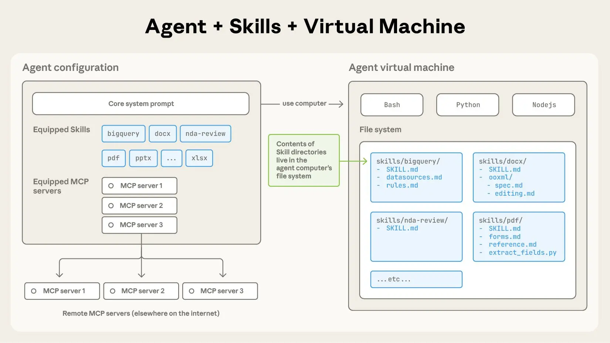
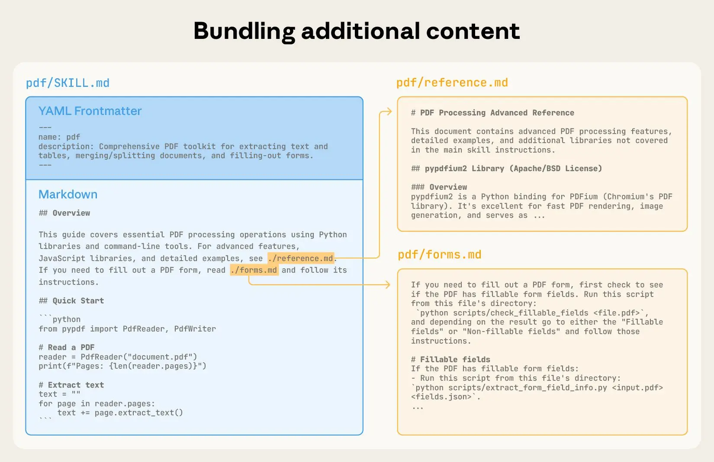
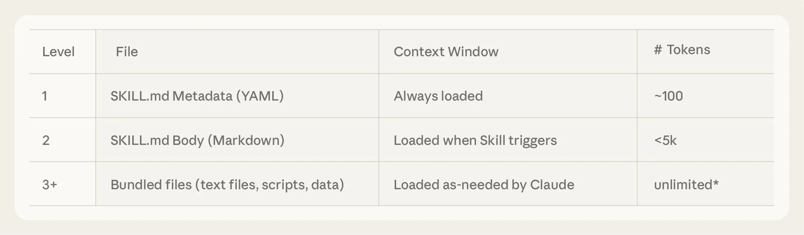
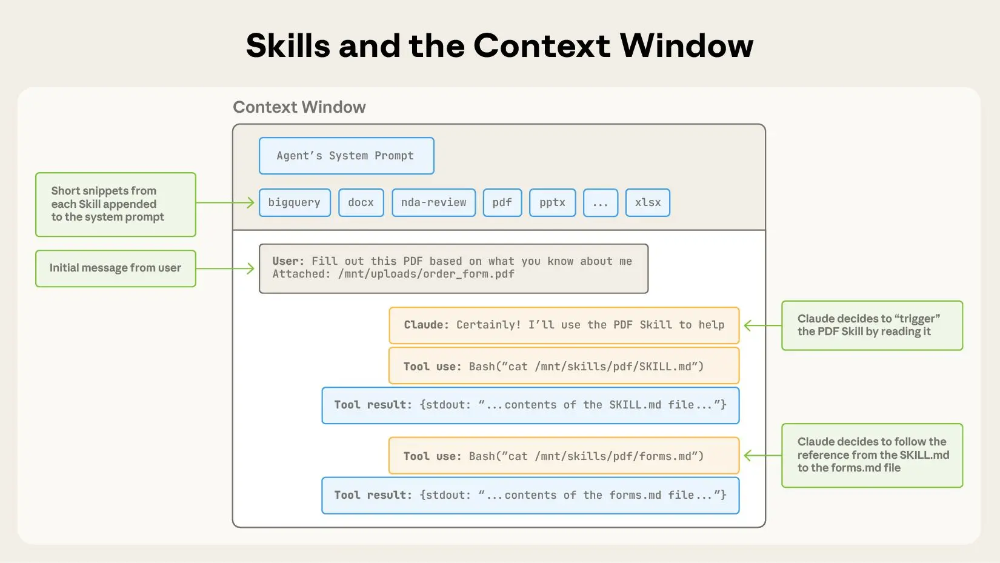

Claude 功能强大，但实际工作需要流程知识与组织情境。
现推出智能体技能——一种通过文件与文件夹构建专业智能体的全新方式。

_更新：我们已发布 [Agent Skills](https://agentskills.io/) 作为跨平台可移植性的开放标准。（2025年12月18日）_

随着模型能力的提升，我们现在可以构建能够与成熟计算环境交互的通用智能体。
例如，[Claude Code](https://claude.com/product/claude-code) 就能通过本地代码执行和文件系统完成跨领域的复杂任务。
但随着这些智能体日益强大，我们需要更可组合、可扩展且可移植的方式来为它们配备领域专业知识。

这促使我们创建了 [**Agent Skills**](https://www.anthropic.com/news/skills)：
即组织有序的指令、脚本和资源文件夹，智能体能够动态发现并加载这些内容，从而在特定任务中表现更佳。
Skills 通过将您的专业知识打包成可供 Claude 使用的可组合资源，扩展了 Claude 的能力，将通用智能体转化为符合您需求的专用智能体。

为智能体构建一项 Skills，就如同为新员工编写入职指南。
如今，任何人都无需为每个用例零散地定制专属智能体，而是可以通过捕捉和分享流程性知识，用可组合的能力来专业化自己的智能体。
在本文中，我们将解释什么是 Skills ，展示其运作方式，并分享构建自有技能的最佳实践。

::: center

Skills 是一个包含 `SKILL.md` 文件的目录，该文件内含结构化的指令、脚本和资源文件夹，用于为智能体提供额外能力。
:::

## Skills 结构剖析

为直观展示 Skills 运作机制，让我们通过真实案例逐步解析：这是实现 [Claude 近期上线的文档编辑功能](https://www.anthropic.com/news/create-files) 的核心技能之一。
Claude 本身已具备丰富的PDF解析能力，但在直接操作PDF方面存在局限（例如填写表格）。
这项 [PDF Skill](https://github.com/anthropics/skills/tree/main/document-skills/pdf) 使我们能够赋予 Claude 此类新能力。

最基础的 Skills 形式是一个包含 `SKILL.md` file 的目录。
该文件必须以包含必要元数据的 YAML frontmatter：`name` 与 `description`。
Agent 程序在启动时，会预先将所有已安装 Skills 的 `name` 与 `description` 加载至系统提示中。

此元数据属于 **渐进式披露** 的第一层级：仅提供足够信息让 Claude 知晓何时应调用各项 Skills，而无需将所有内容载入上下文。
该文件的实际主体内容构成**第二层级**的详细信息。
若 Claude 判定某项 Skills 与当前任务相关，将通过读取完整的 `SKILL.md` 文件将其载入上下文。

::: center

`SKILL.md` 文件必须以包含文件名和描述的YAML Frontmatter开头，这些信息会在启动时加载到其系统提示中。
:::

随着 Skills 复杂度的增加，其内容可能过多而无法容纳在单个 `SKILL.md` 中，或者某些内容仅在特定场景下相关。
在这种情况下，Skills 可以在 Skills 目录中捆绑附加文件，并通过名称在 `SKILL.md` 中引用它们。
这些附加的链接文件是**第三层**（及更深入）的细节，Claude 可以根据需要选择性地浏览和发现。

在下方展示的PDF技能中，`SKILL.md` 引用了 Skills 作者选择与核心 `SKILL.md` 捆绑的
两个附加文件（`reference.md` 和 `forms.md`）。
通过将填写表单的说明移至单独的文件（`forms.md`），Skills 作者能够保持 Skills 核心的简洁性，
并相信 Claude 仅在填写表单时才会读取 `forms.md` 。

::: center

您可以在 Skills 中融入更多上下文（通过附加文件），Claude 随后可根据系统提示触发这些内容。
:::

**渐进式披露** 是使 Agent Skills 灵活且可扩展的核心设计原则。
它如同一本编排精良的手册，从目录开始，到具体章节，再到详细附录，技能让Claude能够按需加载信息：

拥有文件系统和代码执行工具的智能体在处理特定任务时，无需将整个技能内容读入其上下文窗口。
这意味着可以捆绑到 Skills 中的上下文量实际上是无限的。

## Skills 与上下文窗口

下图展示了当 Skills 被用户消息触发时，上下文窗口的变化情况。

::: center

Skills 通过系统提示在上下文窗口中被触发。
:::

所示的操作序列：

::: steps

- 开始时，上下文窗口包含核心系统提示、每个已安装 Skills 的元数据以及用户的初始消息；
- Claude 通过调用 Bash 工具读取 `pdf/SKILL.md` 的内容来触发 PDF Skill；
- Claude 选择读取与该 SKill 捆绑的 `forms.md` 文件；
- 最终，Claude 在从 PDF Skill 加载了相关指令后，继续处理用户的任务。

:::

## Skills 与代码执行

Skills 也可以包含代码，供 Claude 自行决定作为工具执行。

大语言模型擅长处理多种任务，但某些操作更适合通过传统代码执行。
例如，通过令牌生成对列表进行排序，远比直接运行排序算法成本高昂。
除了效率考量外，许多应用需要只有代码才能提供的确定性可靠保障。

在我们的示例中，PDF Skill 包含一个预先编写的 Python 脚本，用于读取 PDF 并提取所有表单字段。
Claude 可以运行此脚本，而无需将脚本或 PDF 加载到上下文中。
由于代码具有确定性，这一工作流程是稳定且可重复的。

::: center

Skills 还可以包含代码，供Claude根据任务性质自行决定是否作为工具执行。
:::

## 开发与评估 Skills

以下是一些关于如何开始创作和测试 Skills 的实用指南：

- **从评估入手**：

  通过在代表性任务中运行智能体并观察其薄弱环节或需要补充上下文的场景，来识别能力缺口。
  随后通过渐进式构建 Skills 来弥补这些不足。

- **构建可扩展结构**：

  当 `SKILL.md` 文件变得臃肿时，将其内容拆分至独立文件并建立引用关系。
  若某些上下文互斥或很少同时使用，保持独立路径可减少令牌消耗。
  最后，代码既可充当可执行工具，也可作为文档。
  应明确区分 Claude 应直接运行脚本还是将其作为参考上下文读取。

- **从 Claude 视角思考**：

  在实际场景中观察 Claude 如何使用您的 Skills ，并根据观察结果进行迭代：
  留意意外操作轨迹或对特定上下文的过度依赖。
  请特别关注 Skills 的 `name` 和 `description` ，Claude 将根据这些信息决定是否针对当前任务触发该 Skill。

- **与Claude协同迭代**：

  在使用 Claude 处理任务时，可要求 Claude 将其成功方法和常见错误总结为可复用的上下文及代码并整合到技能中。
  若 Claude 使用 Skills 执行任务时出现偏差，可要求其自我反思问题所在。
  此过程有助于发现 Claude 实际需要的上下文，而非预先猜测。

## 使用 Skills 时的安全考量

Skills 通过指令和代码为 Claude 赋予新能力。
虽然这使得 Skills 功能强大，但也意味着恶意技能可能在使用环境中引入安全漏洞，或诱导 Claude 泄露数据并执行非预期操作。

建议仅从可信来源安装 Skills 。
若从可信度较低的来源安装 Skills ，请在使用前彻底审核其内容。
首先阅读技能包内文件，了解其功能，特别注意代码依赖项及捆绑资源（如图像或脚本）。
同时，需留意 Skills 中指示 Claude 连接可能不可信外部网络资源的指令或代码。

## Skills 的未来展望

Agent Skills 目前已 [全面支持](https://www.anthropic.com/news/skills)，
覆盖 [Claude.ai](http://claude.ai/redirect/website.v1.cb6e2017-f868-4af8-a0e9-2e618a4fc002) 、Claude Code 、Claude 智能体 SDK 以及 Claude 开发者平台。

在接下来的几周里，我们将持续新增功能，以支持技能从创建、编辑、发现、分享到使用的完整生命周期。
我们尤其期待 Skills 能帮助组织和个人与 Claude 共享其背景信息和工作流程。
我们还将探索 Skills 如何通过教导智能体掌握涉及外部工具和软件的更复杂工作流，来补充 [模型上下文协议](https://modelcontextprotocol.io/)（MCP）服务器。

展望未来，我们希望能让智能体自主创建、编辑和评估 Skills ，使它们能够将自身的行为模式固化为可复用的能力。

Skills 是一个简单的概念，对应着同样简洁的格式。
这种简洁性让组织、开发者和终端用户能更轻松地构建定制化智能体，并赋予其新的能力。

我们期待看到大家运用 Skills 创造出怎样的成果。立即查看我们的 Skills
[文档](https://docs.claude.com/en/docs/agents-and-tools/agent-skills/overview) 和 [示例库](https://github.com/anthropics/claude-cookbooks/tree/main/skills)，开启您的探索之旅。

## 致谢

本文由 Barry Zhang、Keith Lazuka 和 Mahesh Murag 共同撰写，他们都对文件夹情有独钟。
特别感谢 Anthropic 公司内外众多支持、倡导并参与构建 Skills 体系的同仁。
