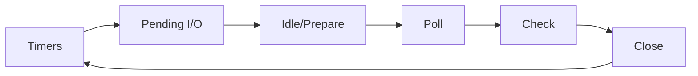

## 引言

想象一下你经营着一家网红奶茶店（主线程），柜台后只有你一位店员。客人下单（代码执行）时你会快速制作当前订单（同步任务），遇到需要等待的操作（比如要煮珍珠），你会先把这单暂时搁置（挂起异步任务），继续处理下一个订单（执行后续代码）。
等计时器响起（异步任务完成），再把完成的订单交给顾客（回调执行）。这种高效的排队处理机制，就是 JavaScript 事件循环的核心逻辑。

:::info 为什么需要事件循环？
JavaScript 是单线程语言，意味着它一次只能执行一个任务。如果没有事件循环，任何耗时操作都会阻塞整个程序的执行。事件循环通过异步处理机制，让 JavaScript 能够"同时"处理多个任务，保持应用的响应性。
:::

## 一、浏览器的事件循环机制

### 1.1 核心架构模型

浏览器的事件循环基于三层处理机制：

```javascript
// 浏览器环境示例（技术栈：ES6+）
console.log('开始准备珍珠') // 同步任务1

setTimeout(() => {
  console.log('定时器煮好了珍珠') // 宏任务回调
}, 1000)

new Promise((resolve) => {
  console.log('正在煮波霸珍珠') // 同步任务2
  resolve()
}).then(() => {
  console.log('波霸准备完成') // 微任务回调
})

console.log('开始制作奶茶基底') // 同步任务3

/* 执行顺序：
1. 开始准备珍珠
2. 正在煮波霸珍珠
3. 开始制作奶茶基底
4. 波霸准备完成
5. 定时器煮好了珍珠（约1秒后）
*/
```

::: card

- 浏览器运行时环境
  - 执行栈（Call Stack）
    - 同步代码
  - 微任务队列（Microtask Queue）
    - Promise.then
    - MutationObserver
    - queueMicrotask
  - 宏任务队列（Macrotask Queue）
    - setTimeout
    - setInterval
    - I/O 操作
    - UI 渲染
:::

### 1.2 事件循环完整流程

事件循环按照以下顺序处理任务：

:::steps

- **步骤1**：执行当前执行栈中的所有同步代码
- **步骤2**：检查微任务队列，执行所有微任务直到队列清空
- **步骤3**：执行一个宏任务
- **步骤4**：再次检查并执行所有微任务
- **步骤5**：进行 UI 渲染（如果需要）
- **步骤6**：开始下一轮事件循环

:::

### 1.3 复杂场景分析

```javascript
function complexExample() {
  console.log('开始冲泡奶茶')

  setTimeout(() => {
    console.log('定时器1完成')
    Promise.resolve().then(() => console.log('定时器1的微任务'))
  }, 0)

  new Promise((resolve) => {
    console.log('正在称量茶叶')
    resolve()
  }).then(() => {
    console.log('茶叶称量完成')
    setTimeout(() => console.log('微任务中的定时器'), 0)
  })

  requestAnimationFrame(() => {
    console.log('动画帧回调')
  })
}

complexExample()

/* 典型输出顺序：
1. 开始冲泡奶茶
2. 正在称量茶叶
3. 茶叶称量完成
4. 动画帧回调
5. 定时器1完成
6. 定时器1的微任务
7. 微任务中的定时器
*/
```

## 二、Node.js 的事件循环机制

### 2.1 libuv 引擎的六层处理结构

Node.js 采用更复杂的事件循环阶段轮询机制：



### 2.2 各阶段详解

:::code-tabs
@tab Timers 阶段

```javascript
// 处理 setTimeout 和 setInterval 回调
setTimeout(() => {
  console.log('计时器回调')
}, 0)
```

@tab Poll 阶段

```javascript
// 执行 I/O 回调，检索新事件
fs.readFile('file.txt', (err, data) => {
  if (err)
    throw err
  console.log('文件读取完成')
})
```

@tab Check 阶段

```javascript
// 专门处理 setImmediate 回调
setImmediate(() => {
  console.log('setImmediate 回调')
})
```

:::

### 2.3 Node.js 特殊 API

```javascript
// Node.js 环境示例（技术栈：Node 14+）
console.log('阶段1: 启动程序')

setImmediate(() => {
  console.log('阶段5: setImmediate回调')
})

setTimeout(() => {
  console.log('阶段1: 计时器回调')
}, 0)

Promise.resolve().then(() => {
  console.log('微任务队列')
})

process.nextTick(() => {
  console.log('nextTick队列')
})

/* 执行顺序：
1. 阶段1: 启动程序
2. nextTick队列
3. 微任务队列
4. 阶段1: 计时器回调
5. 阶段5: setImmediate回调
*/
```

:::warning 注意
`process.nextTick` 拥有独立最高优先级，在每个阶段切换时都会优先处理，甚至比 Promise 微任务还要早执行。
:::

## 三、浏览器与 Node.js 的关键差异

### 3.1 架构对比表

| 特性 | 浏览器环境 | Node.js 环境 |
|------|------------|--------------|
| **任务队列架构** | 两层队列体系 | 六阶段轮询机制 |
| **微任务执行时机** | 每个宏任务结束后 | 各阶段切换时 |
| **nextTick** | 不存在 | 拥有独立最高优先级 |
| **渲染时机** | 每个循环周期可能渲染 | 不涉及 DOM 渲染 |
| **setImmediate** | 不支持 | 支持并用于阶段控制 |
| **文件 I/O 处理** | XMLHttpRequest 等 | fs 模块异步 API |

### 3.2 执行顺序差异深度解析

```javascript
// 复杂执行顺序示例
console.log('Main')

setTimeout(() => {
  console.log('Timeout 1')
  process.nextTick(() => console.log('nextTick in Timeout'))
}, 0)

setImmediate(() => {
  console.log('Immediate 1')
  Promise.resolve().then(() => console.log('Promise in Immediate'))
})

Promise.resolve().then(() => console.log('Promise 1'))
process.nextTick(() => console.log('nextTick 1'))

/* Node.js 输出顺序：
Main → nextTick 1 → Promise 1 → Timeout 1 → nextTick in Timeout → Immediate 1 → Promise in Immediate
*/
```

## 四、任务类型详解

### 4.1 宏任务（MacroTasks）

宏任务是 JavaScript 事件循环中较大的任务单元：

:::code-tabs
@tab 定时器任务

```javascript
setTimeout(() => {
  console.log('setTimeout 宏任务')
}, 0)

setInterval(() => {
  console.log('setInterval 宏任务')
}, 1000)
```

@tab I/O 操作

```javascript
// 浏览器
fetch('/api/data')
  .then(response => response.json())
  .then(data => console.log(data))

// Node.js
fs.readFile('file.txt', (err, data) => {
  if (err)
    throw err
  console.log('文件读取完成')
})
```

@tab UI 渲染

```javascript
// 浏览器专用
requestAnimationFrame(() => {
  // 动画更新逻辑
  element.style.transform = 'translateX(100px)'
})
```

:::

### 4.2 微任务（MicroTasks）

微任务在当前宏任务执行完毕后立即执行：

:::code-tabs
@tab Promise

```javascript
Promise.resolve()
  .then(() => console.log('Promise.then 微任务'))
  .then(() => console.log('链式微任务'))
```

@tab async/await

```javascript
async function asyncExample() {
  console.log('1') // 同步
  await console.log('2') // 同步
  console.log('3') // 微任务
}
```

@tab queueMicrotask

```javascript
queueMicrotask(() => {
  console.log('queueMicrotask 微任务')
})
```

:::

## 五、实战应用与性能优化

### 5.1 浏览器环境优化实践

**浏览器阻塞示例：**

```javascript
// 危险操作：同步阻塞
document.querySelector('#load-btn').addEventListener('click', () => {
  const data = JSON.parse(largeJsonString) // 假设这是很大的 JSON
  renderList(data) // 复杂 DOM 操作

  // 正确做法应该是：
  // 1. 使用 Web Worker 处理数据解析
  // 2. 分帧渲染列表项
})
```

**优化方案：**

```javascript
// 使用微任务优化用户交互
function debounce(func, wait) {
  let timeout
  return function executedFunction(...args) {
    const later = () => {
      clearTimeout(timeout)
      func(...args)
    }
    clearTimeout(timeout)
    timeout = setTimeout(later, wait)
  }
}

// 使用 requestAnimationFrame 优化动画
function smoothAnimation(element) {
  let start = null

  function step(timestamp) {
    if (!start)
      start = timestamp
    const progress = timestamp - start

    element.style.transform = `translateX(${Math.min(progress / 10, 200)}px)`

    if (progress < 2000) {
      requestAnimationFrame(step)
    }
  }

  requestAnimationFrame(step)
}
```

### 5.2 Node.js 服务端优化要点

```javascript
// Node.js 优化示例
function processData(data) {
  // 低效的同步处理
  // return cpuIntensiveTask(data);

  // 优化方案：使用 setImmediate 释放事件循环
  return new Promise((resolve, reject) => {
    setImmediate(() => {
      try {
        const result = cpuIntensiveTask(data)
        resolve(result)
      }
      catch (err) {
        reject(err)
      }
    })
  })
}

// 使用工作线程处理 CPU 密集型任务
const { Worker } = require('node:worker_threads')

function heavyComputation(data) {
  return new Promise((resolve, reject) => {
    const worker = new Worker('./computation-worker.js', {
      workerData: data
    })

    worker.on('message', resolve)
    worker.on('error', reject)
    worker.on('exit', (code) => {
      if (code !== 0) {
        reject(new Error(`Worker stopped with exit code ${code}`))
      }
    })
  })
}
```

## 六、常见陷阱与规避策略

### 6.1 微任务递归导致的饥饿问题

```javascript
// 危险示例：微任务递归导致宏任务饥饿
function microtaskLoop() {
  Promise.resolve().then(() => {
    console.log('Microtask executed')
    microtaskLoop() // 递归调用
  })
}

// 浏览器：会强制中断无限微任务链（如 Chrome 的 100 万次限制）
// Node.js：无此保护机制，可能导致事件循环完全阻塞
```

**解决方案：**

```javascript
// 使用宏任务分解长任务
function processInChunks(data, chunkSize = 1000) {
  let index = 0

  function processChunk() {
    const chunk = data.slice(index, index + chunkSize)
    // 处理数据块...
    index += chunkSize

    if (index < data.length) {
      // 使用 setImmediate 或 setTimeout 让出控制权
      setImmediate(processChunk)
    }
  }

  processChunk()
}
```

### 6.2 定时器精度与销毁

:::code-tabs
@tab Vue 中销毁定时器

```javascript
export default {
  mounted() {
    this.timer = setInterval(() => {
      console.log('Interval triggered')
    }, 1000)
  },
  beforeDestroy() { // Vue 2.x
    clearInterval(this.timer)
  },
  beforeUnmount() { // Vue 3.x
    clearInterval(this.timer)
  }
}
```

@tab React 中销毁定时器

```javascript
import React, { useEffect } from 'react'

function MyComponent() {
  useEffect(() => {
    const timer = setInterval(() => {
      console.log('Interval triggered')
    }, 1000)

    // 清理函数
    return () => clearInterval(timer)
  }, []) // 空依赖数组表示这个 effect 只在组件挂载时运行一次

  return <div>Check the console.</div>
}
```

:::

## 七、现代异步编程实践

### 7.1 Promise 进阶应用

```javascript
// Promise 组合使用
async function complexAsyncOperation() {
  try {
    const [user, settings] = await Promise.all([
      fetchUser(),
      fetchUserSettings()
    ])

    const processedData = await processUserData(user, settings)

    return await saveProcessedData(processedData)
  }
  catch (error) {
    console.error('操作失败:', error)
    throw error
  }
}

// 自定义 Promise 工具函数
class AsyncUtils {
  static delay(ms) {
    return new Promise(resolve => setTimeout(resolve, ms))
  }

  static timeout(promise, ms) {
    return Promise.race([
      promise,
      new Promise((_, reject) =>
        setTimeout(() => reject(new Error('操作超时')), ms)
      )
    ])
  }

  static retry(operation, maxRetries = 3) {
    return new Promise((resolve, reject) => {
      const attempt = (retryCount) => {
        operation()
          .then(resolve)
          .catch((error) => {
            if (retryCount < maxRetries) {
              console.log(`重试 ${retryCount + 1}/${maxRetries}`)
              attempt(retryCount + 1)
            }
            else {
              reject(error)
            }
          })
      }
      attempt(0)
    })
  }
}
```

### 7.2 async/await 最佳实践

```javascript
// 错误处理模式
async function robustAsyncFunction() {
  try {
    const result = await potentiallyFailingOperation()
    return { success: true, data: result }
  }
  catch (error) {
    console.error('操作失败:', error)
    return { success: false, error: error.message }
  }
}

// 并行执行优化
async function parallelOperations() {
  // 错误的串行执行
  // const a = await operationA();
  // const b = await operationB();
  // const c = await operationC();

  // 正确的并行执行
  const [a, b, c] = await Promise.all([
    operationA(),
    operationB(),
    operationC()
  ])

  return { a, b, c }
}

// 流式处理大数据集
async function processLargeDataset(dataset) {
  const results = []

  for (const item of dataset) {
    // 使用 await 确保顺序但让出控制权
    const result = await processItem(item)
    results.push(result)

    // 定期让出控制权避免阻塞
    if (results.length % 100 === 0) {
      await AsyncUtils.delay(0)
    }
  }

  return results
}
```

## 八、总结与最佳实践

### 8.1 核心原则总结

:::important 浏览器开发要做到

- 优先使用微任务优化交互响应
- 合理分配不同优先级任务
- 关注长任务对用户体验的影响
- 动画处理优先使用 `requestAnimationFrame`
:::

:::important Node.js 开发要注意

- 充分利用各阶段的特性
- 避免阻塞事件循环的误操作
- 正确处理不同优先级的回调
- 警惕 CPU 密集型任务阻塞
:::

### 8.2 通用最佳实践

1. **始终牢记 JavaScript 的单线程本质**
2. **优先采用异步编程模式**
3. **合理使用任务类型**：
   - <50ms 的任务优先使用微任务
   - I/O 密集型操作使用宏任务分解
   - 动画更新使用 `requestAnimationFrame`

4. **内存管理**：
   - 及时移除事件监听器
   - 避免在微任务中创建大型对象
   - 使用 `WeakMap` 管理 DOM 引用

5. **错误处理**：
   - 保持异步操作的错误处理链路完整
   - 使用适当的超时机制
   - 实现重试逻辑处理临时故障

理解事件循环机制是成为高级 JavaScript 开发者的关键一步。
通过掌握浏览器和 Node.js 环境的不同实现，你能够编写出更高效、更可靠的异步代码，为用户提供更好的体验。

:::tip 实战建议
在实际项目中，多使用浏览器开发者工具的 Performance 面板和 Node.js 的 `--trace-event-categories` 标志来分析和优化你的事件循环性能。
:::

## 参考

- [MDN Web Docs: 并发模型与事件循环](https://developer.mozilla.org/zh-CN/docs/Web/JavaScript/EventLoop)
- [Node.js 官方文档：事件循环](https://nodejs.org/zh-cn/docs/guides/event-loop-timers-and-nexttick/)
- [Philip Roberts: 到底什么是事件循环？](https://www.youtube.com/watch?v=8aGhZQkoFbQ)（经典演讲）
