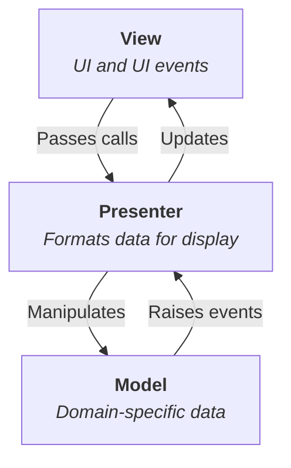

::: tip
MVP 模式通过强制视图与逻辑解耦，显著提升前端代码的可维护性和可测试性，特别适合业务复杂的 Web 应用。
尽管在现代框架（如 React/Vue）中部分职责被组件化替代，但其分层思想仍深刻影响前端架构设计。
:::

## 什么是MVP模式？

MVP (模型-视图-表示器) 是 一种用户界面架构模式，核心目标是分离业务逻辑与视图逻辑，
提升代码可维护性和可测试性。它是 MVC 的变体，通过明确角色分工解决传统 MVC 在 Web 前端中的耦合问题。



它将应用程序分成三个部分：**Model**，**View**，**Presenter**。

### Model (模型)

负责数据和业务逻辑（如数据获取、验证、存储）。

独立于 UI，不直接与 View 交互。

### View (视图)

被动的 UI 层，仅负责渲染和用户输入转发。

通过接口/约定与 `Presenter` 通信（无业务逻辑）。

### Presenter（协调器）

中介者角色：监听 View 事件，调用 Model，更新 View。
包含展示逻辑（如数据格式化、状态控制）。

## 实现 MVP 模式

::: code-tabs

@tab index.js

```js
// 初始化
const model = new UserModel()
const view = new UserListView()
const presenter = new UserPresenter(model, view)

// 首次渲染
presenter.loadInitialData()
```

@tab user-model.js

```js
class UserModel {
  constructor() {
    this.users = []
  }

  addUser(name) {
    this.users.push({ id: Date.now(), name })
    return this.users
  }
}
```

@tab user-list-view.js

```js
class UserListView {
  constructor(presenter) {
    this.presenter = presenter
    this.list = document.getElementById('user-list')
    this.form = document.getElementById('user-form')
    this.form.addEventListener('submit', e => this.onSubmit(e))
  }

  render(users) {
    this.list.innerHTML = users.map(u => `<li>${u.name}</li>`).join('')
  }

  onSubmit(e) {
    e.preventDefault()
    const name = document.getElementById('name-input').value
    this.presenter.addUser(name) // 转发给 Presenter
  }
}
```

@tab user-presenter.js

```js
class UserPresenter {
  constructor(model, view) {
    this.model = model
    this.view = view
  }

  addUser(name) {
    if (!name.trim())
      return // 简单验证
    const updatedUsers = this.model.addUser(name)
    this.view.render(updatedUsers) // 更新视图
  }
}
```

:::

## 优点

- **关注点分离**

  View 只处理 UI，Model 只处理数据，Presenter 负责协调。

- **高可测试性**

  Presenter 可脱离 View 测试（通过 Mock View）。

- **避免框架依赖**

  View 可为原生 DOM 操作，易于替换 UI 库。

- **清晰的代码结构**

  各层职责明确，适合团队协作

## 缺点

- **复杂度增加**

小型项目可能过度设计（需手动绑定事件/更新视图）。

- **Presenter 膨胀风险**

复杂页面可能导致 Presenter 臃肿（需拆分或引入状态管理）。

- **手动更新视图**

相比 MVVM 的自动绑定，需手动调用 `render()` 。
