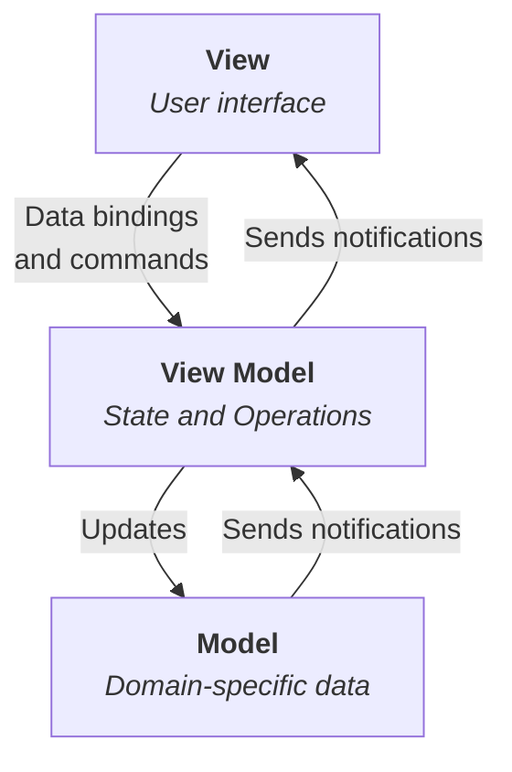

## 什么是 MVVM 模式？

==MVVM（Model-View-ViewModel）== 是一种用于分离用户界面逻辑与业务逻辑的架构模式，核心是数据驱动视图。
它通过 **ViewModel** 将 **Model** 和 **View** 解耦，实现双向数据绑定：



### Model

数据模型（如 API 数据、业务逻辑）。

### View

用户界面（DOM 元素）。

### ViewModel

连接 Model 和 View 的桥梁，处理数据转换和交互逻辑。

## 实现 MVVM 模式

以 Vue.js 为例，核心机制是响应式系统和模板引擎：

```html
<!-- View (HTML模板) -->
<div id="app">
  <input v-model="message"> <!-- 双向绑定 -->
  <p>{{ message }}</p>     <!-- 数据渲染 -->
</div>
```

```js
// ViewModel (Vue实例)
const vm = new Vue({
  el: '#app',
  data: {
    message: 'Hello MVVM!' // Model数据
  }
})

// 修改Model自动更新View
vm.message = 'Updated!' // <p>内容同步变化
```

## 关键机制

- 双向数据绑定

  View（如输入框）修改 → 自动更新 Model → ViewModel 通知其他依赖视图更新。

- 依赖追踪

  Vue 通过 `Object.defineProperty`/ `Proxy` 监听数据变化，触发视图更新。

- 模板编译

  将模板（如 `{{ message }}`）编译为虚拟 DOM，高效更新真实 DOM。

## 优点

| 优点           | 说明                                               |
| -------------- | -------------------------------------------------- |
| **开发效率高** | 自动同步数据视图，减少手动 DOM 操作（如 jQuery）。 |
| **代码解耦**   | View、ViewModel、Model 职责分离，便于维护。        |
| **可测试性**   | ViewModel 可独立测试（不依赖 UI）。                |
| **数据驱动**   | 聚焦数据变化，而非视图操作。                       |

## 缺点

| 缺点         | 说明                                               |
| ------------ | -------------------------------------------------- |
| **学习曲线** | 需理解响应式原理、虚拟 DOM 等概念。                |
| **性能开销** | 深度监听大对象或频繁更新可能影响性能（需优化）。   |
| **过度绑定** | 滥用双向绑定可能导致数据流混乱（推荐单向数据流）。 |
| **黑箱化**   | 框架封装复杂，调试底层问题较困难。                 |
