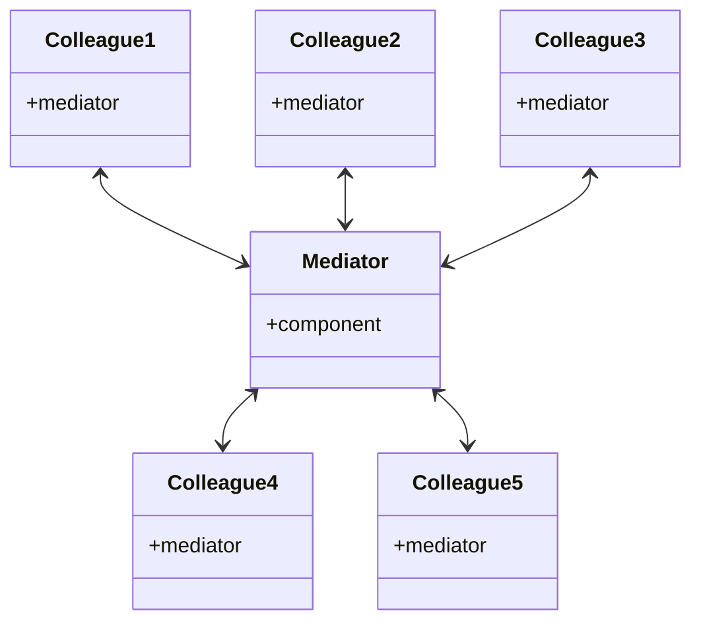

> ==中介者==，指 “协助谈判和解决冲突的中立方”

## 什么是中介者模式？

==中介者模式== 是一种行为型设计模式。它允许我们公开一个统一的接口，系统的不同部分可以通过该接口进行通信。

如果一个系统的各个组件之间看起来有太多的直接关系，也许是时候需要一个中心控制点了，以便各个组件可以通过
这个中心控制点进行通信。

Mediator 模式促进松散耦合的方式是：确保组件的交互是通过这个中心点来处理的，而不是通过显式地引用彼此。
这种模式可以帮助我们解耦系统并提高组件的可重用性。

一个典型的例子是机场交通控制系统。机场控制塔（中介者）处理飞机的起飞和降落，因为所有的通信（监听到货发出的通知）
都是从飞机到控制塔，而不是从飞机和飞机直接相互听信的。
中央控制系统是该系统成功的关键，而这也是中介者在软件设计中所担任的角色。



## 使用中介者模式

我们来实现一个简单的 聊天室 应用，在这个应用中，用户之间不会直接交谈，而是通过将消息发送到
聊天室（中介者）中，再由聊天室将消息广播给其他用户。

```ts
class ChatRoom {
  logMessage(user, message) {
    const time = new Date()
    const sender = user.getName()

    console.log(`${time} [${sender}]: ${message}`)
  }
}

class User {
  constructor(name, chatroom) {
    this.name = name
    this.chatroom = chatroom
  }

  getName() {
    return this.name
  }

  send(message) {
    this.chatroom.logMessage(this, message)
  }
}
```

在这个应用中，我们创建一个聊天室（中介者）实例，然后创建新的用户实例加入到聊天室中，
用户通过 `send()` 将消息发送给其他用户：

```ts
const chatroom = new ChatRoom()

const user1 = new User('John', chatroom)
const user2 = new User('Jane', chatroom)
const user3 = new User('Bob', chatroom)

user1.send('Hi!')
user2.send('Hello!')
```

## 优点

- **降低复杂度**：将多个对象间的一对多关系转换为一对一关系。
- **解耦**：对象之间不再直接引用，通过中介者进行交互。
- **符合迪米特原则**：对象只需知道中介者，不需要知道其他对象。

## 缺点

中介者可能会变得庞大和复杂，难以维护。

## 中介者 与 观察者

> 在 Observer 模式中，不存在封装约束的单一对象。Observer 和 Subject (合作) 必须合作才能维持约束。
> Communication (通信) 模式由观察者和目标互连的方式所决定：
> 单一目标通常有很多观察者，有时一个目标的观察者是另一个观察者的目标。

中介者 和 观察者 都能够促进松耦合；然而，中介者模式通过限制对象严格通过 中介者进行通信来实现这一目的。
观察者模式创建观察者对象，观察者对象订阅他们的对象发布其感兴趣的事件。
