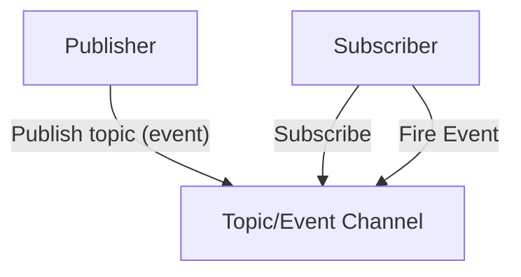

==发布/订阅模式== 是观察者模式的一种变体。

::: info ==发布/订阅模式== 在 JavaScript 中非常常见，比如：

- 浏览器的 [事件监听系统](https://developer.mozilla.org/zh-CN/docs/Web/API/EventTarget)
- Node.js 中的 [EventEmitter 模块](https://nodejs.org/api/events.html#events_class_eventemitter)
- 自定义事件 [CustomEvent](https://developer.mozilla.org/zh-CN/docs/Web/API/CustomEvent)
- [WebSocket 消息推送](hhttps://developer.mozilla.org/zh-CN/docs/Web/API/WebSockets_API)

:::

## 什么是发布/订阅模式？

==Publish/Subscribe (发布/订阅)模式==，是一种行为型设计模式，用于实现对象间的解耦和事件通知机制。



发布/订阅模式使用了一个 主题/事件通道，这个通道介于希望接收到通知（订阅者）的对象和激活时间的对象（发布者）之间。
改时间系统允许代码定义应用程序的特定事件，这些事件可以传递自定义参数，自定义参数包含订阅者所需的值。
其目的是避免订阅者和发布者之间产生依赖关系。

## 实现 发布/订阅模式

在 JavaScript 中，我们可以通过实现一个简单的事件系统，来实现发布/订阅模式。

```ts
class Event {
  constructor() {
    this.listeners = []
  }

  // 订阅
  on(listener) {
    this.listeners.push(listener)
  }

  // 取消订阅
  off(listener) {
    this.listeners = this.listeners.filter(l => l !== listener)
  }

  // 发布
  emit(data) {
    this.listeners.forEach(listener => listener(data))
  }
}
```

在这个简单的事件系统中，订阅者通过 `on()` 方法订阅它们感兴趣的事件，发布者通过 `emit()` 方法发布事件，
订阅者可以通过 `off()` 方法取消订阅。

```ts
const event = new Event()

event.on('click', () => console.log('clicked'))

event.emit('click')
```

## 优点

- **解耦性强**

  发布者和订阅者无直接依赖，发布者不需要知道谁订阅了事件，订阅者也不需要知道事件是谁触发的。

- **可扩展性高**

  动态增减订阅者：通过 `on()` 和 `off()` 方法灵活管理订阅关系。

- **支持广播通信**

  一对多消息传递：一个事件可被多个订阅者同时响应。

- **异步处理能力**

  非阻塞通信：事件发布后，订阅者可异步处理任务。

- **集中化管理**

  事件中心统一调度：所有事件通过中间层（如 EventEmitter）管理，便于监控和调试。

## 缺点

- **难以跟踪事件流**

  隐式调用链：订阅者和发布者没有显式关联，这可能导致调试困难。

- **性能开销**

  大量事件分发：高频事件（如鼠标移动）可能引发性能问题。

- **事件命名冲突**

  全局事件名重复：多人协作时，可能因事件名相同导致意外覆盖。

- **过度使用导致逻辑分散**

  逻辑碎片化：过度依赖事件通信会让业务逻辑分散到多个订阅者中，破坏代码内聚性。

## 适用场景

| **适用场景**                                 | **不适用场景**                              |
| -------------------------------------------- | ------------------------------------------- |
| 跨层级/模块通信（如微前端、跨组件通信）      | 简单父子组件通信（优先用 Props/Events）     |
| 需要广播或一对多通信（如实时通知、日志广播） | 高频、高性能敏感操作（如游戏循环）          |
| 动态插件系统或可扩展架构                     | 强依赖顺序的逻辑（需明确调用链）            |
| 异步任务协调（如文件上传完成后的多步骤处理） | 需要严格类型检查的场景（需结合 TypeScript） |

## 最佳实践

- **严格管理订阅生命周期**
- **使用命名空间或类型约束**：避免事件名冲突
- **控制事件粒度**：避免过度细化或粗粒度的事件设计
- **结合其他模式**：如与观察者模式、状态模式混合使用
- **性能监控**：对高频事件进行性能分析，必要时优化或替换方案
