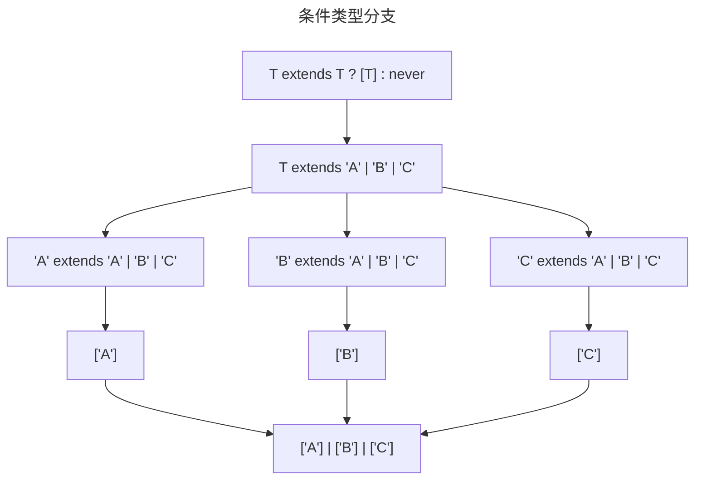

## 题目

实现联合类型的全排列，将联合类型转换成所有可能的全排列数组的联合类型。

```ts
type perm = Permutation<'A' | 'B' | 'C'>
// ['A', 'B', 'C'] | ['A', 'C', 'B'] | ['B', 'A', 'C'] | ['B', 'C', 'A'] | ['C', 'A', 'B'] | ['C', 'B', 'A']
```

## 解题思路

这个挑战需要我们深入理解
[条件类型分支 Distributive Conditional Types](https://www.typescriptlang.org/docs/handbook/2/conditional-types.html#distributive-conditional-types)。
在我们对联合类型进行条件类型推断时：

```ts
type Permutation<T> = T extends T ? [T] : never
```

假设 `T` 为 `'A' | 'B' | 'C'`:

```ts twoslash
type Permutation<T> = T extends T ? [T] : never
// ---cut---
type Result = Permutation<'A' | 'B' | 'C'>
//    ^?
//
```

`T extends T` 从语法上看起来很怪，但它实际上是从泛型 `T` 中取出每一个成员，判断该成员是否在联合类型 `T` 中。



在理解了 条件类型分支后，再来看 联合类型的全排列，当 `T` 为 `'A' | 'B' | 'C'` 时，存在以下的所有排列：

| 首位成员 | 全部成员 | 去除首位成员 |
| -------- | -------- | ------------ |
| A        | A, B, C  | B, C         |
|          | A, C, B  | C, B         |
| B        | B, A, C  | A, C         |
|          | B, C, A  | C, A         |
| C        | C, A, B  | A, B         |
|          | C, B, A  | B, A         |

观察可以发现，在首位成员确定时，全排列就是 首位成员 加上 剩余成员的全排列 的集合。

| 首位成员 | 剩余成员 | 全排列  |
| -------- | -------- | ------- |
| A        | B, C     | A, B, C |
|          | C, B     | A, C, B |

因此可以通过递归的方式，在 `type Permutation<T> = T extends T ? [T] : never` 中添加剩余成员全排列集合：

```ts
type Permutation<T, U = T> = U extends U
  ? [U, ...Permutation<Exclude<T, U>>]
  : never
```

这里我们使用一个泛型参数 `U` 保存条件类型分支中的成员。

同时，还需要考虑递归应该在何时停止，当 联合类型 `T` 中没有成员时，即 `never` 时，应该终止递归。

在 typescript 中，我们不能通过 `T extends never ？ true : false` 判断一个类型是否为 `never`，
因为 在 `T extends never` 中 `never` 本质上是一个没有成员的联合类型，
这导致了 `never extends never ? true : false` 整体被跳过了，得到的结果为 `never` , 而不是 `true/false`。

要避免这种情况，可以在`extends` 两边的类型用方括号包裹，这可以避免 触发条件类型分支：

```ts
type Permutation<T, U = T> = [T] extends [never]
  ? []
  : T
```

## 答案

```ts
type Permutation<T, U = T> = [T] extends [never]
  ? []
  : U extends U
    ? [U, ...Permutation<Exclude<T, U>>]
    : never
```

## 验证

```ts twoslash
import type { Equal, Expect } from '~/tc-utils'

type Permutation<T, U = T> = [T] extends [never]
  ? []
  : U extends U
    ? [U, ...Permutation<Exclude<T, U>>]
    : never

// ---cut---
type cases = [
  Expect<Equal<Permutation<'A'>, ['A']>>,
  Expect<Equal<Permutation<'A' | 'B' | 'C'>, ['A', 'B', 'C'] | ['A', 'C', 'B'] | ['B', 'A', 'C'] | ['B', 'C', 'A'] | ['C', 'A', 'B'] | ['C', 'B', 'A']>>,
  Expect<Equal<Permutation<'B' | 'A' | 'C'>, ['A', 'B', 'C'] | ['A', 'C', 'B'] | ['B', 'A', 'C'] | ['B', 'C', 'A'] | ['C', 'A', 'B'] | ['C', 'B', 'A']>>,
  Expect<Equal<Permutation<boolean>, [false, true] | [true, false]>>,
  Expect<Equal<Permutation<never>, []>>,
]
```

## 参考

- [条件类型 Conditional Types](https://www.typescriptlang.org/docs/handbook/2/conditional-types.html)
- [条件类型分支 Distributive Conditional Types](https://www.typescriptlang.org/docs/handbook/2/conditional-types.html#distributive-conditional-types)
- [递归条件类型 Recursive Conditional Types](https://www.typescriptlang.org/docs/handbook/release-notes/typescript-4-1.html#recursive-conditional-types)
- [可变元组类型 Variadic Tuple Types](https://www.typescriptlang.org/docs/handbook/release-notes/typescript-4-0.html#variadic-tuple-types)
