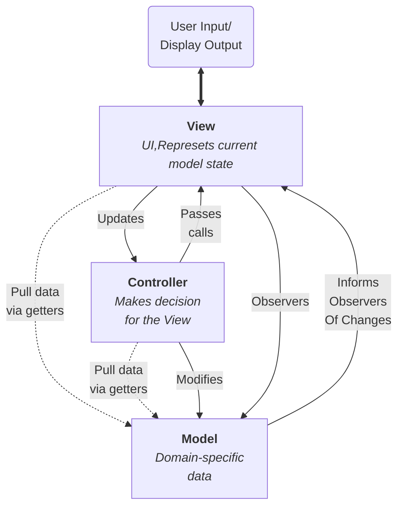

:::info
MVC 实际上是三个经典设计模式的变体：Observer （观察者）模式、Strategy （策略）模式 和 Composite（组合）模式。
它也可以使用 Factory （工厂）模式 和  Template（模板）模式。
:::

## 什么是MVC模式？

MVC 是一种软件设计模式，它将应用程序分成三个部分：**Model**，**View**，**Controller**。



### Model

Model 管理应用程序的数据。Model 不涉及用户界面，也不涉及表示层，而是代表应用程序可能需要的特度形式的数据。
当 Model (模型) 改变时，它通常会通知它的观察者（如 View），以便它们可以做出相应的改变（更新）。

### View

视图是 Model 的可视化表示，表示当前状态的筛选视图。一个 View 通常检测一个 Model，并在 Model 更改是进行通知，
使 View 本身能够相应的更新。

用户可以与 View 交互，包括读取和编辑 Model ，即在 Model 中获取或设置属性值。

### Controller

Controller 是 Model 和 View 之间的中介，当用户操作 View 时，它通常负责更新 Model 。

## 实现 MVC 模式

在 JavaScript 中，MVC 常用于构建单页应用（SPA），通过解耦代码提升可维护性。

以下是一个原生 JavaScript 实现的简单 Todo 应用：

::: code-tabs

@tab index.js

```js
import TodoController from './todo-controller'
import TodoModel from './todo-model'
import TodoView from './todo-view'

// 初始化
const model = new TodoModel()
const view = new TodoView()
const controller = new TodoController(model, view)
```

@tab todo-model.js

```js
class TodoModel {
  constructor() {
    this.todos = []
    this.listeners = []
  }

  addTodo(text) {
    this.todos.push({ text, completed: false })
    this.emitChange()
  }

  toggleTodo(index) {
    this.todos[index].completed = !this.todos[index].completed
    this.emitChange()
  }

  on(event, listener) {
    this.listeners.push(listener)
  }

  emitChange() {
    this.listeners.forEach(listener => listener(this.todos))
  }
}
```

@tab todo-view.js

```js
class TodoView {
  constructor() {
    this.todoList = document.getElementById('todo-list')
    this.addButton = document.getElementById('add-todo')
    this.input = document.getElementById('todo-input')
  }

  bindAddTodo(handler) {
    this.addButton.addEventListener('click', () => {
      const text = this.input.value
      if (text) {
        handler(text)
        this.input.value = ''
      }
    })
  }

  render(todos) {
    this.todoList.innerHTML = todos
      .map((todo, index) => `
        <li class="${todo.completed ? 'completed' : ''}">
          ${todo.text}
          <button onclick="controller.toggleTodo(${index})">✓</button>
        </li>
      `)
      .join('')
  }
}
```

@tab todo-controller.js

```js
class TodoController {
  constructor(model, view) {
    this.model = model
    this.view = view

    this.view.bindAddTodo(this.handleAddTodo.bind(this))
    this.model.on('change', todos => this.view.render(todos))
  }

  handleAddTodo(text) {
    this.model.addTodo(text)
  }

  toggleTodo(index) {
    this.model.toggleTodo(index)
  }
}
```

:::

## 优点

- **解耦代码**：数据、界面、逻辑分离，便于维护。
- **可复用性**：View 可复用（如 Web 和移动端共用 Model）。
- **可测试性**：Model 和 Controller 可独立测试。
- **团队协作**：不同开发者可并行开发不同组件。

## 缺点

- **复杂度高**：小型项目可能因分层过度而冗余。
- **数据流混乱**：若未严格分层，可能导致 View 直接操作 Model。
- **性能开销**：频繁的 DOM 更新可能影响性能（需优化或结合虚拟 DOM）。

## 适用场景

- 复杂交互的 SPA（如管理后台、社交平台）。
- 长期维护的项目：结构清晰降低迭代成本。
- 团队协作开发：明确分工，减少代码冲突。
