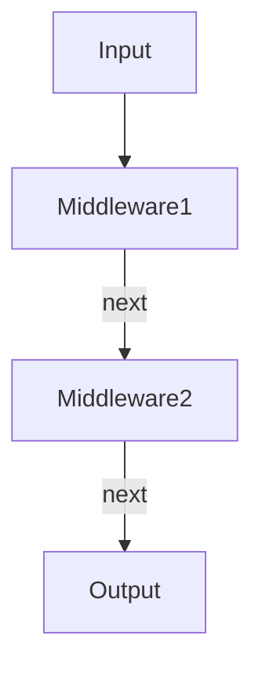

::: tip
中间件模式通过将复杂流程分解为独立处理单元，显著提升了代码的可维护性和扩展性，
是 JavaScript 生态中不可或缺的设计模式。
:::

## 什么是中间件模式？

==Middleware(中间件)模式== 是一种通过串联多个处理函数来处理请求的设计模式。

每个函数（中间件）接收输入，执行特定操作，可选择修改数据，并将控制权传递给下一个函数。
这种模式在 Web 开发（如 **Express/Koa**）、数据流处理等场景中广泛应用。



## 实现中间件模式

以下是基于 Express 风格的中间件实现：

```js
function createMiddleware() {
  const middlewares = []

  const use = fn => middlewares.push(fn)

  const execute = async (context) => {
    let index = 0
    const next = async () => {
      if (index < middlewares.length) {
        const middleware = middlewares[index++]
        await middleware(context, next) // 关键：传入next实现链式调用
      }
    }
    await next()
  }

  return { use, execute }
}

// 使用示例
const app = createMiddleware()

// 中间件1：日志记录
app.use(async (ctx, next) => {
  console.log('Request started at', new Date())
  await next() // 传递控制权
  console.log('Request ended')
})

// 中间件2：数据处理
app.use(async (ctx, next) => {
  ctx.data = { modified: true }
  await next()
})

// 执行中间件链
const context = {}
app.execute(context).then(() => {
  console.log('Context:', context) // 输出修改后的数据
})
```

### 核心流程

- **注册顺序**：中间件按 use() 调用顺序排列。
- **控制传递**：next() 将执行权交给下一个中间件。
- **洋葱模型**：执行顺序类似洋葱（请求从外向内，响应从内向外）。

## 优点

- **解耦性**：每个中间件专注单一职责（如日志、验证）。
- **可扩展性**：动态添加/移除中间件，无需修改核心逻辑。
- **灵活性**：支持异步操作（通过 async/await）。
- **复用性**：通用中间件（如 CORS 处理）可跨项目复用。

## 缺点

- **性能开销**：多层函数调用可能影响性能（需控制中间件数量）。
- **错误处理复杂**：需统一错误处理机制（如 Express 的 error-handling middleware）。
- **调试困难**：深层调用栈增加调试难度。
- **顺序依赖**：中间件顺序错误可能导致逻辑问题（如先验证后解析 Body）。

## 适用场景

- **Web 框架**：

  - 请求/响应处理（Express/Koa）。
  - 身份验证、日志、压缩、CORS。

- **数据处理管道**：

  - 数据转换链（如图像处理管道）。
  - 消息队列消费流程。

- **状态管理**：

  Redux 中间件（如 redux-thunk、redux-logger）。

- **构建工具**：

  Webpack 插件（基于 tapable 的中间件系统）。
