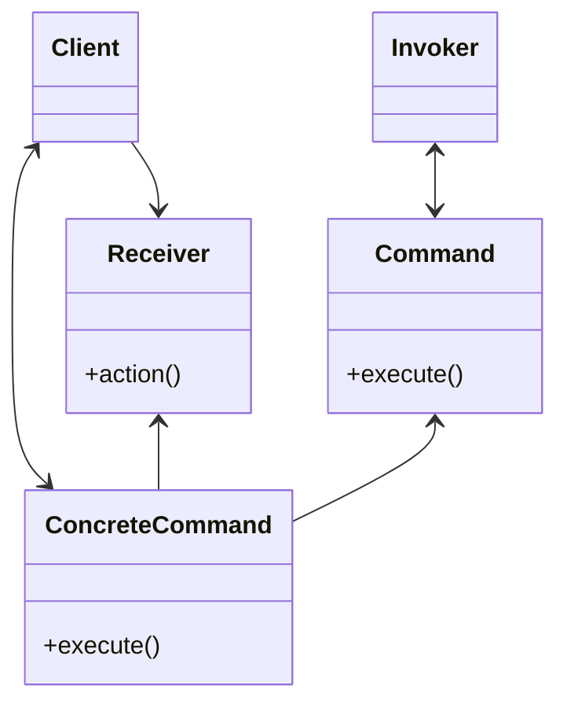

==命令模式== 在前端领域的用例相对有限，这里仅做简单的介绍。

## 什么是命令模式？

==Command(命令)模式== 旨在将方法调用、请求或操作封装到单一对象中，从而根据我们不同的请求对客户进行参数化
和 传递可供执行的方法调用。这种模式将调用操作的对象与知道如何实现该操作的对象解耦，并在交换出具体类（对象）
方面提供更大的整体灵活性。

用基于类的变成语言解释 **具体类** 是最恰当的，它们与抽象类的思想有关。
一个抽象类定义一个结构，但不一定为它所有的成员函数提供实现。
它作为一个基类，派生出其他类。实现确实功能的派生类被称为一个 **具体类**。



==Command(命令)模式== 背后的主要思想是：它为我们提供了一种分离职责的手段，这些职责包括从执行命令的任意地方
发布命令以及将该职责转而委托给不同对象。

实施明智的、简单那的命令对象将把 **Action** 动作和调用该动作的对象绑定在一起。它们始终包括一个执行操作
（如 `run()` 或 `execute()`）。所有具有相同接口的 Command 对象可以根据需要轻松交换，这被认为是该模式的一个更大的好处。

## 使用命令模式

假设我们有一个在线购物系统，用户可以下单、跟踪订单 和 取消订单。

```ts
class OrderManager {
  constructor() {
    this.orders = []
  }

  placeOrder(order, id) {
    this.orders.push(id)
    return `Successfully ordered ${order} (${id})`
  }

  trackOrder(id) {
    return `Order ${id} is in progress`
  }

  cancelOrder(id) {
    this.orders = this.orders.filter(order => order.id !== id)
    return `Order ${id} has been canceled`
  }
}
```

在 `OrderManager` 类中，我们可以访问 `placeOrder`、`trackOrder` 和 `cancelOrder` 方法。

```ts
const manager = new OrderManager()

manager.placeOrder('shoes', '1234')
manager.trackOrder('1234')
manager.cancelOrder('1234')
```

但是，直接在 manager 实例上调用方法也有缺点。我们可能在未来的某些时候，重命名这些方法，或者某些功能发生变化，
或者移除它们。

假设我们把 `placeOrder` 方法重命名为 `addOrder`，这意味着我们需要确保在整个程序应用中没有任何位置调用
`placeOrder` 方法，这在大型的程序中可能是一个大问题。

我们希望将方法与管理者对象解耦，并为每个命令创建独立的命令函数！

我们开始对 `OrderManager` 类进行重构，移除 `placeOrder` 、`trackOrder` 和 `cancelOrder` 方法，
并添加一个新的 `execute` 方法，此方法将执行任何给它的命令。

每个命令都应该可以访问 manager 的 `orders`，我们将作为它的第一个参数传递。

```ts
class OrderManager {
  constructor() {
    this.orders = []
  }

  execute(command, ...args) {
    return command.execute(this.orders, ...args)
  }
}
```

我们需要为订单管理器创建三个 Command：

- `PlaceOrderCommand`
- `CancelOrderCommand`
- `TrackOrderCommand`

```ts
class Command {
  constructor(execute) {
    this.execute = execute
  }
}

function PlaceOrderCommand(order, id) {
  return new Command((orders) => {
    orders.push(id)
    return `Successfully ordered ${order} (${id})`
  })
}

function CancelOrderCommand(id) {
  return new Command((orders) => {
    orders = orders.filter(order => order.id !== id)
    return `Order ${id} has been canceled`
  })
}

function TrackOrderCommand(id) {
  return new Command(() => `Order ${id} is in progress`)
}
```

它们不再直接耦合到 `OrderManager` 实例，而是独立的、解耦的函数，
我们可以通过 `OrderManager` 上可用的 `execute` 方法调用它们。

```ts
class OrderManager {
  constructor() {
    this.orders = []
  }

  execute(command, ...args) {
    return command.execute(this.orders, ...args)
  }
}

const manager = new OrderManager()

manager.execute(new PlaceOrderCommand('shoes', '1234'))
manager.execute(new TrackOrderCommand('1234'))
manager.execute(new CancelOrderCommand('1234'))
```

## 优点

命令模式允许我们将方法与执行作的对象解耦。
如果正在处理具有特定生命周期的命令，或者应该排队并在特定时间执行的命令，它将提供更多控制权。

## 缺点

命令模式的用例非常有限，并且通常会向应用程序添加不必要的样板内容。
