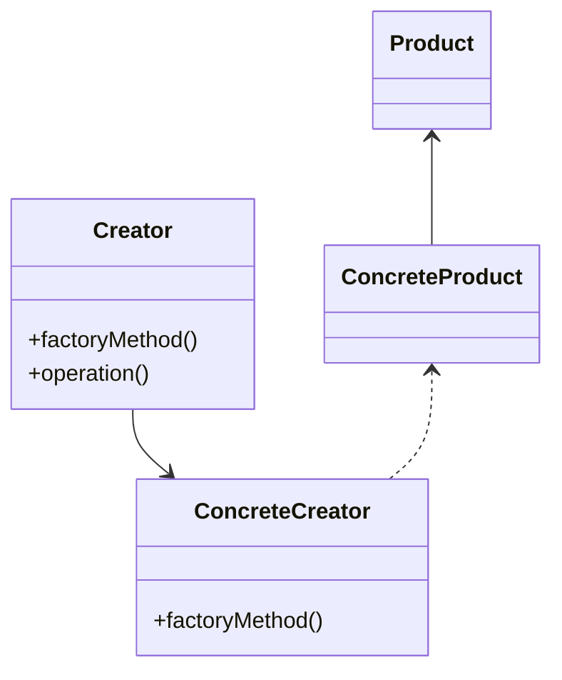

你可能每天都在使用 ==工厂模式=={.caution} ！

## 什么是工厂模式？

==Factory(工厂)== 模式是一种创建型模式，涉及创建对象的概念。

它不显式的要求使用一个构造函数。
Factory 可以提供一个通用的接口来创建对象，我们可以指定我们所希望创建的工厂对象的类型。



## 使用工厂模式

假设我们的应用程序需要许多用户。
我们需要创建具有 `firstName`、`lastName` 和 `email` 属性的新用户。
工厂函数还会向新创建的对象添加 `fullName` 属性，该属性将返回 `firstName` 和 `lastName`。

```ts
function createUser({ firstName, lastName, email }) {
  return {
    firstName,
    lastName,
    email,
    fullName() {
      return `${this.firstName} ${this.lastName}`
    },
  }
}
```

我们可以通过调用 `createUser` 函数来轻松创建多个用户。

```ts
const user1 = createUser({
  firstName: 'Jame',
  lastName: 'Wick',
  email: 'jame@wick.com'
})

const user2 = createUser({
  firstName: 'Juan',
  lastName: 'Jonson',
  email: 'juan@jonson.com'
})

console.log(user1)
console.log(user2)
```

对于对象创建过程相对比较复杂，这种方法特别有用。
比如，我们需要根据动态因素或者配置文件创建对象。

```ts
function createStore() {
  if (process.env.NODE_ENV === 'production') {
    return { env: 'production' }
  }

  return { env: 'development' }
}
```
