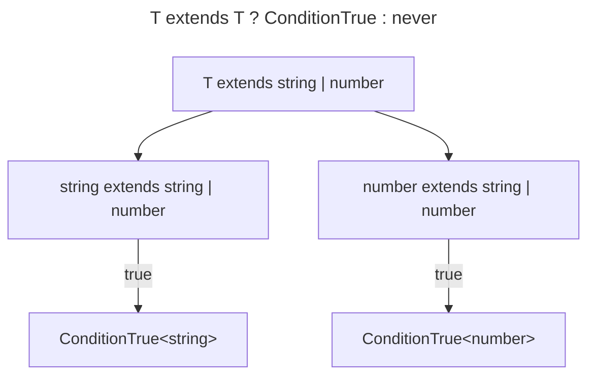
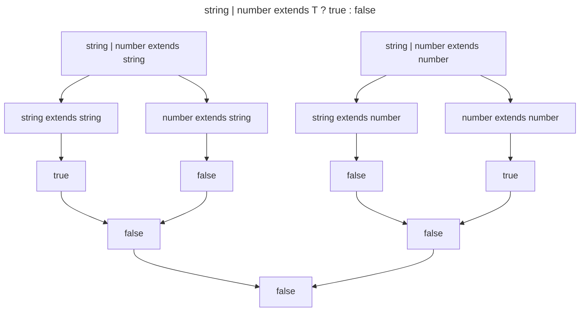

## 题目

Github: [IsUnion](https://github.com/type-challenges/type-challenges/blob/main/questions/01097-medium-isunion/)

实现一个类型 `IsUnion`，它接受一个输入类型 `T` 并返回 `T` 是否解析为联合类型。

```ts
type case1 = IsUnion<string> // false
type case2 = IsUnion<string | number> // true
type case3 = IsUnion<[string | number]> // false
```

## 解题思路

> 起初看到这道题目时，我有些无从下手，在看了 [#1140](https://github.com/type-challenges/type-challenges/issues/1140#issue-838282400) 的回答后才恍然大悟。

首先，我们需要思考 联合类型 及其含义。

当我们指定一个普通类型时，比如 `string`，它将永远是字符串。当我们指定一个联合类型时，比如 `string | number` ,
它可以是 字符串，也可以是 数值 。

普通类型并不能表示一组值，但是 联合类型 可以。因此，在 普通类型 上进行分布式迭代是没有意义的，但对于 联合类型
来说是有意义的。

这就是我们如何检测是否是 联合类型 的关键点。但对 类型 `T` （普通类型）进行分布式迭代时，它不会产生变化，
但如果 类型 `T` 是 联合类型，它会产生比较大的变化。

当我们构造一个 `T extends T ? ConditionTrue<T> : never` 时，比如 `T` 为 联合类型 `string | number`:



我们继续构造 `ConditionTrue<T> = string | number extends T ? true : false`：



看到了吧！如果 `T` 是联合类型，那么它的每个元素 `subT` 必然不能满足 `T extends subT` 。

基于以上，我们可以开始实现 `IsUnion` 类型。

首先保存一个类型 `T` 的副本，以方便后续的使用：

```ts
type IsUnion<T, C extends T = T> = never
```

通过应用条件类型，我们得到了分布式语义。在条件类型的 true 分支中，我们将获取联合 类型中的每一项。

```ts
type IsUnion<T, C extends T = T> = T extends T ? true : never
```

接下来，将每一项与原来的输入类型T进行比较：

```ts
type IsUnion<T, C extends T = T> = T extends T
  ? C extends T
    ? false : true
  : never
```

当然，我们还需要完善一些边界情况。

## 答案

```ts
type IsUnion<T, C extends T = T> = (T extends T
  ? C extends T
    ? true
    : unknown
  : never) extends true
  ? false
  : true
```

## 验证

```ts twoslash
import type { Equal, Expect } from '~/tc-utils'
type IsUnion<T, C extends T = T> = (T extends T ? C extends T ? true : unknown : never) extends true ? false : true

// ---cut---
type cases = [
  Expect<Equal<IsUnion<string>, false>>,
  Expect<Equal<IsUnion<string | number>, true>>,
  Expect<Equal<IsUnion<'a' | 'b' | 'c' | 'd'>, true>>,
  Expect<Equal<IsUnion<undefined | null | void | ''>, true>>,
  Expect<Equal<IsUnion<{ a: string } | { a: number }>, true>>,
  Expect<Equal<IsUnion<{ a: string | number }>, false>>,
  Expect<Equal<IsUnion<[string | number]>, false>>,
  // Cases where T resolves to a non-union type.
  Expect<Equal<IsUnion<string | never>, false>>,
  Expect<Equal<IsUnion<string | unknown>, false>>,
  Expect<Equal<IsUnion<string | any>, false>>,
  Expect<Equal<IsUnion<string | 'a'>, false>>,
  Expect<Equal<IsUnion<never>, false>>,
]
```

## 参考

* [联合类型 Union Types](https://www.typescriptlang.org/docs/handbook/2/everyday-types.html#union-types)
* [泛型 Generics](https://www.typescriptlang.org/docs/handbook/2/generics.html)
* [条件类型 Conditional Types](https://www.typescriptlang.org/docs/handbook/2/conditional-types.html)
* [条件类型分支 Distributive Conditional Types](https://www.typescriptlang.org/docs/handbook/2/conditional-types.html#distributive-conditional-types)
* [元组类型 Tuple Types](https://www.typescriptlang.org/docs/handbook/release-notes/typescript-1-3.html#tuple-types)
